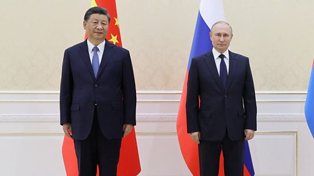

# 上合组织峰会：习近平与普京举行双边会晤

#  上合组织峰会：习近平与普京举行双边会晤

**上合组织峰会：习近平与普京举行双边会晤**

9月15日，在乌兹别克斯坦参加上海合作组织峰会期间，中国国家主席习近平与俄罗斯总统普京举行了双边会谈。

中国国家主席习近平说：“面对世界之变、时代之变、历史之变，中方愿同俄方一道努力，体现大国担当，发挥引领作用，为变乱交织的世界注入稳定性和正能量。”

习近平说，非常愿意这次借着上海合作组织会议召开之际，同普京“就双边关系和共同关心的国际问题、地区问题交换意见”。

俄罗斯总统普京表示，俄方将“坚定地坚持‘一个中国’原则，我们谴责美国对台湾海峡的挑衅行为”。

他说：“莫斯科和北京之间的外交政策协调在确保全球和区域稳定方面发挥着关键作用。我们共同主张，在国际法和联合国核心作用的基础上，建立一个公正、民主和多级的世界秩序。”

##  相关报道：

