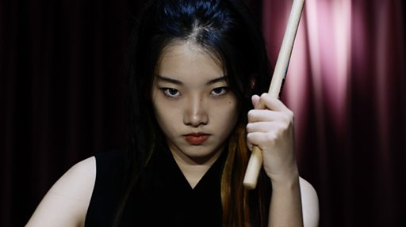

# 日本“二次元”在中国：一位年轻人的诠释与期待

#  日本“二次元”在中国：一位年轻人的诠释与期待

**日本“二次元”在中国：一位年轻人的诠释与期待**

**许多中国年轻人喜欢日本的“二次元”文化，希望将流行动漫和游戏中的元素带入到自己的创作当中。有些长辈对他们的这种爱好表示不理解。**

中国官方并没有限制这种文化进入中国市场；但也担心粉丝狂热情绪可能带来不利影响。官方曾批评过“精日”或“哈日”现象。

不过，一些年轻人则认为，国界不应该成为文化传播的界限，这样才能让创作无止境地进行下去。

董羿琳是“二次元”文化的深度爱好者，她目前在中央音乐学院学习中国打击乐。她希望将“二次元”融入到民乐创作中，推动多元化发展。

采访/摄像：真实影像 卢嘉琳、水番、雨田雨、海宁

导演：真实影像 邱嘉秋

剪辑：王溦

制片：常思颖

_（感谢边境牧羊猫和一鸣对本片的支持）_

