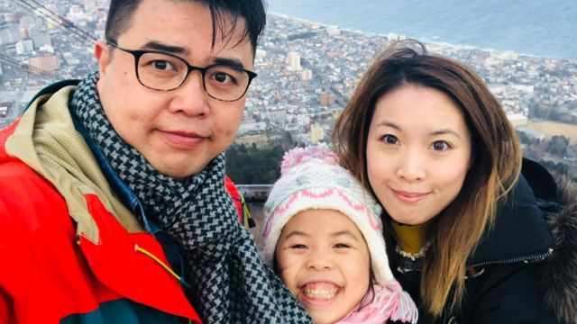
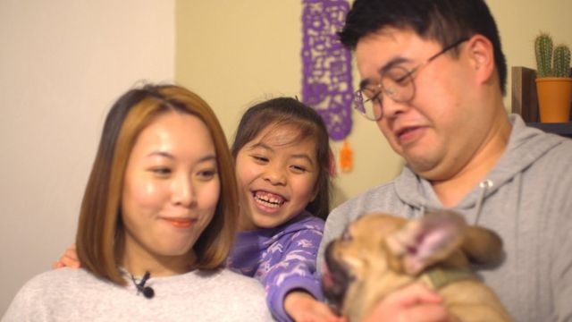
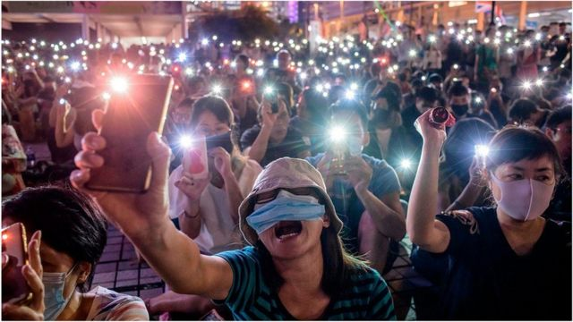
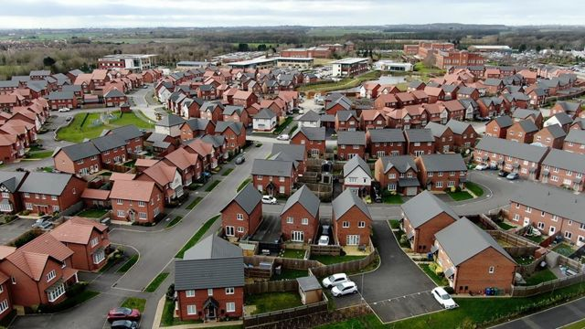
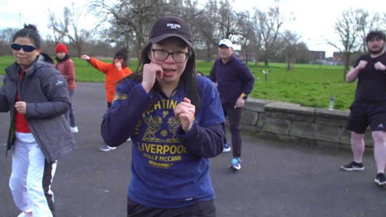
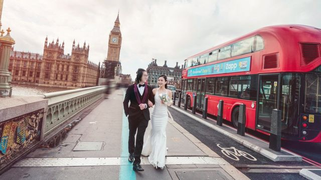

# 买楼、养儿育女与习武自卫：香港BNO移民如何在英国开启新生活

#  买楼、养儿育女与习武自卫：香港BNO移民如何在英国开启新生活

  * 张永贤 (ElaineChong) 及帕特里克·克拉汉（Patrick Clahane） 
  * UK Insight 

> 图像来源，  Yowin Mo
>
> 图像加注文字，两夫妻告诉BBC，离开香港符合女儿的最大利益。现在海莉已愉快地在当地一所小学安顿下来，其他镇上的11名香港儿童也进入该校就读。

**在过去的一年里，成千上万的香港人移居到英国。有许多人说移居英国是为了逃避香港在中国管治下的压力，亦有人说他们是被英国较慢的生活节奏所吸引。BBC采访了一些初来乍到的香港人，了解他们在英国的新生活。**

莫女士（Yowin Mo）及王先生（Eddie Wong）和他们9岁的女儿海莉（Hayley）从住在香港的高层公寓，迁移到了英格兰西北部克鲁镇（Crewe）的一个两房公寓。起初，他们在镇上不认识任何人，而且在搬家之前从未去过英国。迄今他们对英国印象很好。 莫女士说：“多数英国人都很有礼貌，很从容。”

对这一家三口来说，离开亲友和工作并不是一个容易的决定：“我爸爸哭了，他不想离开，”海莉回忆说。海莉也对搬家不太确定，但一只宠物小狗帮助她适应了新生活。

在香港，莫小姐当时做的营销工作要求很高，工时很长。王先生则是一名摄影记者。现在他们放弃了在繁华国际都市的忙碌生活，迁移到了一个房价较低、有好学校的小镇。

“我们不指望成为富人，我们仅期望在这里有一个简单的生活，女儿能快乐地成长。”莫女士说。

> 图像加注文字，莫女士（Yowin Mo）及王先生（Eddie Wong）和他们9岁的女儿海莉（Hayley）。

两夫妻告诉BBC，离开香港符合女儿的最大利益。现在海莉已愉快地在当地一所小学安顿下来，其他镇上的11名香港儿童也进入该校就读。

莫女士又解释，孩子在香港上学的压力要大得多，香港学校几乎没有操场让学童跑来跑去，而海莉当时在港每天都要做作业到傍晚七点。

但这位母亲最担心的是，她认为将女儿留在香港会被 “洗脑”。莫女士认为香港的教育体系已经发生了巨大变化，因为学童们现在正在学习中国官方批准的课程。她还担心学校会逐步停止讲粤语，而海莉将接受普通话汉语教学。“这也是我不想留在香港的原因之一。”

香港政府则坚决否认“洗脑”的说法，并说其教育系统一直在培养香港一代又一代的人才。港府还说，学生们被教授粤语、汉语普通话和英语。

莫女士的另一个担忧是审查制度。她认为女儿不会在香港电视上看到“真正的新闻”。“也许只有假新闻，你知道吗？在香港，她可能无法说任何她想说的话。”

在一个高高的书架上，在海莉够不着的地方，莫女士还保存着一本名为《反抗》（Defiance）的的摄影书，它记录了2019年香港的示威运动。书中有几张香港示威者和警察暴力冲突的照片。

这位母亲说，她期望当海莉稍大一点时，这些书中的照片能帮助他们向女儿解释为什么他们觉得必须离开。

莫女士强调：“当200万人都上街了，但政府仍然无视这些声音时，你发现这个城市已经没有希望了。”她说，“每当谈到这问题，我都会哭。”

> 图像来源，  Getty Images
>
> 图像加注文字，2019年香港的民主抗议活动资料照片。

想要改变生活的人远不止这一家三口。

根据英国政府的统计数据表明，有14万名香港人根据新的签证途径申请来英居住。2020年，北京在香港实施了一项有争议的香港《国安法》，英国称这是对自由和权益的侵蚀。

这条新的签证路线允许数以百万计的香港人能合法来英居住。在1997年香港移交中国之前，有些香港人申请了一个名叫“英国海外公民”（BNO）的身份。英国现在则允许BNO签证持有者申请在英国生活、工作和就学。BNO签证的家庭成员也能到英国来生活。5年后，签证持有者能申请英国永居。

现在，英格兰北部是一个受港人欢迎的地方。许多新移民家庭在克鲁镇、斯托克（Stoke）和沃灵顿（Warrington）定居。

相关企业也如雨后春笋般涌现，为这批移民提供移居服务。一家招聘公司已经雇用了2名讲粤语的员工，以开发新的劳动力。

斯托克市KPI招聘公司的肖女士（Charlotte Shaw ）告诉BBC：“我们发现港人在此有很大的就业机会”。

她表示，招聘公司希望香港劳动力能协助英国应对因为疫情和“脱欧”（Brexit）导致的劳动力短缺。她说：“我们发现，很多东欧人决定离开英国，已经回到东欧。”

肖女士称公司已经收到了数以千计的香港移民试图找工的信息。

迁往英国的香港人中约有70%拥有大学学位或更高学历。超过一半的人在香港曾担任专业人员或资深管理职位。到目前为止，招聘人员已经帮助香港人在客服中心、食品加工和办公室行政部门任职。

莫女士与王先生都明白，他们未必能在英国赚到彼时在香港的薪资，但他们尚有一笔卖掉香港房子的现金缓冲。莫女士说，她做收银员或接待员，而正在上英语课的先生则希望成为一名送货司机。

招聘人员为两夫妻提供了一个在肉类工厂工作10小时的机会。莫女士说：“这将是像机器人一样的工作。”

> 图像加注文字，莫女士已在克鲁镇当地的小店试了一次班，一边堆货到架上去，一边学着如何使用收银机。

同时，在沃灵顿，港人谢先生（Matthew Tse）成立了一家房地产公司，帮助同乡在英买房。他告诉BBC，他的粤语地产团队每天有20到30个新客户，平均每个客户为英国带来70万英镑资产。他还说，竞标大战已经爆发了。卖价有时会比要价高出3万至4万英镑。

一位名叫查理（Charlie）的潜在香港买家正在以大约65万英镑的价格出售她在香港的一套公寓，并一直在远程查看沃灵顿的房产，后者房价大约为22万英镑。

“我以前从未去过沃灵顿，”她承认。“但我在那里有几个朋友。我相信英格兰的大多数房子都会足够大，可以让我的孩子跑来跑去。”

> 图像加注文字，香港人一直在像沃灵顿这样的地方购买房产。

港人移居英国的兴趣越来越高，一些来自在英港人的“油管播主”（Youtuber）影片呈现爆炸性增长。他们制作影片记录英国新生活的点滴，每部影片的点击率可以从数千次点阅率起跳，内容包含在英国的新住房开发项目的评析，以及如何吃全套英式早餐的指南。

譬如，住在诺丁汉的香港人海蒂（Heidi Simpson）自从去年和未婚夫克里斯·辛普森（Chris Simpson）搬到英国后，已经成为一名全职的Youtuber。海蒂向记者说：“香港人希望看到英国的真实生活......比如如何租房子，或如何用自助结账机的影片”。

> 图像来源，  Heidi Simpson
>
> 图像加注文字，香港人海蒂其中一个YouTube视频专注于介绍英国的利兹大学。

她的影片不谈政治，但仍被北京的支持者锁定。她说，最近上传了一个关于在英国预约全科医生（GP）有多困难的影片，而这影片被一个亲北京的YouTube频道引用部分内容，作为港人即便有钱也无法在英国获得医疗照顾的证据。她觉得自己的影片被挪去用作政治宣传，警示香港人不要移民到英国。

“我感到很震惊。也很不开心。但我不知道该怎么做，”海蒂告诉BBC，她将继续制作影片，但担心她的影片被监控，她不会谈论还留在香港的家人。

而这个引用海蒂的Youtube频道，尚未回应BBC的置评请求。

除此之外，许多在香港参与抗议示威的人，已经辗转流亡到英国。

罗冠聪（Nathan Law）是最引人注目的香港民主示威者之一。目前在英国政治流亡的他告诉BBC称，若他回港将面临监禁。但即使在英国，他仍是北京大外宣和网络攻击的目标。

他说：“你面对的是世界上最大的专制政权，他们的触角可能会延伸到英国社会的每个角落......而且他们可以调动必要的资源，以多种方式伤害你。”

自从抵达这里，他个人遇到的最严重的威胁之一来自中国的网络信息服务，有一个用户悬赏1万英镑，要求网友提供他在英国居住的详细信息。

因此，他说自己现在在公共场所出入都很谨慎：“我很少和邻居交谈，也很少去酒吧，因为你永远不知道自己的行踪是否会落入坏人手中”。

但他拒绝让这一点阻止他的政治工作：“我需要有足够的勇气来继续。如果我放弃香港民主工作，那么这就是中国共产党的胜利。”

但是，BBC发现有证据表明，偶尔会有来自香港的紧张局势在英国浮现。一些在英港人告诉我们说，他们在网上甚至是当面，还是会受到一些北京或港府支持者的辱骂。

艾伦（Alan，化名）说他在去年秋天的一个晚上遭到一群华人男子的袭击，之前他曾对他们叫喊支持香港的口号。

> 图像来源，  Alan
>
> 图像加注文字，艾伦（化名）说他在去年曾遭到一群华人男子袭击，因为他曾向他们叫喊支持香港的口号。

“当时大约有10个人追着我，其中一人把我推倒在地，”他说。

艾伦的头部和肋骨各被踢了一脚。艾伦给记者看了一张他的脸部照片，布满鲜血。英国警方后来逮捕了两名与此事件有关的人，但此案现已撤销。

“我很生气和恐惧，因为这是在英国，而不是在中国。我怎么能忍受这种痛苦？”他说。 “这是一个以民主和法治著称的国家。”

在利物浦，克莉丝蒂（Christie）在听到涉及港人和中国共产党支持者的类似暴力相向的事件后，决定开始教授武术自卫课程。 她向学员展示了如何能运用武术抵御对方的暴力攻击。 “我们需要让香港人在遇到这种情况时，能具备保护自己的一些基本技能，”她告诉BBC。

> 图像加注文字，在利物浦，克莉丝蒂（Christie）在听到有关港人在英国遭受暴力的事件后，决定开始教授武术自卫课程。

但对其他人来说，英国生活仍是平静的。

莫女士已在克鲁当地的小店试了一次班，一边堆货到架上去，一边学着如何使用收银机。她表示：“只要它能支持我的基本生活，对我来说就足够了。”

> 图像来源，  KaFu Wedding Photography UK
>
> 图像加注文字，克里斯和海蒂在伦敦大本钟附近拍摄婚纱照。

海蒂和克里斯则正在准备婚礼。 婚纱照的拍摄地选在“最英国”的场景——英国议会大厦的背景前。

在港的家人无法来英出席婚礼，她对此感到难过，但仍计划留在英国。她说： “我们看不到香港的未来。”

