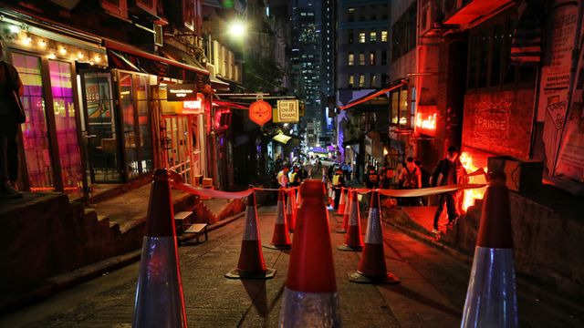
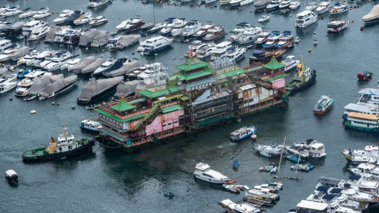
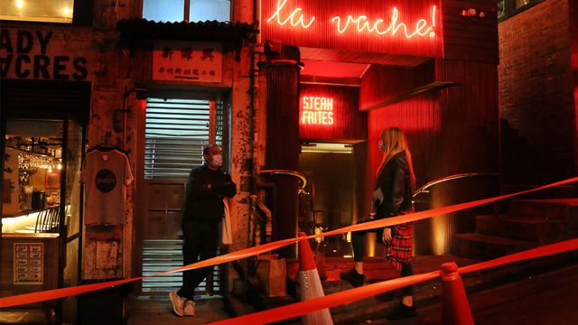
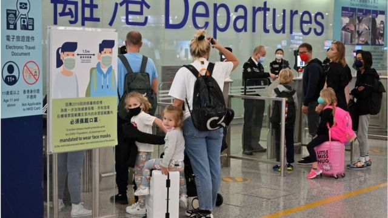
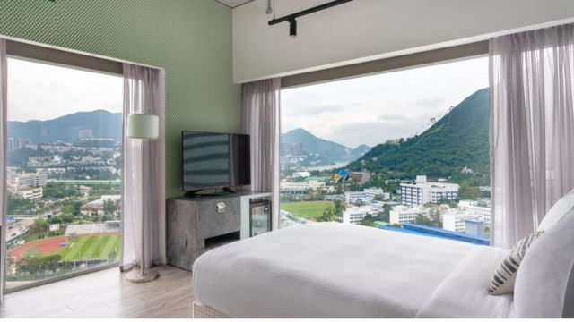

# [Chinese] 香港经济：“0+3”入境新政是否足以拯救奄奄一息的旅游业

#  香港经济：“0+3”入境新政是否足以拯救奄奄一息的旅游业

  * 吕嘉鸿 
  * BBC中文 

> 图像来源，  BBC Chinese
>
> 图像加注文字，这两年大批警员在Soho一代戒备巡逻，在一条拥有多家餐馆的小巷内拉起警戒线。

**“大流行之前，中国大陆客人占我们客人的比例约15%，是我们客人组合的重要组成部分，我们非常想念他们。然而，我们还更多地依赖来自美国、英国、澳大利亚和亚洲其他地区等国家的国际旅客。他们只有在 0+3 政策也取消后才会大量回流。”**

这是香港酒店奥华（Ovolo）集团总裁Girish Jhunjhnuwala面对港府放宽入境检疫政策的回应。他告诉BBC，曾经加入隔离酒店的奥华对香港入境新政表示欢迎，但直言要吸引失去的国际旅客来港，“0+3”远远不够。

“0+3”政策指来港旅客无需酒店隔离，但三天内仍然不许进入餐馆、酒吧等指定场所。

随着新冠肺炎疫情趋缓，香港政府在经济和就业压力下，宣布逐步放宽入境检疫措施。港府9月底推出“0+3”政策，希望吸引全球人才“回心转意”来港，同时挽救香港经济支柱之一的旅游观光业。

> 图像来源，  Getty Images
>
> 图像加注文字，香港珍宝海鲜舫水上餐厅的退场，被一些看作是当下香港的一个象征

香港特首李家超将在10月19日发表施政报告，港媒预测，除非疫情逆袭，否则他有极大机会宣布回归常态，采取“0+0”挽救香港经济。

然而，这两年多来新冠疫情带来的伤害业已造成。

在疫情及防疫政策冲击下，香港的旅游观光业遭受重击。据本地媒体 报导  ，香港旅游业的本地生产总值（GDP）占比，由2018年的4.5%下坠至2019年的3.6%。2020年，新冠疫情打击下，其产值占比暴跌至2020年的0.4%。访港旅客由2019年的5591万人次，在2020年急坠到357万人次，2021年只剩下9.1万人，观光旅游业奄奄一息。此外，长期被视为香港购物观光主力之一的大陆客人，在两地未能实现双向自由通行的情况下，似乎难以为香港注入活水。许多大陆网友说，就算香港开放，回大陆后，要再隔离多日，因此此刻来港并不是首要选择。

BBC中文访问了在香港知名网上旅游预订平台Trip.com，以及奥华酒店集团，了解他们对于香港“0+3”政策的看法。

##  黑暗中等待黎明

今年农历新年期间，新冠变种病毒奥密克戎蔓延全球，在香港，面对传播力极高的变种病毒，接种疫苗意愿普遍偏低的香港长者成为这波疫情下的首要受害者。各大医院门口排起长队，私家医院不收治新冠病人，香港医疗濒临崩溃，震撼国际。

香港与北京同步采取了严格的防疫措施。许多金融界人士或公司对香港望而却步，有的甚至搬离香港去了新加坡或其他地方。

今年二月，记者认识的外籍白领人士莫里森被外派到一间知名事务所的香港办公室。她费尽千辛万苦，在亚太区主管协助下，终于拿到签证来到香港。但在今年一月底拿到签证时，刚好是香港疫情最为险峻时刻。因为自北美入境，她需先在条件简陋的竹篙湾隔离中心待上21天进行强制检疫隔离。做了无数次的核酸及快筛检测后出关后，她看到的是冷清的城市，许多餐馆突然宣布不再营业或只做外卖，数万港人持BNO签证离港赴英，香港机场出境处有时比旺角街头热闹，曾经闹腾的兰桂坊酒吧区宛若鬼市。

一个月后，莫里森赌上在这家公司职涯归零的决定，无预警地辞职离港回乡，与亲友团聚，另谋工作。

> 图像来源，  BBC Chinese
>
> 图像加注文字，与疫情前相比香港SOHO繁华程度仍有相当距离。

根据《 纽约时报  》，香港投资基金公会称，最近一项调查显示，超过三分之一的基金投资公司称已将地区和全球高管全部或部分迁出香港，直接影响香港的劳动力萎缩到近10年来的最低水平。香港股市，亦在美升息及内部压力下，港股自2021年中30000点左右的高位，开始探底，今年累计已暴跌6174点（26.39%），外资及投资者却步不前，其竞争对手新加坡成为离港人士首选。

此次实施地“0+3”政策，对香港旅游业许多业者来说，是期盼已久的甘霖。根据港媒报导，政策宣布当日香港国泰航空的网站塞车，查询或下订的客人需要排队等待进入网站。

旅游网站Trip.com香港地区电子商务主管叶卓铭通过电子邮件回覆BBC中文说，在港府宣布0+3政策之后的周末期间（9月24-25日），Trip.com上香港出境航班订单量比上周同期增长近400%。 叶先生表示，该网站航班方面香港，前五的出境目地名为：曼谷、首尔、东京、新加坡、大阪，订单量比上周同期分别增长628%（曼谷）、700%（首尔）、1385%（东京）、 197%（新加坡）、 7300%（大阪）。

至于入境趋势，叶卓铭分析，Trip.com入境香港航班订单量比上周同期增长155%。以航班方面，该公司数据显示前五入境香港依序来自曼谷、伦敦、新加坡、台北、曼彻斯特，而订单量比上周同期分别增长200%（曼谷）、132%（伦敦）、139%（新加坡）、180%（台北）、69%（曼彻斯特）。“亚洲范围内的短途旅行趋势更加明显，大部分的出境航班订单将在国庆和圣诞假期进行。我们香港用户预订海外酒店的平均天数现在是 3-4 天。”叶卓铭说。

过去，Trip.com在疫情期间，该公司的策略是与隔离酒店合作，或全力促销港人在香港酒店进行本地度假。

对港府何时与大陆通关，该公司表示也翘首期盼。

叶先生称，在上周末，经由大陆携程网预订香港酒店的订单也比之前一周增长了35%。“0+3”政策的公布，在当前的条件下对于内地商旅客和游客都是利好消息，“我们也期待有进一步的积极政策并与公众一样，热切地期盼与内地尽早通关，”

請稍等

不过，对许多大陆网友说，就算香港开放，若回大陆后要再隔离多日，在此情况下，来往香港尚不是首要选择。

自香港入境大陆的旅客，目前隔离天数为“7+3”﹐即是7天集中隔离医学观察+3天居家健康监测，总共10天隔离。港府正与大陆商讨推动“逆隔离”﹐亦即选定香港一个地点完成隔离后，再以闭环方式进入深圳等地，但相关安排仍未公布。

##  酒店：恢复常态尚需时日

香港在地的一些酒店业者认为，仍需要更好的计划刺激香港旅游业。

> 图像来源，  Getty Images
>
> 图像加注文字，很多在香港工作的白领“外派人员”，在新冠疫情期间已经离开这个城市

自香港起家的奥华集团总裁Girish Jhunjhnuwala向BBC解释，这项政策是迈出了一大步，但仍有太多限制措施。“商务和休闲旅客还不会大量的回流香港，但对探望亲友的人确实有所帮助。但若我们要从新冠疫情造成的经济衰退中完全恢复，香港需要取消剩余的边境限制。”

Jhunjhnuwala强调，由于大多数商务旅客都是短期访问，为期三天的监控可能会限制他们的到来，因为在现行的0+3政策下，游客在三天的监控期间禁止踏入餐馆和酒吧内用餐，而且仍然还有二维码、出发前快筛测试和其他限制行动的防疫要求，“这会让国际游客可能还是选择拜访其他地方而非香港。”

“我们盼望政府能尽快宣布进一步放宽限制，让香港重回真正的全球城市前沿的地位。”他强调。

疫情爆发后，奥华酒店的入住人数及收入下跌了50%，对集团来说打击甚大。奥华后来加入了隔离酒店。Jhunjhnuwala观察，许多酒店担忧，一旦作为隔离酒店，可能会带给饭店“污名”，但他认为酒店需要负起社会责任。他认为，酒店在疫情中学到的课题之一，是有关维持深度清洁及人员安全的技术增进。此外，如何协助旅客在隔离期间的心理健康支持，亦是新课题。

> 图像来源，  Ovolo Group
>
> 图像加注文字，奥华认为，在取消隔离酒店之后，虽然香港放松入境管制，自己的入住率还会下降。

Jhunjhnuwala强调，香港虽然现在取消了强制酒店隔离的，但对防疫酒店来说，入住率可能还会进一步下降，直到这座城市像新加坡、泰国、日本和最近的台湾等邻居一样解封，酒店业才能完全恢复。

“大流行前，旅游业是香港经济的主要支柱之一，为 GDP 贡献了超过 420 亿美元，因此感受到这种痛苦的不仅仅是我们酒店，而是整个城市。”他告诉BBC。

不久前，香港特区财政司司长陈茂波称，香港本财政年度恐将录得1000亿港元赤字（127.39亿美元），他还警告称，2022年香港经济濒临负增长边缘。

