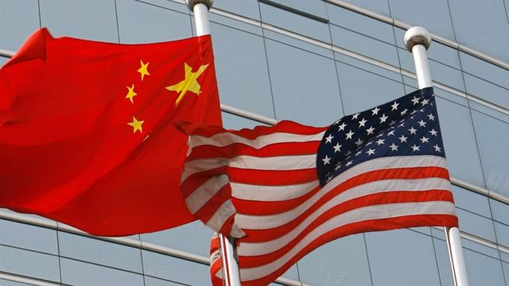
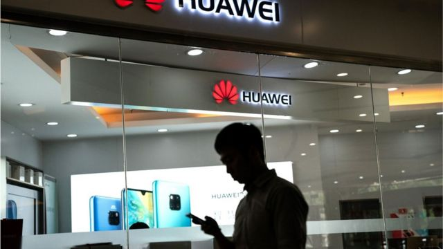

# 美国瞄准“制高地”领域与中国脱钩， 将大疆等公司列入黑名单

#  美国瞄准“制高地”领域与中国脱钩， 将大疆等公司列入黑名单

> 图像来源，  AFP

**美国国防部近日宣布，将新一批中国公司列入黑名单，其中有中国知名无人机制造商大疆创新、深圳华大基因等。**

这是美国国防部公布的第二批黑名单。去年6月，美国国防部公布的首批黑名单包括华为、中国移动和中国电信等公司，意在对抗中国的“军民融合”。 有专家分析认为， 这些公司代表美国意欲与中国脱钩的一些“制高地”领域和核心技术。

##  黑名单

最新一批进入美国国防部黑名单的中国公司有13家，其中包括大疆创新、深圳华大基因、360科技、中国中建等。

“国防部决心要重视并对抗中国的军民融合战略，该战略通过确保中国公司、大学和研究项目获得、发展先进技术和专业知识，支持中国人民解放军的现代化目标，而这些机构看上去是民用机构。”美国国防部通告指。

美国国防部还称，这些公司直接或间接地在美国运作，他们将继续酌情增加更多实体，更新清单。

这份名单禁止美国公司买卖目标公司公开交易的证券。

去年6月，包括电信设备制造商华为在内的首批约50家中国企业被列入该名单。

当时，美国总统拜登签署了一项行政命令，禁止美国实体投资这些据称与国防或监控技术行业有关联的中国公司。

这项命令旨在阻止美国投资支持中国的军事工业综合体，以及军事、情报和安全研发项目。

> 图像来源，  Getty Images
>
> 图像加注文字，去年6月，包括电信设备制造商华为在内的首批约50家中国企业被列入该名单。

这是拜登针对中国采取的一系列措施的一部分，措施还包括在中美关系日益恶化之际，加强美国的盟友关系，寻求在国内进行大规模投资，增强美国的经济竞争力。

大疆在美国的发言人亚当·利斯伯格（Adam Lisberg）对半岛电视台表示，该公司是唯一一家不鼓励将其产品用于军事用途的无人机制造商，并反对将其列入黑名单。

“大疆不属于法律规定的列入名单的任何类别公司。 DJI 在中国、美国或其他任何地方都不是一家军事公司。 DJI 从未设计或制造过军事设备，也从未在任何国家营销或销售其军用产品。相反，我们一直在开发造福社会和拯救生命的产品。我们随时准备正式挑战这个名单。”

##  美国的担忧

澳洲国立大学亚太学院讲师宋文笛对BBC中文表示，美国政府走向“全社会”之力动员私有部门一同预防中方“军民融合发展” ，维护美国技术优势，并不令人意外。

他指出，这是美中战略竞争的自然发展。

“以美国角度而言，既然美中战略上斗而不破，经济完全脱钩亦非一蹴可及，自然会优先在涉及核心技术和大数据等的经济‘制高地’优先脱钩，以确保美国经济的质量优势。”宋文笛说。

他还指出，美中政治体制歧异的影响在美中竞逐年代被放大化。

“美国疑虑中国政治经济体制下民间企业的自主性。无论是已经于十九大进入党章的‘党政军民学，东西南北中，党是总管一切的’指导思想，或是近五年来设立的‘军民融合’框架，皆让美国担心和中国企业交往中分享的技术容易出现'民为官用'、'军民两用'现象。”他说。

