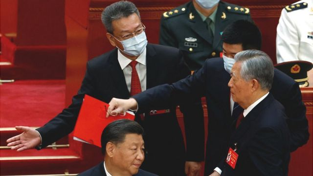
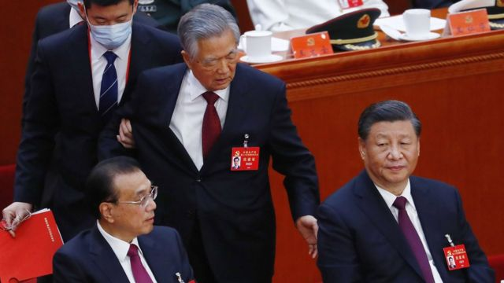

# [Chinese] 胡锦涛“被离场”引发诸多猜测 新华社英文推特回应原因

#  胡锦涛“被离场”引发诸多猜测 新华社英文推特回应原因

最近更新： 6 小时前

**中国官方通讯社新华社周六（10月22日）在英文推特官方账号对中国前领导人胡锦涛在二十大闭幕会中途离开会场进行回应。**

报道称，其记者获悉，胡锦涛“会议期间身体不适，工作人员为了他的健康，陪他到会场旁的房间休息。”

报道补充称，胡锦涛最近在养病，“现在好多了”。

不过，中国国内媒体并未报道该事件，新华社的声明也未见诸于其中文网站和社交平台。

以下是BBC驻北京记者麦迪文（Stephen McDonell）写的分析文章：

> 图像来源，  Reuters

胡锦涛在中国人民大会堂台上被要求离场的镜头引起了全球关注，人们试图弄清楚刚发生的事情。

有很多问题，但到目前为止，中国政府没有给出答案。

中国前领导人胡锦涛一度似乎不愿离开。如果是真的，为什么？他对继任者习近平说了什么，让他点头？他在被领下台前拍了拍门生李克强的肩膀，对李克强又说了什么？

他被带离会场最有可能的两个原因是，要么展示了中国强权政治的一面——一个代表旧时代的领导人被象征性地带走，要么就是胡锦涛有严重的健康问题。

一个星期以前，大会的第一天，胡锦涛在一名工作人员的协助下走入会场，那一天他看起来很虚弱。

但是，如果他是因为身体不好而被带走的，为什么会突然发生这种情况？为什么在镜头前？是紧急情况吗？

今天拍摄的一段较长的视频剪辑显示，习近平转向前党总书记，与此同时在胡锦涛的左边，高层官员栗战书和王沪宁似乎也很担心。栗战书甚至一度要起身协助，但王沪宁把他拉回座位上，就像是在说，“别插手。”

> 图像来源，  EPA
>
> 图像加注文字，胡锦涛被带离会场

胡锦涛还一度伸手出去好像要去拿习近平面前的文件，这个时候他看起来很困惑，习近平也随即伸出手压住卷宗，阻止胡锦涛拿走文件。

共产党的大会通常高度脚本化，这让人们猜测胡锦涛离开的时机可能并非突发事件。他在大会最后一天早些时候参加了闭门会议，然后当天的最后一段时间允许媒体进入。就在摄像机设置好之后，官员走向胡锦涛并示意他离开。

虽然如此，共产党通常不会把私底下的讨论和争执拿出来公开展示，如果这是一次刻意的安排，那么就代表这和通常做法不一样。

胡锦涛代表了一个与习近平截然不同的中国。他更强调集体领导，必须平衡政治局常委中的各个派系。胡锦涛的年代被视为对外开放和对新思想的包容性增加的时期。

2008年北京奥运是中国在国际舞台上曝光的巅峰，外商企业在中国设立，国际游客不断涌入，互联网比现在更自由，境内媒体尝试开始做像样的新闻，中国的全球声誉也持续改进。

虽然有些人评价胡锦涛是“弱主”，但是他执政十年中国经济经常呈二位数成长，中国也更在乎其国际声誉。

作为党的总书记，习近平将国家带向了截然不同的方向，他是“核心”，不能被挑战。

在现任政府的带领和鼓励下，现在中国民族主义情感大爆发，对其他人如何看待中国毫不在乎，中国向其他国家释放的信息是中国的时代来临了，要跟中国作对是自取灭亡。

对内则以党为最高领导，习近平上任后以反腐为名肃清所有政敌。现在，习近平利用这次大会清除了所有在政治、经济和社会上和他持不同意见的剩余势力。

如果胡锦涛能明白的话，他在二十大上看到的是新一届205个人中央委员会的组成，当中不包括李克强或汪洋，他们都被视为经济自由主义者，都与上一届政府的思想有关。

这表明，新的政治局常委会将充斥着习近平的拥护者，确保继续朝着和胡锦涛时代的改革开放截然不同的方向前进。

