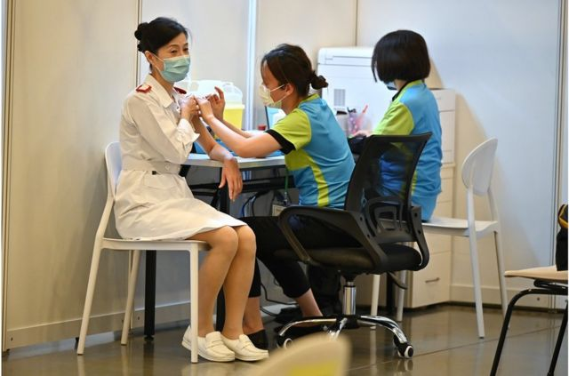
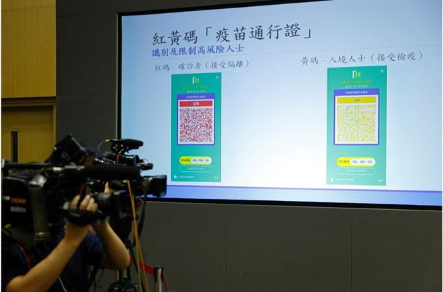
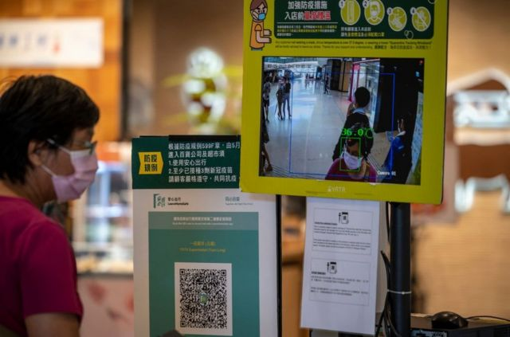
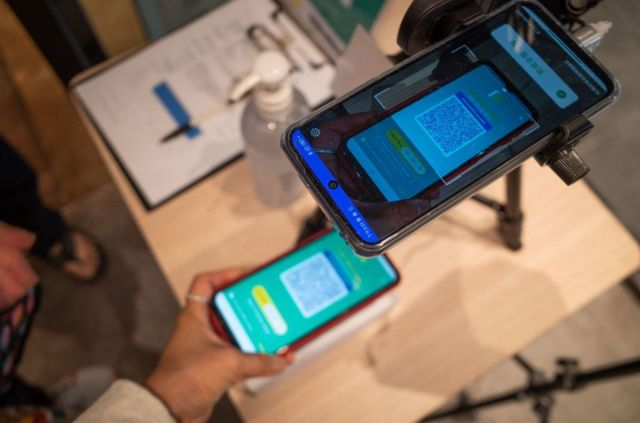
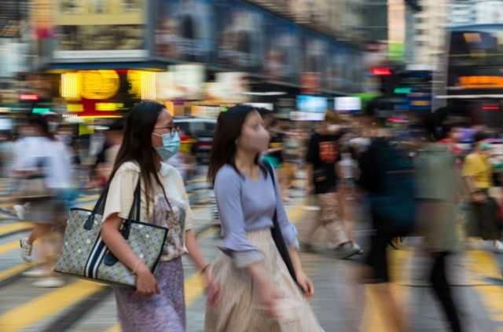

# [Chinese] 香港“免针纸”事件：涉案医生遭逮捕与市民冒险付高价索取背后的故事

#  香港“免针纸”事件：涉案医生遭逮捕与市民冒险付高价索取背后的故事

  * 黃穎 
  * BBC中文特約撰稿人 

> 图像来源，  EPA
>
> 图像加注文字，一名医护人员在香港一家诊所接种COVID-19新冠疫苗。

**37岁的工程师王乐伟（化名）凝视着手上在10月12日便会失效的“新冠疫苗接种医学豁免证明书”，一脸无奈。数个月前，在朋友的介绍下，王乐伟找到一名私家医生，成功拿到“免针纸”，可以豁免接种一定剂量的疫苗进入指定的场所。现在离有效期还有不到三天，王乐伟仍然踌躇着是否要鼓起勇气去注射疫苗。**

香港警方近日展开拘捕行动，至今共有7名私家医生涉滥发“新冠疫苗接种医学豁免证明书”（俗称“免针纸”）而被捕，事件引起广泛回响。

根据警方资料显示，这7名医生一共发出了28000多张“新冠疫苗接种医学豁免证明书”（俗称“免针纸”），每张证明收费由港币500至3000不等。调查发现，其中一名医生由今年2月至6月期间共发出6600多张“免针纸”，涉金额高达2000万港元。与此同时，有26名取得相关“免针纸”的病人被捕。

其中10月7日（周五）警方最新拘捕4名公务员，当中包括小学教师及社工。据了解，警方经调查后发现，有人的身体健康状况与获发“免针纸”的条件不符，以涉嫌“串谋诈骗”将他们拘捕。

香港政府同时宣布，这7名私家医生签发的“免针纸”于10月12日开始失效。王乐伟光顾的医生也是7名被捕医生的其中一名，因此，他手上的“免针纸”也会在12日失效。

“免针纸”事件引发社会广泛讨论，由于政府鼓励市民接种疫苗，并规定市民需接种一定剂量疫苗才能进入很多场所，社会质疑不适合接种疫苗的病人权益及不愿意接种疫苗的人士之自由是否被尊重。

根据香港西医工会会长梁汉辉表示，涉及2万多名病人中，粗略估计，真正有需要发“免针纸”的比例少于10%。然而，索价数千元一张的“免针纸”，仍有市民问津，有医生最高纪录是单月开出6000张，平均每日逾200张。市民不惜冒风险及付出昂贵的费用获取“免针纸”，这里背后说明了什么？ BBC中文访问了两名获取“免针纸”的人士，剖析个中原因。

##  心理阴影与不信任

> 图像来源，  Reuters
>
> 图像加注文字，香港政府于今年年初分3个阶段推行“疫苗通行证”，市民进入指定处所时都要扫描“安心出行”二维码（QR Code）或出示“安心出行”流动应用程式（App）内的针卡方可进入。

王乐伟从小就对药物容易产生敏感，他对BBC中文坦言，担忧注射疫苗会产生不良反应，因他曾听闻及目睹身边的朋友和同事因为注射疫苗后身体出现严重不适，要送往医院急救，幸好及时抢救后才捡回一命。从此，心理阴影加上对疫苗的不信任，他宁愿选择不接种疫苗。

香港政府于今年年初分3个阶段推行“疫苗通行证”，市民进入指定处所时都要扫描“安心出行”二维码（QR Code）或出示“安心出行”流动应用程式（App）内的针卡方可进入。此计划的影响范围广泛，至今年六月，“疫苗通行证”甚至扩展至医院部分部门及专科门诊等医疗处所，可谓与生活息息相关。

与此同时，针对一些不适合接种疫苗的市民，卫生署在今年初推出“新冠疫苗接种医学豁免证明书”（“免针纸”）措施。他们由公立医院或私家医生检视身体情况后，确定符合卫生署的指引签发“免针纸”，在“疫苗通行证”下，能进入食肆和表列处所时， 有效期为90天，最长是180天。

根据香港卫生署向私家医生发出的指引，大部分人都适合接种本港现时提供的两款疫苗，即“科兴”及“复必泰”疫苗。其中，不适合接种疫苗的医学原因包括对两款现时香港提供的新冠疫苗均有严重即时过敏反应（例如出现休克、呼吸困难或血压下降等症状）。

卫生署强调，在考虑签发豁免证明书时，医生须参考卫生署的指引，并遵从《香港注册医生专业守则》，根据临床判断，就病人是否符合清单上不适合接种的原因作出临床决定。另外，医生只会在证实相关人士并不适合接种上述两款疫苗后，才会发出“豁免证明书”。

> 图像来源，  Getty Images
>
> 图像加注文字，政府推行“疫苗通行证”政策之后，市民需要接种一定数量的疫苗才可以获得通行证，这个通行证对于日常生活工作什至去医院法庭都有一定的影响（图为香港一家购物中心内的商店入口处放置了“安心出行”二维码和温度检测点）。

香港病人政策连线主席林志釉接受BBC中文访问时表示，政府推行“疫苗通行证”政策之后，市民需要接种一定数量的疫苗才可以获得通行证，这个通行证对于日常生活工作甚至去医院法庭都有一定的影响，促使市民要选择接种疫苗。

然而，林志釉表示，有病人向他反映，公立医院的医生倾向不愿意发出“免针纸”：一则门槛很高，二是公立医院医生们都担心发出“免针纸”后要解释。林志釉向BBC中文表示，曾经有一个个案，公立医院病房医生确认病人不适合注射疫苗，不管是那一种疫苗；然而医生仍然拒绝签发“免针纸”；因此，私家医生是唯一有希望拿取“免针纸”的地方。

家庭医生林永和对BBC中文表示，“免针纸”市埸的出现，源于有一批市民选择不接种疫苗，他们或基于身体理由，不适合接种疫苗；但有一批纯粹心理因素，可能对接种疫苗有顾虑或负作用，他们因工作需要或个人需要出入指定场所，因此需要找较“手松”（宽松）签发“免针纸”的医生。而一些医生顺应这些需求，不惜以身试法，挺而走险。

因工作原故，王乐伟要出入许多场所包括大学及博物馆，全部均要求三针疫苗接种。由于没有重大疾病纪录，王深明公立医院医生不会签发“豁免证明书”给他。及后在朋友介绍下，王决定花数百块去拿取“免针纸”。签发“免针纸”的医生，就是7名被捕的医生之一。

王乐伟对BBC中文表示，当他听到签发医生纸的医生被拘捕，“心凉了一截！”当天他向医生详细解释自己药物敏感的情况，医生经过充份判断，相信他的身体不适接种疫苗才签厂发“豁免证明书”给他，而且费用是港币数百元，收费颇为合理，他相信签发医生并不存在敛财，而他也没有任何诈骗的动机，纯粹是担心，万一像朋友一样接种了疫苗而差点送命，谁来照顾家里年迈的母亲？他告诉BBC中文，“豁免证明”让他可以安心工作，过日常生活，感到最起码的尊重。

##  “等于砸掉饭碗”？

> 图像来源，  AFP via Getty Images
>
> 图像加注文字，一名妇女在香港一家餐馆门前扫描二维码以获取政府的"疫苗通行证"。

王乐伟的个案并不罕见。48岁的邱易蓉在十多岁因一次意外入医院治理，差点没命，医生千叮万嘱她有严重药物敏感，切忌注射药物。去年邱易蓉因病入住进东区尤德医院，当时病院医生确认她的情况不适合接种疫苗，并开出“医生纸”，豁免她接种疫苗。今年初，香港政府推行“疫苗通行证”，而新措施规定“免针纸”必须载有二维码，才可以进入规定的处所。

邱易蓉于是前往伊利莎白医院请医生重新签发“豁免证明书”，然而医生坚持不肯签发。后来，她再向香港医管局投诉，却不果；及后，医管局又把案件辗转至葛量洪医院，等了个多月，回覆信件中表示：看不到有不适宜接种疫苗的情况。

邱易蓉是保安公司的客服助理员，公司规定一定要接种三剂药苗。 “我要生活，没有‘免针纸’，等如砸掉饭碗”。她于是找了私家医生去签发“免针纸”，并把之前公立医院医生写给她的豁免书给医生看，结果成功拿得一张“免针纸”，惟有效期只是三个月，截至10月底。

正当开始忧虑十月底便要再拿“免针纸”时，突如其来感染了新冠肺炎病毒，变相“赠送”了邱女士半年的时间，可以不用接种疫苗（新冠康复者有180日的疫苗豁免期），“惟有见步行步”，邱易蓉无奈道。

邱易蓉对BBC中文表示，如果身体情况许可，她非常乐意接种疫苗，因为公司对接种疫苗的同事有假期及奖金的鼓励，无奈自己身体不能承担接种疫苗的风险。现在公司对她迟迟未打疫苗颇为不满。她批评政府的措施“一刀切”，对于他们这些身体因素不能接种疫苗的人，仿佛迫到没路可走。

家庭医生林永和认为，不少病人都认为自己不可以接种疫苗，但一般而言，不适合接种疫苗的人数极少。他强调自己对一些要求签发“免针纸”的病人会详细询问他们的病历及仔细评估，至今，他签发的“免针纸”不多于十张。

##  滥发“免针纸”与“寒蝉效应”担忧

> 图像来源，  Getty Images
>
> 图像加注文字，孔繁毅强调，部分不接种疫苗的人对疫苗有错误的理解，因此，要针对网上的谣言或不真确的讯息而辟谣，如果疑虑消除，这些人便不会挺而走险（图为路人在香港铜锣湾过马路）。

“香港病人政策连线”（Hong Kong Patients' Voices）主席林志釉对BBC中文表示，担心警方执法后有“寒蝉效应”，令医生忧虑签发“免针纸”有后果。林志釉更获悉，有病人即使患有长期病，或者对药物敏感，身体状况未必适合打针，但咨询医生意见时仍不获发“免针纸”，甚至有公立医院医生表明，即使病人不适合打针，仍拒向其签发“免针纸”, 林志釉担心病人日后更难取得“免针纸”。

“豁免证明书”在10月12号日便会失效，王乐伟深信警方的拘捕将会带来“寒惮效应”，其他私家医生将会更严谨、甚至不愿意签发“免针纸“。他必须在维持生计及接种后身体有机会不适的两难中作出选择，否则饭碗不保。王乐伟对BBC中文表示，他深感无奈，强调每个人选择接种疫苗与否的自由及权力应该被尊重，而不是被剥削。

政府专家顾问、港大医学院内科学系传染病科主任及临床教授孔繁毅接受BBC访问时表示，市场上医生滥发”免针纸“的行为非常不当，须予以指责，而市民愿意冒高风险或昂贵诊金，知法犯法。

孔繁毅强调，部分不接种疫苗的人对疫苗有错误的理解，因此，要针对网上的谣言或不真确的讯息而辟谣，如果疑虑消除，这些人便不会挺而走险。针对这个事件，关键是要多教育及解说，两只提供的疫苗非常安全及有效，不单保护他们自己个人，更是保护他们家人；另外疫苗可以防止重症，他们接种是非常安全的。

孔繁毅重申，随着香港九成半市民已经接种两针疫苗，真正不能接种疫苗的人，数量非常少，而医生需详尽分析、了解病人病历，并进行解说工作，让索取”免针纸“的人士消除疑虑，让他们安心接种。

