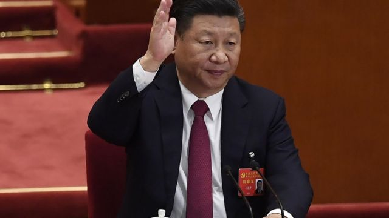
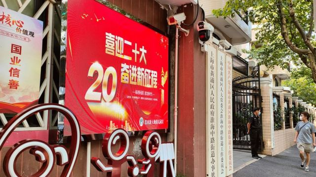
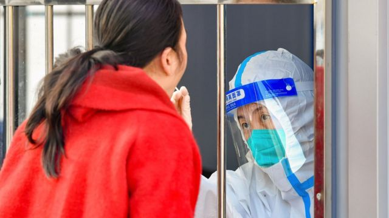

# [Chinese] 中共七中全会：如何看待“国内政治优先”？和台湾及乌克兰议题有关吗？

#  中共七中全会：如何看待“国内政治优先”？和台湾及乌克兰议题有关吗？

> 图像来源，  Getty Images

**二十大召开前一周，中共十九届七中全会全面肯定了领导人习近平过去5年的执政。政治学者对BBC中文表示，全会公报肯定习近平取得的成就，为他在二十大连任做了舆论上的准备。另一方面，公报强调“国内政治优先”和“国家利益为重”，则意味着中国在处理外交问题时，会以国家利益为优先考量。**

##  再提“两个确立”

七中全会10月9日至12日在北京举行。会议高度肯定了十九大以来的五年，称是“极不寻常、极不平凡的5年”。
 会议公报  强调习近平的领导作用，称党的十九大以来5年党和国家事业的重大成就，是在以习近平同志为核心的党中央坚强领导下、在习近平新时代中国特色社会主义思想指引下全党全国各族人民团结奋斗取得的。

“党确立习近平同志党中央的核心、全党的核心地位，确立习近平新时代中国特色社会主义思想的指导地位，反映了全党全军全国各族人民共同心愿，对新时代党和国家事业发展、对推进中华民族伟大复兴历史进程具有决定性意义。”公报指出。

在香港和台湾问题方面，公报指出，依照宪法和基本法有效实施对特别行政区的全面管治权，落实"爱国者治港"原则，香港局势实现由乱到治的重大转折。坚持一个中国原则和“九二共识”，展示了我们维护国家主权和领土完整、反对“台独”的坚强决心和强大能力。"

中国独立政治学者陈道银对BBC表示，公报肯定习近平这十年取得的成就，是为他在二十大连任继续担任党和国家领导人做舆论上的铺垫。

##  “国内政治优先”

值得注意的是，公报还提到：“坚持国家利益为重、国内政治优先，保持战略定力，发扬斗争精神，在斗争中维护国家尊严和核心利益，牢牢掌握了我国发展和安全主动权。”

澳大利亚国立大学亚太学院讲师宋文笛对BBC中文分析，这段陈述示意中共在国际与台湾议题上意图回归耐心，在中共内部鹰派和鸽派之间取得平衡。

> 图像来源，  Getty Images

“一方面在涉及国家尊严和核心利益等敌我矛盾议题时需得敢于亮剑、勇于斗争。二方面也希望‘斗而不破’，维持‘战略定力’。因为凡事当以中共自身的内部发展和安全利益为优先，处理台湾议题时必须以不扰乱中华民族伟大复兴的时程之大局为原则，凡事做全盘考量，维持‘主动权’，不要轻易随外部势力‘挑衅’而过度反应。这是对于所谓武统台湾的声浪踩煞车。”宋文笛指出。

宋文笛还表示，公报强调“国内政治优先”和“国家利益为重”，也意味着在俄乌战争期间，定调中国将维持独立自主外交立场，不会和俄罗斯绑定，也不会因为和俄罗斯所谓“上不封顶”的伙伴关系就甘于和俄罗斯同进退，不会不必要地自绝于国际社会，尤其是西方。

陈道银也认为，这句话传递的信号是：中国处理和其他国家的关系，首先考虑自己的国家利益，而不是受外界的影响，比如西方的压力、俄罗斯对中国的要求。

> 图像来源，  Getty Images
>
> 图像加注文字，中共七中全会召开之际，官媒《人民日报》连发三篇文章，力挺"清零"。

中共七中全会召开之际，官媒《人民日报》连发三篇文章，力挺“清零”，但七中全会没有谈到未来对于疫情防控的要求。

陈道银认为，近来有媒体报道和传闻指，二十大或者明年两会后，中国就会放开“清零”政策，某种程度上“清零”成为二十大的负面包袱，这几篇文章是对这些传言的回应。

“这是告诉大家，清零和二十大以及明年两会没有关系，是中国防疫的要求，我们现在的防疫是最好的。”陈道银说。

