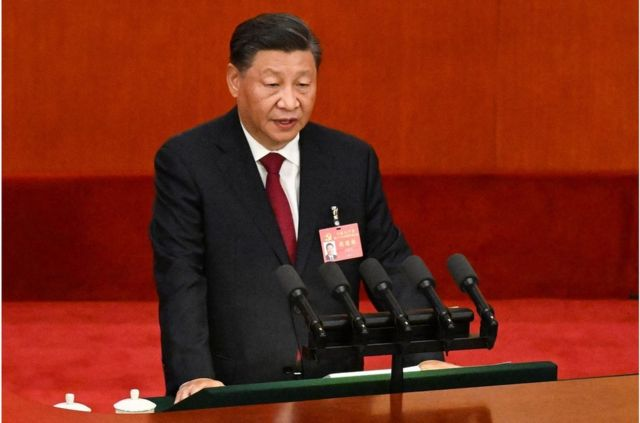
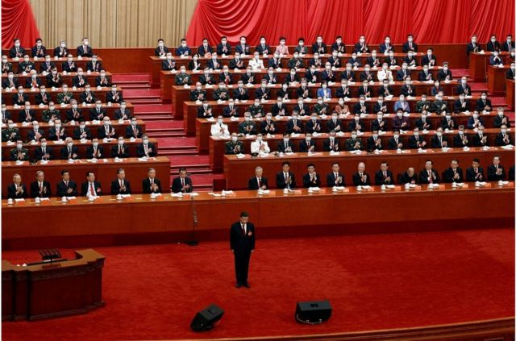
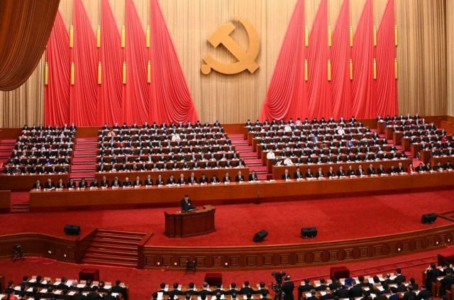
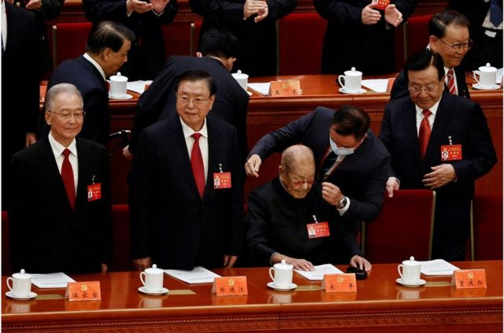
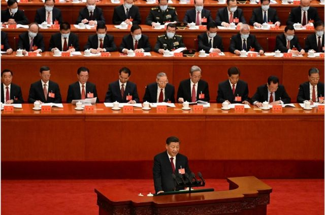
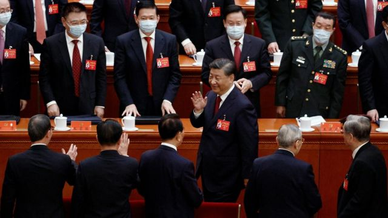
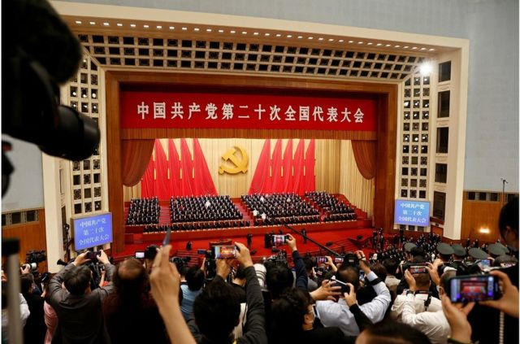
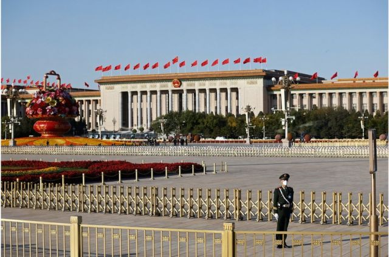

# [Chinese] 中共二十大开幕：习近平称“坚持动态清零不动摇” 提出“中国式现代化”

#  中共二十大开幕：习近平称“坚持动态清零不动摇” 提出“中国式现代化”

> 图像来源，  AFP via Getty Images
>
> 图像加注文字，在报告中，习近平还提出"中国式现代化"的全新提法，并进行阐释。

**10月16日上午十点，中国共产党第二十次代表大会开幕式在北京召开，中共中央总书记习近平代表十九届中央委员会报告，总结过去五年成就并阐述未来的路线。**

习近平称，中国在抗击新冠疫情方面“坚持人民至上、生命至上，坚持动态清零不动摇”，“最大限度保护了人民生命安全和身体健康”。他还强调了中国在扶贫、国防和外交方面的成就，并称反腐败斗争“取得压倒性胜利”。

在报告中，习近平还提出“中国式现代化”的全新提法，并进行阐释。

超过2300名代表及党外列席人士，齐聚人民大会堂，会场内悬挂有“伟大、光荣、正确的中国共产党万岁”的巨幅红色标语。

在习近平讲话时，会场内的所有代表几乎都戴着口罩聆听报告，而党代会第一排就坐的主席团常委并未戴口罩。

习近平的报告时长1小时50分钟左右，相比于“十九大”长达三个多小时的报告，时间上大幅缩短。

但在2020年新冠疫情后，中国政府大型会议的报告时长都有缩短，比如李克强在两会上的工作报告仅为一小时左右，显著短于往年。但会后发给代表的是篇幅更长的完整版。

本次情况也类似，会后记者得到的报告文字本为72页，应该是长于“口头版”的全本。

##  议程

> 图像来源，  Reuters
>
> 图像加注文字，在习近平讲话时，会场内的所有代表几乎都戴着口罩聆听报告，而党代会第一排就坐的主席团常委并未戴口罩。

> 图像来源，  AFP via Gety Images
>
> 图像加注文字，外界预期，本次大会将令中共中央总书习近平继续留任，进入历史性的第三任期，成为自毛泽东以来任期最长的中共最高领导人。

本次大会为期一周，议程包括五项：

  * 听取和审查十九届中央委员会的报告； 
  * 审查十九届中央纪律检查委员会的工作报告； 
  * 审议通过《中国共产党章程（修正案）》； 
  * 选举二十届中央委员会； 
  * 选举二十届中央纪律检查委员会。 

星期日（10月16日）进行的是第一项议程。大会至10月22日上午闭幕后，预计将会召开二十届中央委员会第一次全体会议（简称“一中全会”），并选出25名中央政治局委员，7名中央政治局常委，以及中共总书记。

外界预期，本次大会将令中共中央总书习近平继续留任，进入历史性的第三任期，成为自毛泽东以来任期最长的中共最高领导人。

星期日上午，部分中外媒体记者被允许进入人民大会堂二层拍摄会议，但需要提前在指定酒店住宿一晚进行隔离，并进行核酸检测。

##  谁出席？

> 图像来源，  EPA
>
> 图像加注文字，在北京举行的中国共产党第二十次全国代表大会开幕式上，习近平的前任胡锦涛紧挨习的左侧就坐，但他相比五年前出席十九大时已经满头白发。

开幕式开始后，在主席团第一排就坐的“二十大”主席团常委会成员们步入会场。习近平率先入场，他的前任胡锦涛紧随其后，并紧挨习近平左侧就坐，但他相比五年前出席十九大时已经满头白发。

另一位中共元老江泽民并未出席开幕式。2017年“十九大”开幕时，江泽民紧随习近平入场，但需要两位工作人员搀扶；2019年10月1日，江泽民出席建国70周年庆典，这也是他最后一次出现在公开活动中。

不过，今年96岁的江泽民依然出现在46人的二十大主席团常委会名单中，与江泽民一样名列其中但未出席的还有前总理朱镕基，以及现任国家副主席王岐山。后者或许是因为10月13日刚出访哈萨克斯坦回国，需要隔离，因而缺席。

> 图像来源，  Reuters
>
> 图像加注文字，105岁的中共元老宋平坐在中国前总理温家宝、前副总理张德江和原副主席曾庆红旁边。

> 图像来源，  AFP via Getty Images
>
> 图像加注文字，前中央政治局常委张高丽也坐在主席台第一排（前排左二）。

另外值得注意的两位坐在主席台第一排的人物是：

  * 105岁的宋平是在世的中国“党和国家领导人”中最年长者，他曾在抗战期间任周恩来的政治秘书，“六四事件”后中共高层人士大调整，宋平与江泽民一起进入政治局常委，升格"正国级"，不过三年后即退休。 
  * 前中央政治局常委张高丽，他在2012年“十八大”时跻身政治局常委之列，任副总理；2017年“十九大”时卸任退休。不过2021年11月2日，中国网球明星彭帅在微博发文称曾与退休中共中央政治局常务委员兼中国副总理张高丽发生性关系，舆论哗然。 

##  哪些亮点？

> 图像来源，  Reuters

习近平把总结过去的时间尺度拉到十年，即从他担任中共总书记起，他在报告中提到，十年来，“我们经历了对党和人民事业具有重大现实意义和深远历史意义的三件大事”：

  * 一是迎来中国共产党成立一百周年， 
  * 二是中国特色社会主义进入新时代， 
  * 三是完成脱贫攻坚、全面建成小康社会的历史任务，实现第一个百年奋斗目标。 

**新冠疫情** 则是上届党代会没有的全新挑战，习近平在报告中称，特别是面对突如其来的新冠肺炎疫情，“我们坚持人民至上、生命至上，坚持动态清零不动摇，开展抗击疫情人民战争、总体战、阻击战，最大限度保护了人民生命安全和身体健康”，统筹疫情防控和经济社会发展取得重大积极成果。

在 **国际关系** 上，相比往届，今年增加的提法是，“始终根据事情本身的是非曲直决定自己的立场和政策，维护国际关系基本准则”。该提法是在俄罗斯入侵乌克兰后，中国逐渐形成的提法，在官方层面反复出现，外界解读为中国试图在俄罗斯和西方之间找到中间点和平衡点，避免被视为偏向俄罗斯。

**香港问题** 被作为过去五年主要政绩之一，篇幅显著多于上一届报告。习近平表示，面对香港局势动荡变化，我们依照宪法和基本法有效实施对特别行政区的全面管治权，落实“爱国者治港”原则，香港局势实现由乱到治的重大转折。

**台湾问题** 上措辞也有变化。十九大报告中并未提“武力”二字，只提要“挫败”台独，以及“九二共识”、“两岸一家亲”。但在周日的报告中，措辞大幅变化——“解决台湾问题是中国人自己的事，要由中国人来决定。我们坚持以最大诚意、尽最大努力争取和平统一的前景，但决不承诺放弃使用武力，保留采取一切必要措施的选项，这针对的是外部势力干涉和极少数“台独”分裂分子及其分裂活动，绝非针对广大台湾同胞。”不过在72页完整版报告中依然提到“九二共识”。

当天，台湾的陆委会回应，“维持台海及区域的和平稳定，是两岸的共同责任......坚定捍卫国家主权不退让、守护民主自由不妥协，而兵戎相见绝非两岸选项。”陆委会还表示，“中共面对国际情势剧烈变动及内部社会经济挑战之际，其对台政策始终没有新的思路与正确的判断。”

**在经济方面** ，习近平在报告没有提“房住不炒”；相比五年前的报告，当时他在报告中称坚持“房子是用来住的、不是用来炒”的定位，并获得热烈的掌声。

过去两年，中国楼市在持续打压下，面临大批房企资金链断裂的问题，以及“停贷潮”带来的危机。今年经济持续低迷的情况下，不少地方也已开始放开部分限制，以期促进楼市回升。

周日，关于房地产市场，习近平在报告中称，“部署下一阶段住房工作时仅说，要加快建立多主体供给、多渠道保障、租购并举的住房制度。”

值得注意的是，虽然在口头报告中未提“房住不炒”，但在72页完整版报告中，确实提到“坚持房子是用来住的、不是用来炒的定位”。

##  “归根到底是马克思主义行”

> 图像来源，  Reuters
>
> 图像加注文字，报道会议的记者需在指定的酒店提前入住进行防疫隔离（图为记者在媒体区拍摄中共二十大开幕式）。

“马克思主义”在本次报告中的篇幅值得关注。

在“开辟马克思主义中国化时代化新境界”这一部分，习近平重申了，马克思主义“是我们立党立国、兴党兴国的根本指导思想”。

“实践告诉我们，中国共产党为什么能，中国特色社会主义为什么好，归根到底是马克思主义行，是中国化时代化的马克思主义行。拥有马克思主义科学理论指导是我们党坚定信仰信念、把握历史主动的根本所在。”习近平称。

“能够看出来，‘习时代’非常希望在意识形态和执政理论上，更为清晰和明确，打上他自己的特色。”香港城市大学法学院教授王江雨向BBC中文表示，毛邓之后，中国基本上走解决问题的实用主义路子，走的是去意识形态的路子，现在把信仰问题重新提出来，把马克思主义现代化重新放到神坛上。这说明在意识形态领域，要追求统一和一致，到底具体影响是什么，还要看具体措施。

##  “中国式现代化”

> 图像来源，  Reuters
>
> 图像加注文字，10月16日，中国共产党第20次全国代表大会开幕式前，一名武警在天安门广场站岗。

周日的报告中重申了十九大提出的战略安排是分两步走：

  * 从2020年到2035年基本实现社会主义现代化； 
  * 从2035年到本世纪中叶把我国建成富强民主文明和谐美丽的社会主义现代化强国。 

他进一步表示，从现在起，“中国共产党的中心任务就是......以中国式现代化全面推进中华民族伟大复兴”。

值得注意的是“中国式现代化”是全新的政治语码，并未出现在之前历届党代会报告中。

据不完全统计，今年7月份的举行的省部级主要领导干部“学习习近平总书记重要讲话精神，迎接党的二十大”专题研讨班上，习近平第一次提出“必须坚持以中国式现代化推进中华民族伟大复兴”，此后这个词进入中共官方语境。

他在周日的报告中，进一步称，“中国式现代化，是中国共产党领导的社会主义现代化，既有各国现代化的共同特征，更有基于自己国情的中国特色。中国式现代化是人口规模巨大的现代化，是全体人民共同富裕的现代化，是物质文明和精神文明相协调的现代化，是人与自然和谐共生的现代化，是走和平发展道路的现代化。”

提出“中国式现代化”有何意义？王江雨认为，这表明现在中国具备条件，也明确了目标，就是要搞现代化，但要注意这个现代化要有中国特色，不要幻想中国会跟西方殊途同归，会发生“和平演变”这类事情。

王江雨进一步解释，在经济发展、生活水平，以及环保、科技和工业化上，中国想要实现跟西方一样好，甚至更好的现代化；但最主要的区别是，要实现这些是由党的领导和国家主导的，是自上而下，不是自下而上的。

