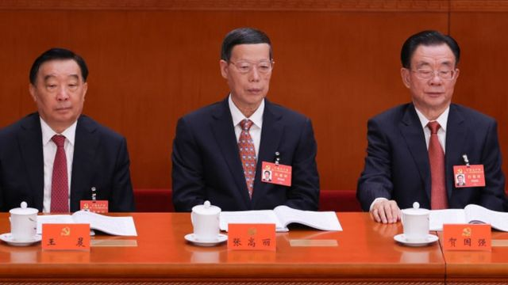

# [Chinese] 习近平二十大讲话：“清零”政策和“零解决方案”

#  习近平二十大讲话：“清零”政策和“零解决方案”

  * 麦笛文（Stephen McDonell） 
  * BBC驻中国记者 

> 图像来源，  Getty Images
>
> 图像加注文字，南京一所大学的学生在观看习近平的演讲

**在中国，很多人通常不会太关注他们领导人这些事先安排的、冗长的、可预测的演讲。**

然而，今年他们正在寻找任何表明中国严格的新冠病毒管控措施可能在中共二十大后放松的迹象。

中国领导人习近平的简短回答是：不。

他说，“清零”政策不会动摇，因为要以拯救人民生命为先。

封锁、大规模检测、扫健康码、隔离、旅行限制都将在可预见的未来持续下去。

甚至没有承认该政策所造成的社会和经济痛苦。

政府面临的其他未被提及的巨大挑战包括：飙升的青年失业率和房地产危机。

相反，这篇长达近两个小时的演讲多是标准的党内辞令，对中国问题的实际解决方案少有提及。

如果你是一名大学毕业生，在政府对科技公司的打压后而无法在科技行业找到工作，习近平敦促你“跟随党的指引……努力成为新一代，建设社会主义现代化国家”，（有关讲话）不会给你多少安慰。

当习近平谈到大陆和台湾的统一时，出现最热烈的掌声，这无疑是事先准备好的。

他表示，北京方面将鼓励与台湾进行经济合作，将真诚争取和平统一，但共产党“绝不会承诺放弃使用武力的选项”。

他还为备受批评的香港《国家安全法》进行了辩护，称该法律恢复了香港的秩序。

同样，他为中国北部宁夏和新疆（主要是穆斯林人口的聚居地）许多清真寺的拆除和改建辩护，称这里的宗教必须坚持“中国化方向”。

被视为反映伊斯兰阿拉伯形象的建筑，已被更符合中国审美的建筑所取代。

还有一些其他元素也没有被忽略。

中国前领导人江泽民没有出席会议，但他已经96岁，可能太虚弱不能参加。前任领导人胡锦涛和温家宝和习近平同台。

坐在前排的还有中国前副总理张高丽。这是他去年被中国网球明星彭帅指控性侵后首次公开露面。

> 图像来源，  Getty Images
>
> 图像加注文字，张高丽（中）

这位75岁的老人还没有对这一指控公开发表评论。

但是，在气候变化和其他环境议题上，习近平政府确实有一个好故事可讲。

大会在晴朗的蓝天下在北京开幕。曾经有一段时间，这在首都是不寻常的。现在情况正好相反，污染严重的日子反而比较显眼。

中国领导人说：“我们将大力发展低碳产业，推广低碳生活方式。加强污染治理，全面消除严重污染。”

但在新能源到位之前，燃煤发电不会被逐步淘汰。他说：“坚持先立后破。”

中国最富有的人和较不富裕的人之间可能仍然存在巨大的收入差距，但在扶贫方面也取得了进步，习近平提到了这一点。

但是，如果你看了这个演讲，不知道中国现在的实际情况，你会对现实有一种扭曲的认识。

演讲传达的总体信息是，中国在共产党的领导下正在突飞猛进地向前发展，但目前围绕中国经济的不确定性是几十年来从未出现过的。

