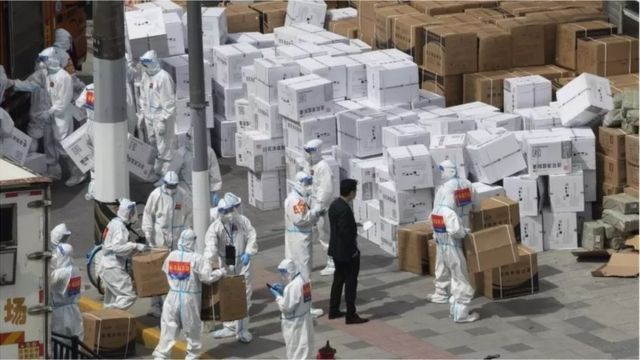
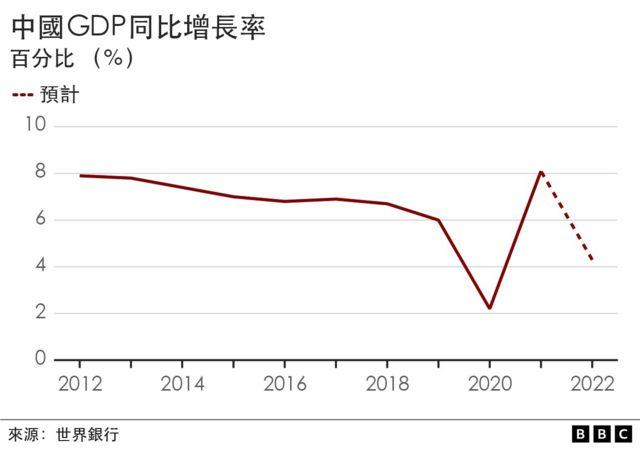
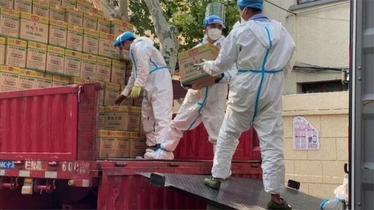

# [Chinese] 中共二十大：中国三季度GDP“罕见”延期公布 折射经济现状

#  中共二十大：中国三季度GDP“罕见”延期公布 折射经济现状

> 图像来源，  Getty Image
>
> 图像加注文字，严厉的清零措施仍在持续，中国经济形势和就业形势非常严峻。

**原本周二（18日）中国统计局将公布第三季度的数据，但却在17日突然宣布延期发布，且未给出理由。**

这一举措颇为罕见，因为即便2020年一季度（萎缩6.8%）和今年二季度（增长0.4%）经济增长表现如此之差，数据依然按时发布。

而在二季度经济几乎停滞的情况下，三季度表现究竟如何，备受外界关注。

专家认为，此举可能并非因为经济表现差，而是当局希望舆论聚焦二十大本身。

##  三季度预期较好

“经济数据发布延期，并不是因为经济复苏欠佳，而是因为正在进行的党代会。当局希望媒体和公众聚焦于这个大型活动带来的关键信息。”仲量联行（JLL）大中华区首席经济学家庞溟（Bruce Pang）向路透社称。

庞溟判断，这次延期不太可能影响市场情绪，因为多数初步经济数据都表明三季度的复苏。

事实上，各种迹象表明，今年三季度经济应该有一定程度回升——17日上午的“二十大”记者招待会上，中国官员称，从目前掌握的情况看，三季度经济明显回升。

再者，财新、路透社的GDP增速预估值分别为3.6%和3.4%，都显著好于上一季度。

相比于全球各国的经济困境而言，“当下中国存在一些独有的优势。”经济学人智库（EIU）经济分析师徐天辰向BBC中文表示，如相对低廉的能源价格、强大的制造业产能和政府对经济资源的支配力，这使得中国经济在面临很大内外压力时仍然能够维持正增长。

##  中国的独特困境

然而，无论是3.6%，还是3.4%，不仅显著低于疫情前6%左右的GDP增速，甚至在疫情发生后的近三年中，大部分季度GDP增速仍高于此数值。

今年初的中国“两会”上，中国总理李克强设定下5.5%的全年经济增长目标，当时不少经济学家和机构形容这一目标保守。

但出乎外界意料的是，在2021年把疫情控制得当的中国，却在2022年因奥密克戎的袭击，频繁陷入封城，其中不乏上海、成都、深圳等经济中心。

> 图像来源，  REUTERS
>
> 图像加注文字，疫情中的上海百业骤停

由于二季度经济表现过差，使中国上半年仅实现2.5%的经济增速，这使得下半年必须实现8%以上的增速才能完成全年目标。

而如果三季度增长仅3.5%左右，那么想要在四季度追回这部分经济增长，十分渺茫。

徐天辰称，前三个季度经济增长都没有达到5.5%，而在疫情挑战和全球经济放缓的背景下，四季度经济仍然面临相当大的挑战。

“5.5%的目标事实上被淡化，下半年重心已经从追求增长目标，转为避免经济失速乃至陷入衰退。”徐天辰表示。

在中国，人们关注二十大时，都在努力寻找任何“清零”政策可能放松的蛛丝马迹。但从二十大目前的各种表态来看，“清零”政策不会动摇，因疫情带来的经济冲击也将持续。

徐天辰认为，中国不同经济部门之间的持续失衡在疫情期间有所加剧，其中居民和私营企业近几年十分脆弱，成为影响中国经济增长持续性和长期竞争力的问题，亟待在下一个五年加以解决。

雪上加霜的是，按照中国教育部的统计，2022届高校毕业生规模预计1076万人，同比增加167万，规模和增量均创历史新高。在经济低迷的年份，却遭遇大量劳动力进入就业市场，使就业压力陡增。

在中国的官方语境中，“保就业”被反复强调，因为就业不足，意味着社会不稳定因素。

