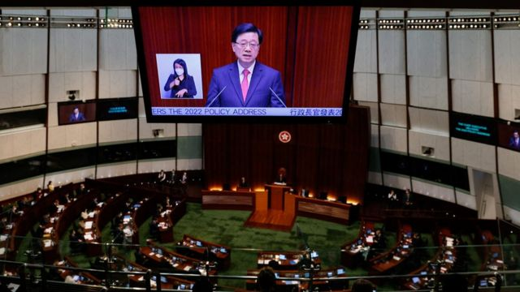
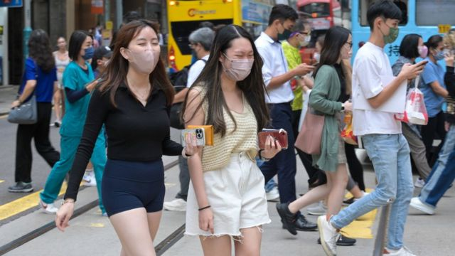
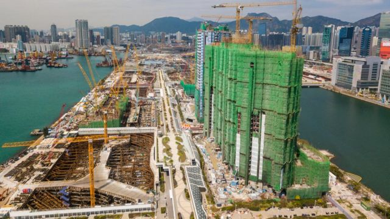
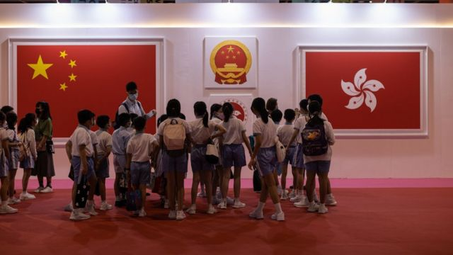

# [Chinese] 香港政府承认人口严重流失 李家超首份施政报告多举措揽才未提23条立法时间表

#  香港政府承认人口严重流失 李家超首份施政报告多举措揽才未提23条立法时间表

> 图像来源，  Reuters
>
> 图像加注文字，李家超发表首份施政报告，也是香港特区立法会民主派议员“清零”以来首次听取特首施政报告。

**香港行政长官李家超就任两个半月后发表其首份年度施政报告，提出多项“主动招揽目标企业和人才”措施。**

李家超在星期三（10月19日）的演说中承认香港劳动人口在过去两年流失约14万，但并未承认这与2020年中国颁布《香港国安法》后出现的移民潮有关。

他提出针对海外与中国大陆企业设立300亿港元（38.2亿美元；276亿元人民币）的“共同投资基金”，另设立100亿港元基金推动大学科研成果商品化，同时推出多项针对“高端人才”的留港签证优惠。

不过，李家超在演说开首强调要先维护中国国家安全与香港特区的宪制秩序，落实北京提倡的“爱国者治港”，提出包括推进进一步制定国安立法的准备工作，以及规管民主派反政府示威群体曾广泛采用的众筹活动。

英国伦敦大学亚非学院中国研究院主任曾锐生教授（Prof Steve Tsang）评论说，警察出身的李家超上任至今已证明了他对中共政权的忠诚，而如今香港的安全挑战已因为《香港国安法》而被平定，发展经济就是他接下来要面对的挑战。

曾锐生教授对BBC电视世界新闻台（BBC World News）说：“北京仍然希望香港对中国有用，而只有经济蓬勃，香港才会对中国有用。”

> 图像来源，  China News Service
>
> 图像加注文字，香港外国商会曾多次促请特区政府放宽新冠防疫措施。

这次也是2021年12月香港立法会根据北京整顿选举制度改选， 民主派议员“清零”  后首次听取特首施政报告。绝大多数党派均对李家超的报告表示欢迎。

身兼特区政府行政会议召集人的新民党主席兼立法会议员叶刘淑仪说：“很高兴行政长官李家超宣读一份内容非常丰富、全面及有前瞻性的施政报告……回应了市民的诉求，无论在土地、房屋、医疗、安老、青年人发展等等，都很详尽的回应了我们在面对的迫切问题。”

建制派最大党派民建联主席李慧琼形容李家超的施政报告“施政展新风，尽取民发展，为民燃希望”；香港经济民生联盟（经民联）副主席林健锋形容300亿元“共同投资基金”计划打破了香港“积极不干预”的政策作风，给予市场正面讯息。

在近90名立法会议员中唯一自称属“非建制派”的新思维主席狄志远批评，李家超在报告中大篇幅讨论如何“用钱抢人才”，却没有谈如何挽留人才，是“本末倒置”，促请特区政府先进行人力评估，再透过人才培训机构增加本地人才，方可治本。

在立法会内已无席位的民主党则评论说，李家超“只谈如何吸引外地人才，对挽留本地人才却像爱理不理”，尤其在医护、教师、社工等专业。

民主党主席罗健熙在一份声明中说，十分同意李家超表示抗疫“不走回头路”，他认为香港市民对政府的防疫政策感到疲累，“可惜施政报告没有就取消不同限制提出时间表，期望政府日后可以以科学为本抗疫，尽量减少对民生的影响，尽快放宽甚至撤消各项非必要的入境限及本地的社交距离限制”。

> 图像来源，  NurPhoto/Getty Images
>
> 图像加注文字，李家超政府提出向居港满七年——符合申请永久居民身份——的合资格专才退还购置房产的额外印花税，该打击房产炒卖的惩罚性征税被俗称“辣招税”。

香港外资商界同样仍然认为全面撤销新冠病毒病（COVID-19）抗疫措施十分重要。香港英商会总裁戴林瀚（David Graham）在发予BBC中文的声明中说：“商会乐见行政长官在其首份施政报告中将人才放于首位……然而，商会相信这些倡议只能在与全面重开边境，并进一步放宽COVID-19措施之下，方可奏效。”

香港美国商会总裁翁以登博士之指出，商会认同特区政府认识到改善香港地位尤其是国际竞争力的急迫性，“然而新冠相关限制仍然存在，且撤销速度不够快，让人失望。”

翁以登在美国商会发予BBC中文的书面评论中说，不全面撤销新冠抗疫措施阻碍旅客与商家流动，不利于香港发展成“超级联系人”——这是前任香港行政长官，中国人民政治协商会议全国委员会（全国政协）副主席梁振英提出，香港在中国大陆与国际商界之间该扮演的角色。

##  “抢企业，抢人才”
 李家超在立法会会议上说  ：“香港是全球最具竞争力的经济体之一，亦是内地对接国际市场的重要窗口。我们必须更积极和进取地‘抢企业’、‘抢人才’。”

他宣布从2016年设立作长线投资用的特区政府“未来基金”中拨款300亿港元设立“共同投资基金”，又将设立“引进重点企业办公室”，针对生命健康科技、人工智能与数据科学、金融科技、先进制造与新能源科技等产业招商引资。

李家超同时宣布设立为期两年的“高端人才通行证计划”，让过去一年年薪达250万港元或以上者，以及毕业于全球百强大学，并在过去五年内累积三年或以上工作经验者，赴港发展，不设人数限额。该计划另设每年1万人配额，让最近五年内毕业，但工作经验不足者申请。

除了“高端人才通行证计划”，多个现有专才赴港工作居留签证计划也将放宽管制。

施政报告还提出让合资格外来人才居留满七年后——即符合申请香港永久居民资格之后——申请退还自置居所的反炒卖“额外印花税”，此措施即时在新签订房产买卖合同上生效。

##  国家安全优先

李家超在开首说，“香港现处于‘由乱到治’走向‘由治及兴’的关键期”，又提及中国国家主席兼中共中央总书记习近平7月到香港主持特区成立25周年庆典时，在其讲话中提及“青年兴，则香港兴”。他宣布特区政府将在推广香港《基本法》群众教育之余，进一步推展中国《宪法》与《香港国安法》的宣传教育，相关专责机构将更名为“宪法和基本法推广督导委员会”。

特区政府又将成立“法治教育督导委员会”，向百姓推广“一致和正确的法治讯息”。
 中国全国人大常委会2020年5月下令制定《香港国安法》的决定中订明  ，“香港特别行政区应当尽早完成香港特别行政区基本法规定的维护国家安全立法”，即所谓“基本法第23条”立法。李家超称，将“推进……准备工作”，但未明确时间表。

但他同时提出将“立法规管线上线下众筹活动、立法提升关键基础设施的网络安全、完成处理虚假讯息的顾问研究作政策考虑等”，又称“国际政治环境错综复杂，外部势力不时刻意对国家抹黑造谣，歪曲香港的状况……香港有说不完的真实好故事，政府会凝聚社会力量，共同将香港故事说好”。

众筹活动在2019年反修例示威爆发后被示威者广泛采用，以支持被捕示威者诉讼等活动。特区政府财经事务及库务局长许正宇在李家超上任前曾对立法会表示有意立法防范透过众筹集资策划危害国家安全活动。

> 图像来源，  EPA
>
> 图像加注文字，除国家安全法律外，李家超称特区政府也将修订法律，“进一步维护区旗及区徽作为特区象征和标志的尊严”，并与保护中国国旗、国徽与国歌的本地法律“适度地保持一致”。

放宽新冠抗疫措施被普遍视为重振香港经济的重要一环，但分析人士普遍担忧在中国“动态清零”政策下，特区政府不会大刀阔斧地恢复疫情前常态。

李家超说：“我多次提及，希望‘抗疫不走回头路’。我们的抗疫大原则是以最小代价换取最大成效。在疫情可控的前提下，政府的抗疫路线是不断向前，根据疫情实际情况和变化，调整和优化措施，确保一切有序稳妥，逐步向前推进。”

伦敦大学亚非学院的曾锐生教授对BBC评论说：“香港仍将是中国领先的金融中心，但要维持在国际上的顶尖金融中心地位，就必须让人相信这里必然有法治。”

“但《香港国安法》削弱了外间对香港司法独立的信心，李家超想要回那地位将变得更加困难。放宽新冠防疫限制或许有帮助，但仍不足以让香港回到疫情前的境地。”

