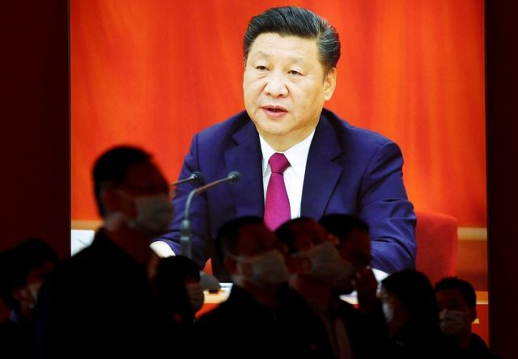

# [Chinese] 中共二十大：“人民领袖”尊称公开，习近平或向更明确的集权迈进

#  中共二十大：“人民领袖”尊称公开，习近平或向更明确的集权迈进

> 图像来源，  Getty Images
>
> 图像加注文字，外界预计中共二十大将会令习近平进入历史性的第三任期

**中共第二十次全国代表大会记者会上，中央政策研究室副主任田培炎形容最高领导人习近平是“众望所归的人民领袖”，这一尊称的公开使用，或显示习近平正向更明确的集权迈进。**

田培炎周一（10月17日）在记者会上表示：“总书记习近平是这个伟大时代产生的杰出人物、众望所归的人民领袖。”

他还表示，习近平新时代中国特色社会主义思想，就是正确回答时代和实践提出的重大问题所取得的最新理论成果。

外界预期，二十大将令习近平进入历史性的第三任期，成为自毛泽东以来任期最长的中共最高领导人。

较早前的报道说，本届党代会还将会对中共党章作“适当修改”。

官方目前未有明确透露修改的具体内容，但现在外界预期中共会将所谓的“两个确立”写入党章——“两个确立”指确立习近平党中央的核心、全党的核心地位，确立习近平新时代中国特色社会主义思想的指导地位。

田培炎在周一表示，“两个确立”是中共在新时代取得的重大政治成果，是党和国家事业取得历史性成就、发生历史性变革的决定性因素。

新华社、人民日报和央视网等中国官媒网站的习近平专属页面上，已经明确称他为“人民领袖习近平”。

专家表示，这些迹象似乎表明，二十大将确立习近平在党内至高无上的地位，显示他有可能会做终身领袖。

在习近平治下，2018年中国人大对中国宪法作出历史性修改，废除了国家主席任期不超过两届的限制，从法律上为习近平终身担任领袖奠定了基础。

##  “人民领袖”代表什么？

> 图像来源，  Reuters
>
> 图像加注文字，习近平是继毛泽东之后第一个使用这一尊称的中共领导人。

在中华人民共和国历史上，此前曾被称为“人民领袖”的仅有开国领袖并终身担任最高领导人的毛泽东一人。

他的继任者华国锋曾顺延毛泽东“伟大领袖”的尊称，他在执政期间被称为“英明领袖”。

此后历任中国党政最高领导人均未使用过这一尊称，带领中国进入改革开放时代的邓小平是继毛泽东之后最有影响力的中国高层领导人，但他从未正式担任过中共最高领导人，更多被称为改革开放的“总设计师”。

习近平是继毛泽东之后第一个使用这一尊称的中共领导人。

香港中文大学客座教授、中国时事评论员林和立向BBC中文表示，习近平使用这一称呼，并不令人意外。

“习近平觉得自己是21世纪的毛泽东，”林和立说，“而且他也一直将自己视为亲民领袖，所以他用这个词汇是可以理解的。”

他表示，习近平在前两个任期内显示了他善于集权的特质，而且也成功地做到了“定于一尊”——政治、经济、外交决策均由他本人决定。

“集中的程度相对于毛泽东是有过之而无不及，”林和立说。

他表示，目前的集权是否适合中国，还需逐一分析习近平制订的具体政策是否奏效——以及是否符合国际上的期望。

不过他也承认，即使批评习近平的声音不少，但在可见的将来似乎很难看到党内有足够强大的反对力量。

##  “某种个人崇拜”

林和立表示，在这种形势下，“可以讲，全国在进行某种个人崇拜”。

他指出，这与邓小平在改革开放以来定下的一系列政策和传统是相违背的——在文革结束后登上领导层的邓小平反对个人崇拜，也坚持最高领导人任期不超过两届的限制。

“读过邓小平的演讲或著作的人都会知道，邓小平的改革开放不仅是像设立特区、吸引外资等政策这么简单，也包括了党和国家的制度改革，”林和立说。

他表示，这些改革开放的传统已经存在了好几十年，在当前的时代若再出现毛泽东时代的个人崇拜或者政治运动，一些干部和人民也可能会有一些与毛时代不同的看法。

只不过，他说，“目前发展的态势将会继续。”

