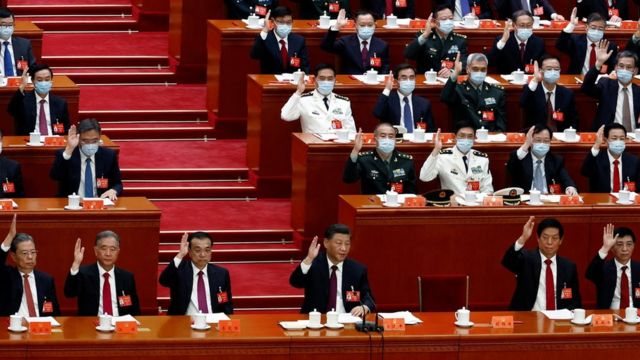
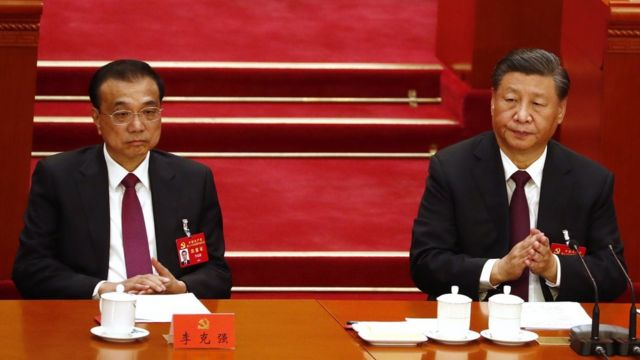
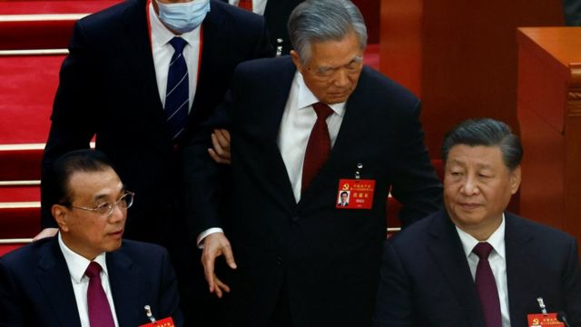

# [Chinese] 中共二十大闭幕：李克强汪洋韩正栗战书未名列中央委员，胡锦涛提前退场

#  中共二十大闭幕：李克强汪洋韩正栗战书未名列中央委员，胡锦涛提前退场

> 图像来源，  Reuters
>
> 图像加注文字，习近平旁边的空位是前中共领导人胡锦涛离场后留下的，胡没有参加后二十大闭幕会后半部分议程。

**中共二十大闭幕会周六（10月22日）在北京举行，第二十届中央委员会和中央纪律检查委员会名单已经公布，并对党章进行了修改。**

根据新华社的发布，中共第二十届中央委员会委员共有205名，另有候补委员171名。中共第二十届中央纪委委员133名。

第十九届中共中央政治局7名常委中有4人未进入中央委员会，可能面临退休。另外3人留任，除了习近平外被普遍认为将继续担任领导人外，其他两位的具体职位还有待确认。

现年67岁的总理李克强、72岁的人大委员长栗战书、67岁的政协主席汪洋和68岁的副总理韩正都不在中央委员名单中。这意味着他们将无法进入第二十届中央政治局。69岁的习近平、65岁的赵乐际以及67岁的王沪宁保留在中央委员之列。

> 图像来源，  EPA
>
> 图像加注文字，现任中国总理李克强（左）未进入中央委员会。

会前颇受各界关注的北京市委书记蔡奇、上海市委书记李强、重庆市委书记陈敏尔、广东省委书记李希、中央办公厅主任丁薛祥、全国人大宪法和法律委员会副主任委员应勇都入选了中央委员。他们被外界称为“之江新军”或“习家军”，因为习近平担任中国领导人后，曾提拔这些他在浙江和上海任职时的下属。

现任中国副总理、59岁的胡春华，69岁的外长王毅，72岁的中共中央军委副主席张又侠仍在中央委员名单之中。

港澳事务官员中，现任澳门中联办主任、现年58岁的郑新聪名列中央委员，现任香港中联办主任骆惠宁、前港澳办主任张晓明、现任港澳办主任夏宝龙均未上榜。张晓明和骆惠宁是十九届中央委员。

彭博社在名单公布后发布快讯称，习近平已经正式敲定了由自己盟友环绕四周的第三个任期，和他没有紧密联系的中共领导人已经退出了领导层。

当天还通过了《中国共产党章程（修正案）》。目前中国还未发布修改后的党章全文。

据路透社报道，修改后的党章加入了“两个确立”和“两个维护”，旨在巩固习近平的核心地位以及他的政治思想在党内的指导作用。

“两个确立”，即确立习近平同志党中央的核心、全党的核心地位，确立习近平新时代中国特色社会主义思想的指导地位；“两个维护”是指坚决维护习近平总书记党中央的核心、全党的核心地位，坚决维护党中央权威和集中统一领导 。

澳大利亚国立大学（ANU）亚太学院讲师宋文笛根据中央委员名单预测，目前中共政治局常委中，习近平、王沪宁和赵乐际将留任，李希、胡春华、李强、丁薛祥、陈敏尔、黄坤明、蔡奇和李鸿忠8人将争夺剩下的位置。

宋文笛还在社交媒体上表示，中国外交部长王毅到了退休年龄仍入选中央委员，他可能会接任杨洁篪成为中央外事工作委员会办公室主任。中国驻美大使秦刚成为中央委员，可能成为新一任中国外交部长。

中国民运人士王丹则评论名单指：“中共新一届中央委员名单出炉，李克强，汪洋连中央委员都不是。习派大胜。”

在10月23日二十届一中全会结束后，中共最高权力机构——新一届中央政治局常委将同中外记者见面。中央政治局常委的组成是本次会议最让人瞩目的焦点。

##  胡锦涛提前离场

据闭幕会现场画面，79岁的中共前总书记胡锦涛，80岁的前总理温家宝都出席了闭幕会。开幕会上未现身的王岐山在闭幕会上出现。

多家媒体报道称，记者被允许进入会场时，工作人员正在与胡锦涛交谈。随后胡锦涛在两名工作人员陪同下离场，他没有继续参加下半场的大会。胡锦涛离场时跟习近平打了个招呼，也轻拍了一下李克强左肩。

> 图像来源，  EPA
>
> 图像加注文字，胡锦涛离场时轻拍了一下李克强左肩。

> 图像来源，  Reuters

##  分析：胡锦涛离场引发的关注

**BBC驻北京记者麦笛文（Stephen McDonell）**

胡锦涛被要求离场的镜头引起了全球关注，人们试图弄清楚刚发生的事情。有很多问题，但到目前为止，中国政府没有给出答案。

中国前领导人胡锦涛一度似乎不愿离开。如果是真的，为什么？他对继任者习近平说了什么，让他点头？他在被领下台前拍了拍门生李克强的肩膀，对李克强又说了什么？

他离开的最有可能的两个原因是，要么展示了中国强权政治的一面——一个代表旧时代的领导人被象征性地带走，要么就是胡锦涛有严重的健康问题。

如果他是因为身体不好而被带走的，为什么会突然发生这种情况？为什么在镜头前？是紧急情况吗？

今天拍摄的一段较长的视频剪辑显示，习近平转向前党总书记，与此同时在胡锦涛的左边，高层官员栗战书和王沪宁似乎也很担心。

共产党的大会通常高度脚本化，这让人们猜测胡锦涛离开的时机可能不是突发的。他在大会的最后一天参加了早些时候的闭门会议，然后当天的最后一段时间允许媒体进入。就在设置好摄像机后，官员找到胡锦涛并表示他应该离开。

胡锦涛代表了一个与习近平截然不同的中国。他更强调集体领导，必须平衡政治局常委中的各个派系。胡锦涛的年代被视为对外开放和对新思想的包容性增加的时期。

作为党的总书记，习近平将国家带向了截然不同的方向，他是“核心”，不能被挑战。

新一届中央委员会不包括李克强或汪洋，他们都被视为经济自由主义者，都与上一届政府的思想有关。这表明，新的政治局常委会将充斥着习近平的拥护者。

