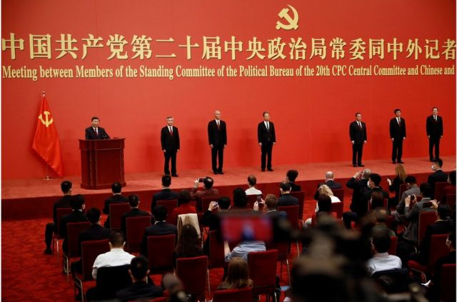
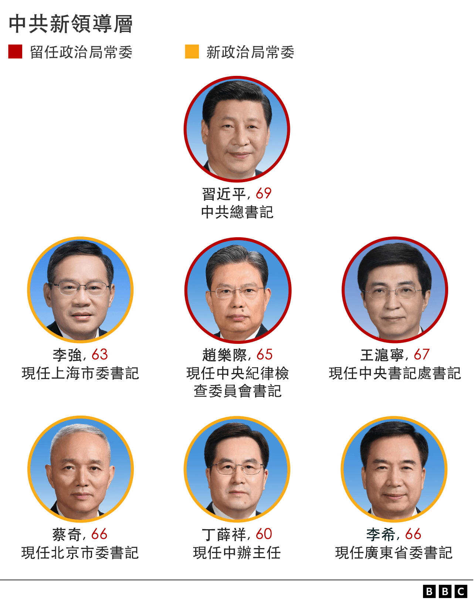
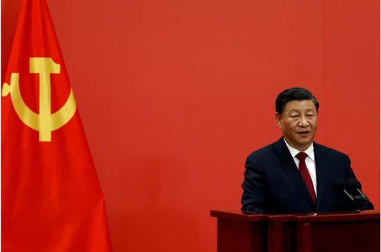
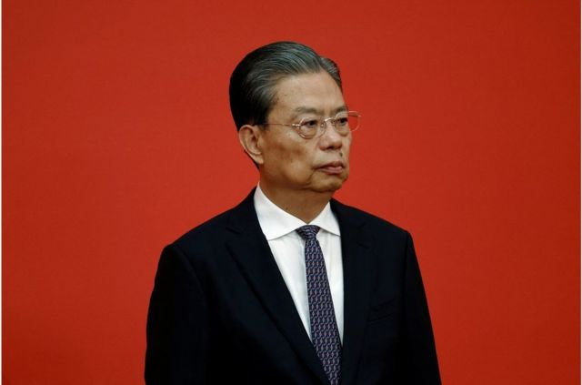
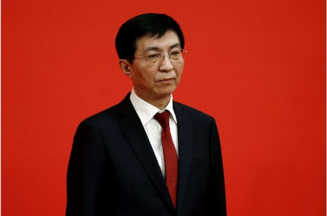
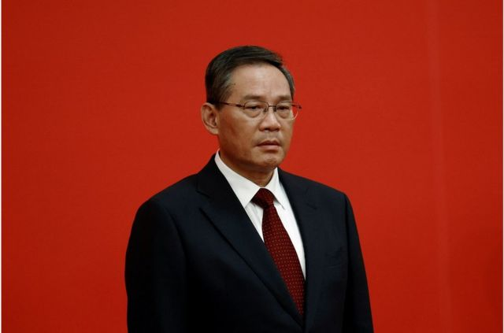
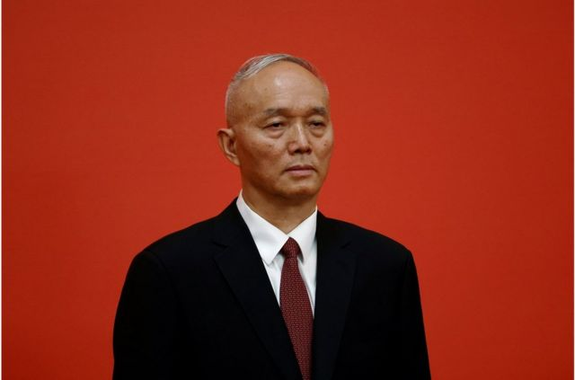
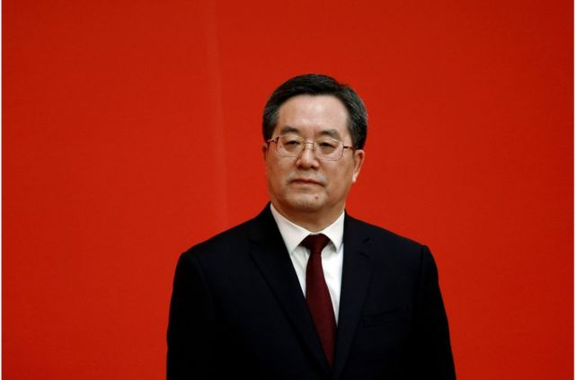
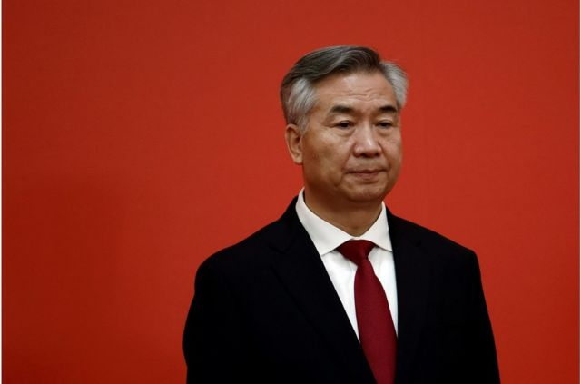

# [Chinese] 中共二十届政治局常委：习近平开启历史性第三任期 李强预计出任总理 胡春华未入局

#  中共二十届政治局常委：习近平开启历史性第三任期 李强预计出任总理 胡春华未入局

> 图像来源，  Reuters
>
> 图像加注文字，习近平在记者会上介绍了中共中央政治局常委的新阵容。

**星期日（10月23日），中共二十届一中全会在北京举行。中午12时许，随着习近平带领新一届中央政治局常委出现在记者面前，中国下一届权力核心浮出水面。**

七位中共中央政治局常委按照出场顺序为：习近平、李强、赵乐际、王沪宁、蔡奇、丁薛祥、李希。

习近平一如所料，历史性地开启第三任期，继续担任中共中央总书记。

在记者见面会上，习近平介绍，“刚才，我们召开中共二十届一中全会，选举产生新一届中央领导机构，选举我继续担任中共中央总书记。现在，我向大家介绍其他6位常委同事：李强同志、赵乐际同志、王沪宁同志、蔡奇同志、丁薛祥同志、李希同志。”

“赵乐际同志、王沪宁同志是十九届中央政治局常委，其他同志都是十九届中央政治局委员，大家都比较了解。”

习近平称，“在这里，我代表新一届中共中央领导成员，衷心感谢全党同志的信任。我们一定牢记党的性质和宗旨，牢记自己的使命和责任，恪尽职守、勤勉工作，决不辜负党和人民重托。”

他进一步表示，“一个饱经沧桑而初心不改的党，才能基业常青；一个铸就辉煌仍勇于自我革命的党，才能无坚不摧。百年栉风沐雨、淬火成钢，特别是新时代10年革命性锻造，中国共产党更加坚强有力、更加充满活力。”

> 图像来源，  Reuters
>
> 图像加注文字，习近平、李强、赵乐际、王沪宁、蔡奇、丁薛祥和李希当选中共新一届中央政治局常委。

按照中国的政治惯例，七位政治局常委的出场顺序，通常能决定他们之后的具体职务。

继续留任的赵乐际、王沪宁可能会接替栗战书和汪洋，分别出任全国人大委员长和全国政协主席。

> 图像来源，  Reuters
>
> 图像加注文字，赵乐际。

> 图像来源，  Reuters
>
> 图像加注文字，王沪宁。

##  无明显继任者人选

从年龄来看，新一任常委中没有较年轻的潜在接班人。李强（1959年生）、蔡奇（1955年生）、李希（1956年生），五年后将分别达到68岁、72岁、71岁，按照中共“七上八下”的惯例（即67岁留任，68岁退休），他们都到了退休年龄。只有丁薛祥（1962年生）在五年后只有65岁，可能会留任，但丁薛祥从未主政一方，按照政治履历，接任可能性较小。

1963年出生的胡春华常被外界看作潜在继任者，但他没有进入新一届政治局常委，甚至也未进入中央政治局的24人名单。

美国加州大学圣地亚哥分校副教授史宗瀚向BBC表示，不仅所有政治局常委都来自习近平派系，而且习近平没有坚持已有年龄惯例，甚至也没有提出新惯例的情况下，就实现了这一点。“他的行为就像一位没有任何权力限制的领导人。”

明年春季由李强而非胡春华出任总理，史宗瀚评价，这体现习近平“对任命的绝对控制”。李强没有在国务院工作过，却将接管这个复杂的官僚系统。 相比之下，胡春华担任五年副总理。自1980年代初以来，中国从未让一个没有经验的官员接管国务院，更何况如今中国经济要复杂得多。

“政治局常委的新阵容，完全由习近平的门徒和坚定盟友组成。”澳大利亚国立大学亚太学院讲师宋文笛向BBC分析称，由此可见，他觉得没有必要给其他派系分配一个名额。这表明，在面临国际上的压力时，习近平考虑的是凸显统治力而非展现宽宏大量。“新常委阵容传达了一个明确信号——赢家通吃的政治时代已经来临。”

##  李强：排名第二，预计出任总理

> 图像来源，  Reuters
>
> 图像加注文字，李强是中国唯一主政过江浙沪三个富裕地区的官员。

排名第二出场的李强可能会在明年春季全国“两会”上正式接替李克强，成为中国新一届总理。

李强曾是一名工人，后来就读于一所技术学校的农业机械化专业。在1984年，他成为共青团浙江省瑞安县委书记，并很快被调入浙江省民政厅，负责农村工作。

1992年，他成为省民政厅副厅长，在随后的十多年间在浙江多地任职，并于2004年成为浙江省委秘书长，当时习近平任省委书记。

2016年，李强被调往江苏任省委书记。2017年晋升中共中央政治局委员，转任上海市委书记至今。

今年3月，上海爆发的新冠疫情为李强的继续升迁带来质疑。长达两个多月的严厉封锁导致上海频发民生危机，经济受到重创。李强在居民区视察时，罕见遭到情绪激动的居民当面斥责。

值得注意的是，相比于胡春华（现任副总理），李强从未有过在中央任职的经历，而且63岁（1959年出生）的他，五年后为68岁，由于年龄关系，他可能仅能任职一届总理。

在本届政治局常委名单出炉前，美利坚大学助理教授张扬就向BBC表示，“我从不认为胡春华这次有机会成为总理，甚至是政治局常委。他多年来一直在被边缘化。”

张扬认为，李强当上总理，确实令人惊讶。李强的晋升对重新思考习近平第三任期下的中国权力结构意义重大，李强将成为第一个从省或直辖市直接升任总理而没有任何中央工作经验的官员；除了周恩来总理，李强也将是唯一没有担任过副总理的总理。而且，李强将成为华国锋下台后，首位权力基础不再独立于党领导人的总理，他的权力基础恰恰来自于党的领导人。

“李强没有担任过副总理（或任何中央职位），意味着他缺乏权力基础和领导国务院的经验，而国务院机构组成是巨大的。为使国务院发挥作用，他将不得不依靠习近平的权威，及其他更有经验官员们，后者的大部分是习近平的亲信。另一方面，李强是第一位同时具有治理江浙沪经验的政府高官，主政这三个富裕地区的经验将是他的主要亮点。”

“提拔李强是一个可以理解但不符合常规的举措。”宋文笛也提到，历史上，所有的总理都需要先担任副总理，以便在成为总理之前“摸清”中央政策的运行情况。李强的任命突破了这一传统，尽管李强的履历也有其亮点——他曾在长江三角洲的所有三个地区（江浙沪）执政，那里是中国的经济引擎和经济开放的象征。

“如果我们乐观来看，可以说李强升任总理，将为市场经济带来新的活力。如果我们悲观来看，这可能是一个信号，即政治忠诚度被看得高于执政经验，随着习近平身边的忠臣越来越多，中国政府的自我纠正能力将随着时间推移而减弱。”

##  蔡奇：火箭蹿升

> 图像来源，  Reuters
>
> 图像加注文字，在此前的预测中，蔡奇的名字较少出现。蔡奇同样是习近平在福建和浙江的旧部。

排名第五的蔡奇，现任北京市委书记，他将担任中央书记处书记。

在此前的预测中，蔡奇的名字较少出现。蔡奇同样是习近平在福建和浙江的旧部。

他有着火箭般的官场跃升速度，在2012年“十八大”时，蔡奇不是十八届中央委员或候补委员，五年之后，“十九大”时，他成为极少的个例——以非中央委员身份，直接进入中共中央政治局。

“二十大”他又进入常委，并且排名第五。

蔡奇早年从高校转入福建省委办公厅，逐步爬升，在1997年成为三明市市长。

两年后，他被调到浙江任衢州市长，后任衢州市委书记，这与同样从福建调至浙江的习近平轨迹重合。当时，蔡奇还因是为数不多使用微博的高官而受到关注，粉丝达到600多万。

2014年，他被调至中央，任新成立的中央国家安全委员会办公室副主任，在2016年成为首都北京的市委副书记，2017年成为北京市委书记。

他主政北京后，迅速开展了一系列整治行动，例如要求“控制人口规模”，大规模强拆廉价出租屋，导致极具争议的清理“低端人口”运动。

他还提出拆除北京建筑物楼顶的牌匾和广告牌，以“亮出天际线”。据报道，北京当局在两个月内就拆除了近9000块牌匾。但该行动被批评是劳民伤财的行为。

蔡奇任内，北京在疫情中成功举办了冬奥会，这可能被视为他仕途上的“加分项”。

##  丁薛祥：习近平的政治秘书

> 图像来源，  Reuters
>
> 图像加注文字，丁薛祥是习近平的亲密助手。

长期扮演习近平秘书角色的丁薛祥现年60岁（1962年9月出生），他是习近平的亲密助手。

原本外界预测，丁薛祥作为十九届中央书记处书记（排名第二）、中办主任等职务，可能接替王沪宁，出任中央书记处书记（排名第一），主管意识形态工作。

但蔡奇已宣布成为中央书记处书记（排名第一），使丁薛祥未来职务成疑。往届，政治局常委中有一人会担任常务副总理（张高丽、韩正等），然而丁薛祥的履历并不包含主政一方的经历。

对此，宋文笛解释，虽然在政治局委员和常委中，看不到习近平潜在的继任者。但比较清晰的是丁薛祥可能被培养为五年后的下一任总理。

宋文笛进一步表示，丁薛祥原本很可能在政治局委员这一层级再待一届，这样习近平可能把他现在的位置奖励给其他亲信，比如黄坤明和李鸿忠，今年是他们入常的最后时机。但习近平没有这么做。相反他把这个位置给了丁，显示出他准备把丁培养成一个在党内传统上可以接受的总理人选。（考虑到李强的年龄，他可能会在下届党代会退休。）

丁薛祥是工程师出身，这让他的仕途在上海材料研究所开始。在1996年，他成为所长。

1999年，他成为上海市科委副主任，并在2001年任上海闸北区区长，2004年任上海市委组织部副部长、上海市人事局局长。

2007年，45岁的他任中共上海市委常委、秘书长，成为时任上海市委书记习近平的政治秘书。尽管两个人共事时间不到一年，习近平就被调入中央，但这段时间仍可能为他赢得了习近平的信任。

2013年，他被擢升为中共中央办公厅副主任，不久后又被授予习近平个人办公室主任的新头衔。此后，他多次陪同习近平出访国内外。

2017年，他成为中共中央政治局委员、中央书记处书记，并兼任中央办公厅主任，被视为是习近平的“左膀右臂”。

##  李希：新任纪委书记

> 图像来源，  Reuters
>
> 图像加注文字，与其他几位新晋常委不同，李希与习近平并未有直接共事经历。

李希已经当选二十届中纪委书记，接任赵乐际。

与其他几位新晋常委不同，李希与习近平并未有直接共事经历。

李希曾在其家乡甘肃省工作了22年，从省宣传部秘书处干事到省委秘书长。在2004年，他转任陕西省委常委、秘书长。

2011年，李希从西部来到华东，在上海短暂“镀金”三年后，被调至东北的辽宁担任省委书记。

当时，辽宁经历了人大代表贿选案和经济资料造假等一系列事件，任命李希被视为有“救火队长”的意味。他在辽宁的四年间整饬官场，并进行改革。

2017年，辽宁公开承认该省2011年至2014年存在财政数据造假的问题，而这几年主政辽宁的是李希的前任王珉，后者后被判处无期徒刑。

在辽宁整饬官场的经历或许为他担任中纪委书记“加分”。

2017年，李希跻身中共中央政治局，并远调广东任“一把手”。广东是中国经济大省，也是政治局常委的跳板，他的仕途仍可能更进一步。

此外，根据中共中央政治局常委会的提名，中央委员会还通过中央书记处人选，决定中共中央军事委员会人选；批准第二十届中纪委第一次全体会议选举产生的书记、副书记和常务委员会委员人选。

##  相关报道：

##  市民怎么看？

> 图像加注文字，天安门广场周围有几个检查站。

在北京，找到讨论“二十大”的人并不难，但与其他国家不同的是，人们关注的话题通常并不是新一届领导人是谁，而是会议对生活的影响。

尤其对于这个坚持“清零”的国家来说，很多民众都认为，会议之后当局将放宽隔离措施。“等开完会明年就会放开了”是我经常听到的预测。

各种严格的措施也无时无刻在提醒着人们会议的重要性。在会议期间，很多快递服务暂停，北京的打印店老板也被告知在打印前，需要仔细检查文档是否有政治敏感内容，例如是否是上访或抗议材料。

有网约车司机表示，他们被要求在“二十大”期间不能把车停在距离任何政府大楼300米的范围内。

“其实谁上谁下和我们有什么关系呢，那都是搞政治的人的游戏。”他说道。

##  社交媒体反应

中国的社交媒体受到严格管控，尽管数以千万计的人通过网络收看了官方媒体的直播，但当局关闭了评论区。

在微博上，只有官方媒体被允许发布相关新闻，而评论区不是被关闭，就是仅显示几条筛选后的歌颂评论。

但在海外社交媒体，画面则完全不同。

“实至名归的习家军了，全国人民迎接帝制回归。”一名网友评论道。这位网友指的是新的六名常委都被视为是习近平的盟友或亲信。

“李强在上海疫情期间那么差还能当总理？”另一名网友说道。他指的是今年上海被封锁了近两个月，期间发生了很多民生灾难。居民们抱怨无法获得足够的食物和看病。

“这些人给全国公务员树立了榜样：站对队是多么重要！”一名网友讽刺道。

