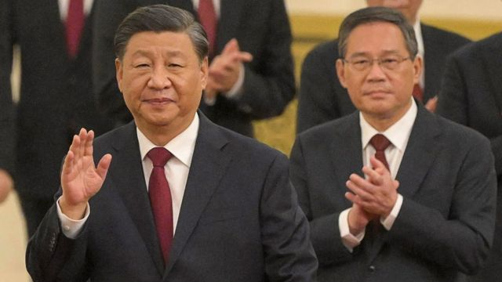
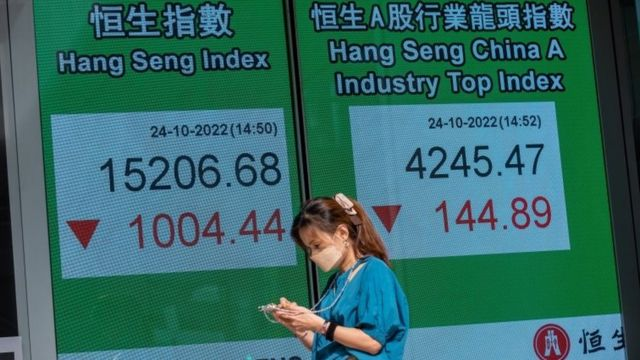

# [Chinese] 中国经济：二十大之后可供观察的几个信号

#  中国经济：二十大之后可供观察的几个信号

> 图像来源，  Getty Images
>
> 图像加注文字，中共新领导层由忠于习近平的人构成，其中就包括可能出任总理的李强（右）。

**作为习近平的忠诚支持者，63岁的李强有望成为总理，管理世界第二大经济体。他将怎样影响中国经济？中国经济正面临什么挑战？**

中共二十大闭幕，习近平开启历史性的第三个五年任期。外界目光投向政治局二号人物李强。

他是习近平的忠实支持者，外界认为他将在明年3月成为总理，管理世界第二大经济体。

与此同时，中国周一发布早前推迟公布的经济数据。受清零政策和中美贸易战影响，中国经济正面临双重夹击。

在过去一周，中国经济发生了什么？

##  增长缓慢

香港股市周一暴跌，人民币对美元汇率继续走低。外界担心习近平会不惜牺牲经济增长，而继续推行其意识形态主导的政策。

> 图像来源，  EPA
>
> 图像加注文字，中共二十大闭幕后的第一个交易日，香港恒生指数暴跌，13年来第一次跌破16000点。

同时，官方数据显示，中国经济第三季比去年同期增长3.9%，好于市场预期，相对于二季度0.4%的增速有明显反弹。

官方在二十大期间延迟发布经济数据，没有交代推迟原因。有分析指有关数据或指向经济疲软。

新加坡国立大学东亚研究所所长郝福满（Bert Hofman）告诉BBC，“中共二十大没有揭示经济政策的任何新方向，整体经济方针是否会是中国所需要的增长模式，还有待观察。”

尽管与大多数西方经济体相比，中国最新增长数字看起来还是较高，却远低于中国几十年来的扩张速度，而且与3月份时设定的全年5.5%增长目标仍有一定差距。

自那时起，中共的最高决策机构政治局已经预告，在主要城市全面或部分封锁后，经济增长可能难以达标。

##  新的二把手

分析认为，从政治局常委的人选可见，习近平重视政治忠诚度，多于专业知识和经验。

李强获提拔为第二把手，他离中国最高领导人的惯常退休年龄只有五年，此前从未在中央工作，但一直密切参与管理浙江省和上海市的地方经济，并在上海设立特斯拉超级工厂的过程中发挥了关键作用。

恒生银行（中国）首席经济学家王丹（Dan Wang）说：“考虑到这一点，李强实际上将是该工作的完美人选。他也是习主席的坚定支持者，这意味着，只要决策是正确的，决策过程可能会比以前更有效率。”

经济学人智库（EIU）全球贸易首席分析师马志昂（Nick Marro）说：“在习近平第三个任期内，主席和总理之间的平衡关系将继续被淡化。内部制衡的削弱，将使政策漂移的风险和后果恶化。”

总理通常是中共的第二把手，通过协调政府各部委和中央银行的工作，在管理经济方面发挥着重要作用。

李强的前任李克强，被认为是代表更温和的声音，已在任近十年，料明年3月任期结束后退休。

##  继续清零

清零政策阻碍中国经济增长，外界关注当局会否放松措施。

但在二十大召开的前一天，新闻发言人孙业礼表示支持清零政策，并说“我们坚信，曙光就在前头，坚持就是胜利”。

习近平在二十大开幕讲话中也强调“坚持动态清零不动摇”，指中国“开展抗击疫情人民战争、总体战、阻击战，最大限度保护了人民生命安全和身体健康”。

华盛顿智库史汀生中心（Stimson Center）高级研究员孙韵对BBC表示，她认为中国将会渐进式放弃清零。“众所周知，中国正计划重新开放，这将刺激贸易增长。中国正试图在封控和增长之间找到中间地带，这不是非此即彼。”

恒生银行经济师王丹则认为，清零政策将长期存在似乎是共识，“对中国政府来说，几乎不能容忍看到新冠病毒导致任何死亡。”

##  离不开世界

外界担心，中国会在全球经济中进一步自我封闭。

经济学人智库的马志昂（Nick Marro）直言，中国面临的最大障碍之一是与美国的“破裂关系”。“最近美国的出口管制，不仅对中国的技术发展构成生存危机，也威胁中国国内的科技业。中国将很难克服这些挑战，因为其中许多都与人权、民主价值观的根本分歧有关。”

新加坡国立大学的郝福满说：“面对未来挑战，习近平下届任期主管经济的团队，需要在经济和改革方面具有高度的能力和经验。”

在二十大闭幕讲话中，习近平说会致力保持对国际贸易的开放，“中国发展离不开世界，世界发展也需要中国，经过改革开放40多年不懈努力，我们创造了经济快速发展和社会长期稳定两大奇迹”，并强调“中国开放的大门只会越来越大”。

