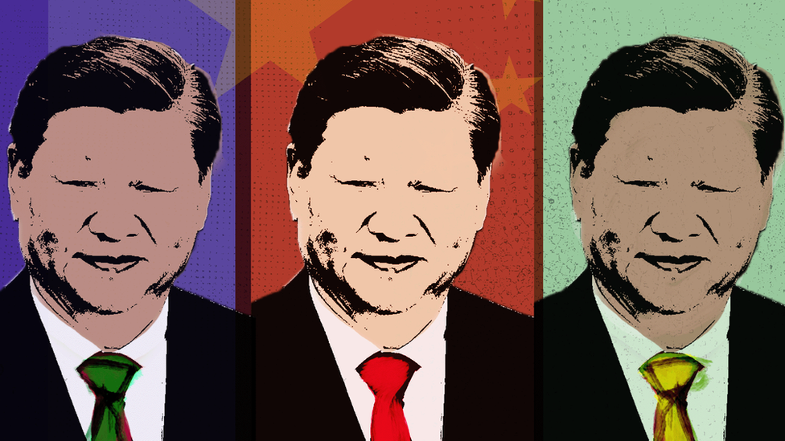
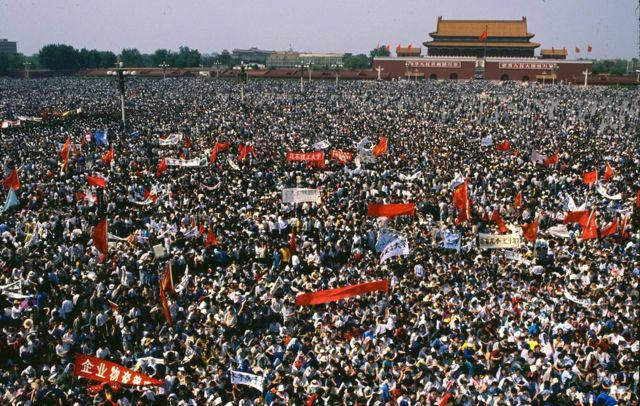
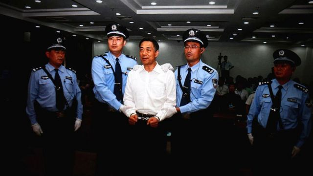
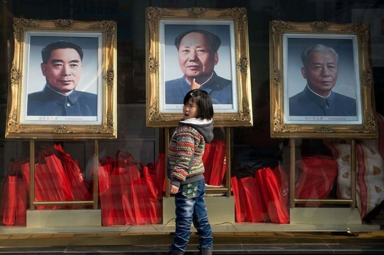
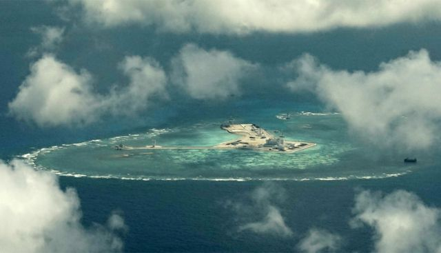
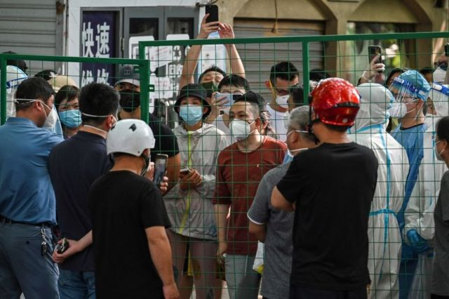

# [Chinese] 中共二十大：习近平的中共才初露锋芒

#  中共二十大：习近平的中共才初露锋芒

  * 傅东飞（Rupert Wingfield-Hayes） 
  * BBC记者 

**把习近平与毛泽东相提并论是“愚蠢的”，这是纽约大学中国历史教授丽贝卡·卡尔（Rebecca Karl）的看法。**

“如果你要比较两个人，它必须显露一些东西。这就像把普京比作斯大林，或把特拉斯比作撒切尔夫人一样。”

乍一看，两人的相似之处并不少。众所周知，毛主席是20世纪中国的决定性政治人物。从1949年中共建政到他在1976年辞世，毛泽东一直掌控着中共，以及这个国家。自那以后，没有其他中国领导人能与他相提并论。直到现在。

周日，习近平成为自毛泽东以来第一位三次当选党首的领导人。在习近平主政的十年里，他将权力集中在自己手中，无情地清除对手、推行个人崇拜、封杀批评，并将他的思想——习近平新时代中国特色社会主义思想——写入宪法。他被半开玩笑地称之为“万能主席”。

但卡尔教授认为，将毛泽东和习近平画等号仍然是一个错误，因为它忽略了介于两者之间的一切，以及那些梦想着或为另一个国家而战的中国人。

“这暗示的是专制是在他们的血液中，在他们的水中，或者在他们的文化中。”她说道。

但事实是，习近平的权力之路远非不可避免。这既取决于他的野心，也取决于党未能阻止他们不想要的事：毛泽东灾难性独裁统治的重现。

“我第一次接触中国是在1980年代，当时关于中国未来的辩论是巨大、重要的和有影响的。”卡尔教授说道。“党本身也参与了这些辩论，但在1989年被禁止。”

1989年，在苏联濒临解体之际，中国对变革的希望也被坦克和枪声粉碎。

##  “我们来得太晚了”

在毛泽东去世后的十几年里，中国仍在走出泥潭。有数以千万计的人在他的任内死亡：先是因为他希望中国通过“大跃进”实现工业化而导致饥荒，随后是对政敌、不同政见者、知识分子和“阶级敌人”进行的暴力和偏执的清洗。

毛的衣钵最终落在了邓小平身上。邓小平在两次清洗中幸存，并坚持每十年更换一次集体领导。

这一直持续到1989年，时任总书记是属于改革派的赵紫阳。

那年春天，数十万学生和工人占领了北京市中心，抗议腐败和物价上涨，并要求改革。在中共的权力之基中南海的高墙背后，党的最高领导层分裂了。

以赵紫阳为首的温和派试图利用抗议活动来推动进一步改革，而以时任总理李鹏为首的强硬派坚信学生的目标是推翻党的统治，希望平息抗议活动。

赵紫阳去探望了抗议者，在一次现在看来是历史性的讲话中恳请他们停止绝食：“我们来得太晚了……你们说我们、批评我们，都是应该的……你们还年轻，同学们啊，来日方长，你们应该健康地活着，看到我们中国实现‘四化’的那一天。你们不像我们，我们都已经老了，无所谓了。”

五月底，强硬派获胜。6月4日清晨，坦克进场。天安门广场上的屠杀结束了关于政治改革的辩论。相反，中共转向了经济改革。

> 图像来源，  Getty Images
>
> 图像加注文字，6月4日清晨，坦克进场。天安门广场上的屠杀结束了关于政治改革的辩论（图为1989年5月4日，天安门广场上的抗议人群资料照片）。

1992年，仍是中国实际最高领导人的邓小平宣布，党应该允许“一部分人先富起来”。 这听起来似乎并不吸睛，但这是对毛主义的又一次决定性突破。革命性的紧缩政策已经被打开了大门。

1990年1月一个寒冷的冬日早晨，我走下一艘夜间轮船，抵达广州的一个码头。这是我第一次来到中国。当时的空气中弥漫着煤炭燃烧后的硫磺味。外面的街道上是川流不息的自行车流，人们是头戴蓝色帽子、穿着毛样式夹克的工人。很偶尔地，这些自行车队会因为一辆“大喘气”的公交车或公务车而被分隔开。

在接下来的六个月里，我踩着自行车穿过云南的群山，在北京的紫禁城闲逛，并乘坐由两台炭黑的蒸汽机牵引的火车，驶向了遥远的西部新疆沙漠。景色令人赞叹，但却一贫如洗。我所到之处，人们都在告诉我，与西方相比，中国是多么“落后”。但是已经可以看到变化的迹象。

当我在1998年再来到中国时，整个国家已经把邓小平“致富光荣”的名言铭记于心。那一年，共产党下令将中国的国有住房一股脑地出售。北京一片片历史悠久的灰砖院落被拆除，取而代之的是玻璃钢筋建筑。

“下海”成为每个人嘴里的时髦词语，意思是辞去国有企业的旧工作，投身于私企。我记得有一天，我们的一个助理来到BBC办公室，递上他的身份证，郑重表示：“我要去深圳了”。当时，深圳是南方沿海的一个新兴城市。

毛泽东曾将中国经济与世界隔绝开来。现在，他的继任者打开了大门。2001年，中国加入世贸组织，东南沿海的新城市如雨后春笋般涌现。一些城市专门生产纽扣和拉链，另一些则生产打火机。在浙江，我发现有一座城市只做袜子，产量达到几百亿只。

当我准备在2008年离开中国时，苏联风格的机场已经让位给诺曼·福斯特（Norman Foster）设计的熠熠生辉的巨型建筑，而第一条高铁在北京和天津之间开通。

中国比历史上任何其他国家都更快地富裕起来。但这也释放了其他力量。

##  太子党的竞争

中国有句老话叫“天高皇帝远”，意思是在统治者视线以外的地方，没有人看着你在做什么。

习近平的前任胡锦涛似乎就面临这种情况。腐败在上升，而他的权威被公开忽视，甚至受到挑战。

随着土地价格因改革而飙升，中国各地的党政官员向农民征地，将其卖给开发商，并从中获取巨额利润。

2005年，我得到一张从河北定州偷运出来的DVD录像光盘，显示了当地农民与一家国有电力公司雇用的数十名武装暴徒之间的激战。这些暴徒希望驱赶农民离开土地。农民们在其农田里挖了很深的壕沟。暴徒们在黎明时分发起攻击，用猎枪开火，并用钢筋殴打农民，导致六人遇难。

贪污腐败的现象十分严重。在北京，我记得我去了一家夜店，据说这家夜店的老板为有钱人提供非法的毒品和迷人的年轻女性，而他的商业伙伴却是公安。

《金融时报》前北京分社社长理查德·麦格雷戈（Richard McGregor）说，这只是巨大冰山的一角。他补充说：“每个人都分得一杯羹，但它已经失控了。”他说。“它变得更像苏哈托的印度尼西亚，它正在腐蚀体制的基础。”

正是在这时，中国和欧盟就纺织品配额问题进行了一场贸易战，而我得到了采访商务部长的罕见邀请。对中国高级官员的此类采访通常非常枯燥，但这次却完全不同。

部长的名字叫薄熙来。他身材高大，英俊潇洒，魅力四射。他似乎很享受采访中的挑战，机智而有说服力地回答了问题。我心想：“这是一个可以在任何地方成为政治家的人”。

2007年，薄熙来被派去管理中国西南部横跨长江的重要山城重庆。那里当时因有组织犯罪而声名不佳。

> 图像来源，  Getty Images
>
> 图像加注文字，这是薄熙来的最后一张公开照片。

薄熙来发起了一场无情的反腐运动，逮捕了数百名犯罪分子、商人、政客和警察。他建造了豪华的基础设施，包括公共住房。奇怪的是，他还恢复了“红色文化”，要求每个人学习毛泽东时代歌颂中共的歌曲。许多人对薄熙来的统治感到恐惧，但他在工人阶级中广受欢迎。

政客们从北京赶来研究“重庆模式”。其中一位是政治新星，名叫习近平。

随后，在2012年，多年来一直在建立自己权力基础的薄熙来，被一场震惊中国的融合了谋杀、腐败和国际阴谋的离奇故事所打倒。被判无期徒刑的他时至今日仍在狱中。

然而，他的“重庆模式”可以说是习近平即将在全中国推出的模式的原型。

习近平是一名“太子党”，他的父亲习仲勋是毛泽东的得力助手，但他曾遭到清洗，后来又被平反。同事们形容年轻的习近平谦虚、自律、勤奋，但其他方面并不突出。即使在他被提升为中共总书记前夕，也几乎没有迹象表明会发生什么。

在2012年习近平被任命为中共领导人时，腐败已经达到了最高层。这让将其视为严重威胁的党内长老忧心忡忡，同时也给了习近平把自己打造成救世主的机会。

“他们认为（反腐运动）会持续三到六个月，但这绝不止是一场反腐运动，而是一场党的矫正运动，将永远持续下去。”伦敦大学亚非学院中国研究院主任曾锐生（Steve Tsang）教授说。

在薄熙来惊人的垮台后，数十万名党员干部被调查。超过10万人因腐败被起诉，包括120名高级官员。腐败现象急剧下降，习近平的声望飙升。

现在他有了摧毁其最强大政治对手的弹药。他在2014年下令逮捕周永康，后者在两年前还是政治局常委，是中国最有权力的人之一。2015年，周永康被定罪，也被判处终身监禁。

这在后毛泽东时代是史无前例的。

“我认为党内长老们一定有一丝‘买家自责’的感觉，”麦格雷戈说。

习近平无情和戏剧性的权力巩固使许多人将他比作毛泽东。但毛泽东的破坏性源于他对建立社会主义乌托邦的执念。习近平想建立什么？

卡尔教授说，毛不会认可这一切。

“今天的中国没有社会主义特征。”她说。“劳动对资本的从属地位是完全的。如果你是一个真正的社会主义者，你必须有一个阶级民主、正义、等级制度和反等级制度的概念。这些都不是习近平思想的一部分”。

> 图像来源，  Getty Images
>
> 图像加注文字，习近平的中国已不是毛泽东的中国。

从毛时代的中国唯一遗留至今的是党本身。她说，这才是习近平真正关心的东西。

“他认为，在竞争激烈的资本主义以及在与美国进行激烈的军备竞赛的世界中，中国保持竞争力的唯一可行方式是继续处于一个被称为共产党的政党之下。”

##  另一个伟大舵手？

没有谁能像毛泽东那样给共产党带来合法性。这位标志性革命家的画像仍在天安门广场上，正是在那里，他宣布了中华人民共和国的成立。

因此，他破坏性的一面被人们的崇敬之心所掩盖。而现在，习近平不失时机地继承毛泽东，甚至挪用了毛泽东已经过时的头衔——伟大舵手、人民领袖。但他所追求的是更大的目标。

曾教授说：“伟大的皇帝是习近平真正仰望的人，这个人的野心很大。”

他称，习近平的目标是一个辉煌而神话性的中华文化——“天下”，由万众一心的人民构成的统一家园。“中国的爱国者是热爱中国、共产党及其领导人的人。”曾教授说道。“而他所说的中华是指汉族文化”。

在习近平的中国，几乎没有多元化的空间。新疆的1200万维吾尔族穆斯林正在被强行同化。在西藏和内蒙古，类似的计划也在推进中。

“习近平实施的政策——再教育营——是为了让他们更像中国（汉族）人而不是维吾尔人。”麦格雷戈说。“这是文化上的种族灭绝”。

这与毛泽东的多民族国家理念截然不同，在理论上，不同群体有更多自主权，而习近平的父亲也以安抚和尊重中国的少数民族而闻名。

但他的儿子正在推动一种强烈的民族主义，力图在国内团结中国人，并赶走那些在北京看来试图包围和削弱中国的外国势力。

2015年11月， 我乘坐一架小型单引擎塞斯纳飞机从菲律宾巴拉望岛起飞  ，目的地是菲律宾控制的派格阿萨岛（中国称中业岛），它位于400英里之外的南中国海中部。而我们的计划是经过一个新的中国军事基地，该基地建在美济礁上的一个人工岛上。

当我们靠近时，一条飞机跑道的轮廓和长达9公里的奇特人工岛出现了。

> 图像加注文字，中国正在南海珊瑚礁上建造新岛屿。

紧接着，无线电中响起中英文警告：“美济礁西北方的外国军机，这是中国海军！你们正在接近中国领空。你们正在接近中国领空。为了避免进一步行动，请立即转向并离开！”

我们是一架在国际空域飞行的民用飞机，但这并不重要。

这些南海岛屿只是习近平控制周边地区的最大胆和最明显的举动。台湾可能是下一个。

“中国现在正在做各种它一直想做，但此前实力还不够的事情，”麦格雷戈说。“台湾一直在那儿。南中国海一直在那儿。（中国）一直有雄心对抗美国，将其赶出亚洲，但他们没有大声说出来。”

现在，中国正大声表明态度。开展口头攻势的中国外交官被人们以爱国动作电影《战狼》命名，他们在国内非常受欢迎。

但美国前总统克林顿政府的中国问题专家谢淑丽（Susan Shirk）认为，习近平的政策只是在制造他声称要防御的敌对世界。

“挑起与邻国的战斗。重新启动建造大型人工岛礁的计划，并用军事设施加固它们。加大对日本和台湾的压力。这是中国外交政策产生的一种自我包围。”谢淑丽说。

作为世界上最大的工厂和市场，中国非凡的实力推动了其鲁莽的行为。迄今为止，它取代美国成为全球最大经济体似乎势不可挡。

不过，新冠疫情扰乱了计划。

##  内部挑战

今年早些时候，我的一位中国朋友被锁在上海一家酒店房间，独处了83天。

“这让你想发疯，”他说。“这是一种抑郁和愤怒混合的感觉。一段时间后，你会感到不能呼吸。你的身体开始停止运转。每一天都是一样的，就像时间停止了一样。”

当时，他身陷中国规模最大和时间最长的新冠封城。封锁原计划只有四天，但实际是另外四天，然后是额外的四天……很快，酒店工作人员不再告诉他时间。

芝加哥大学政治系教授杨大利（Dali Yang）一直在研究习近平亲自支持的“清零”政策。他说：“中国将这些封锁持续如此之久令人惊讶，这非常痛苦。”

杨教授表示，封城在新冠疫情的第一年是有道理的。它们很短暂，让国内的生活得以继续。人们甚至为中国处理这种大流行病的方式比西方国家好得多而感到自豪。“情况不再如此，”他说。

经济增长已放缓至3%，是30多年来的最低水平。中国的房地产市场处于自由落体状态，青年失业率升至约20%，与美国的贸易战也依然在持续。愤怒已经在酝酿。

“每晚午夜后，人们会开始在社交媒体上分享视频片段。”我的上海朋友回忆说。“他们表达了对共产党的愤怒，甚至指向最高领导人。他们谈到这个体制变得多么无情和残酷。”

> 图像来源，  Getty Images
>
> 图像加注文字，在上海长达数月的封锁期间，愤怒的居民曾与官员对峙。

视频片段很快就遭到审查。互联网上的任何异议或批评的迹象都会立即被清除，但对“清零”的愤怒是显而易见的，即使是罕见的抗议迹象也出现了，虽然在被处理前只持续了片刻。很难否认，很多中国人认为习近平本人对中国严厉封锁措施的残酷性负有责任。

谢淑丽说，恐惧和忠诚导致了地方层面“对习近平本人最初想法的过度遵守和执行”。

而这似乎已经得到回报。负责监督上海有争议的封城行动的市委书记李强将被擢升为总理，成为习近平的二把手。

在按部就班的党代会场景背后，中共面临着一个残酷无情的世界。在忠诚者的包围下、在看不到接班人的情况下，习近平现在无可争议地指挥着一个更富有、拥有更强大军队的国家。世界第一次不确定中国会发生什么。习近平已经把批评他的以及更谨慎的党内元老一扫而光。

“过去，我们总是可以指望中国领导人在经济政策上务实，在外交政策上谨慎。我们现在看不到这些。”谢淑丽说。

邓小平曾有名言，中国应该“韬光养晦”。

结束的时候到了。

2017年，习近平在开始第二任期时宣告：“中华民族迎来了从站起来、富起来到强起来的伟大飞跃，迎来了实现中华民族伟大复兴的光明前景。”

他特意呼应了毛泽东1949年中共建政时说的话：“中国人民站起来了”。

但是，习近平的中国已不是毛泽东的中国。习近平对自己和国家的野心远远超过了毛泽东的梦想。

从各方面来看，毛泽东是一个破坏者，他不止一次撕毁了规则手册，但习近平不是无政府主义者，甚至不是一个反叛者。并且，他当然不希望毛时代曾撕裂他自己家庭的混乱局面重现。

他真正想要的是成为中国有史以来最强大的领导人，而中共刚将胜利交付予他。

