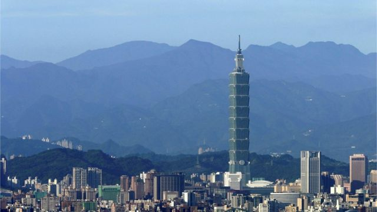
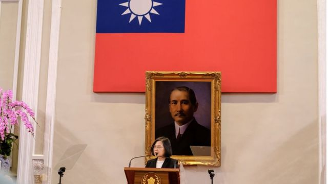
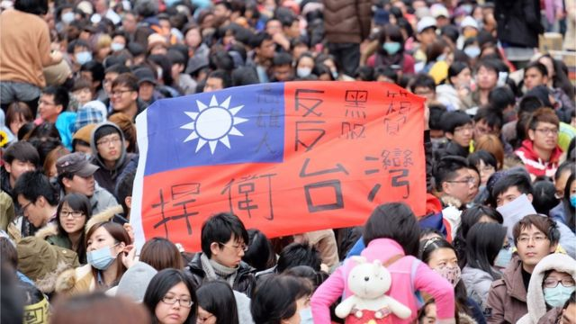
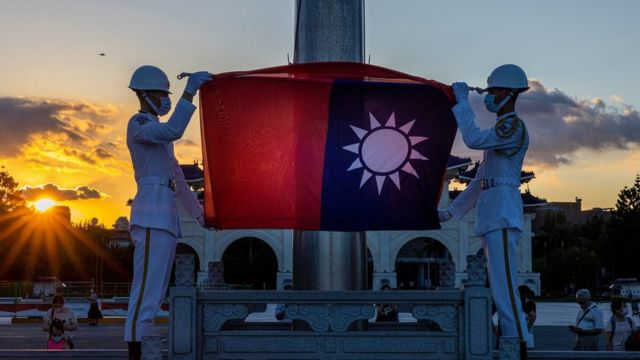
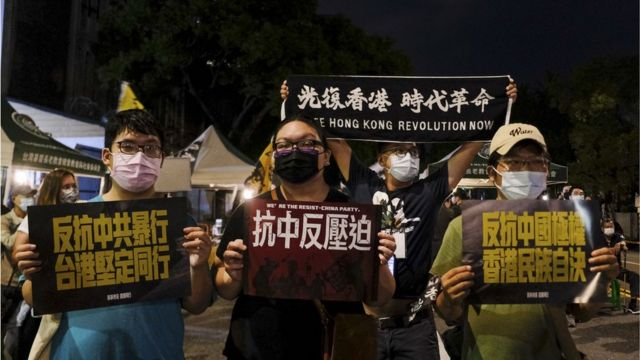

# [Chinese] “九二共识”三十周年：“一中各表”下的和平红利和窄化后的“一国一制”之忧

#  “九二共识”三十周年：“一中各表”下的和平红利和窄化后的“一国一制”之忧

> 图像来源，  Getty Images

**1992年10月末，台湾海峡交流基金会与中国海峡两岸关系协会在香港举行历史性会谈，这次会谈促成了后来的“一中各表”这个表述， 也就是人们所熟知的“九二共识”， 过去三十年一直是两岸关系中最热门的政治术语之一。**

但如今，对于“九二共识”的内涵， 海峡两岸却是渐行渐远，大陆视其为双方沟通的基石，但台湾民进党政府不承认“九二共识”，两岸关系剑拔弩张。政治学者对BBC指出，即便“九二共识”过去给双方带来了一些和平红利，但未来已经没有发挥的空间。

##  分歧与红利

实际上， “九二共识”一词并非出现在两岸1992年香港会谈后，而是由台湾前陆委会主委苏起在2000年提出，他为重新包装“一中各表”自创了这个新名词，他解释说内涵是“一个中国，各自表述”。

对于“九二共识”的内涵，大陆和台湾认知不同。

根据中国大陆的说法，台湾海基会在香港提出的第8种表述方案是双方接受的共识内容，即“在海峡两岸谋求国家统一的过程中，双方虽均坚持一个中国之原则，但对一个中国的涵义，认知各有不同。惟鉴于两岸民间交流日益频繁，为保障两岸人民权益，对于文书查证，应加以妥善解决。” 海基会代表还建议“以口头声明方式各自表述”。

但近年来，中国方面的表述越来越强调“一中”。中国称，“九二共识”的核心意涵是，“海峡两岸同属一个中国，共同努力谋求国家统一”。

在台湾，国民党和民进党对“九二共识”也有分歧。

> 图像来源，  Getty Images
>
> 图像加注文字，2016年，民进党领导人蔡英文当选台湾总统后，始终不接受“九二共识”。

国民党一直以来的说法是，九二共识即“一中各表”，“一个中国，各自表述”。不过今年6月，国民党主席朱立伦在美国受访又称，“九二共识”是“没有共识的共识”。

“九二共识”一直被大陆视作与两岸关系发展的政治基础。在共产党和国民党对“九二共识”的一致认同下 **，** 两岸实现了更加紧密的经济文化交流与合作。2008年，两岸海、空运直航、直接通邮，实现“大三通”；2010年，双方签订《海峡两岸经济合作框架协议》；2015年，中国领导人习近平和时任台湾总统马英九在新加坡举行历史性会晤，这是1949年来双方最高领导人的首次会面。

台湾政治大学国家发展研究所助理教授黄兆年认为，作为2000年才提出的政治词汇，“九二共识”是一种政治论述工具，它的意义在于提供了国共两党合作的基础，带来了一些和平红利。

“虽然2000年后是民进党执政，可是国民党仍然跟共产党跟之间保持交流跟合作； 2008年马英九上台后一系列的经济合作，如ECFA（海峡两岸经济合作架构协议），以及后来所谓的服贸协议、马习会，其实某种程度上都是共产党跟国民党在所谓的‘九二共识’的基础上建构出来的，”黄兆年说。 “两岸之间的和平红利，或者说经济的交流跟合作，可以说是‘九二共识’的基础之上发展而来的。”

> 图像来源，  Getty Images
>
> 图像加注文字，台湾许多民众担心，与中国大陆建立密切的经济联系，会损害台湾自身经济，并且加深中国在台湾的影响力。

不过两岸服贸协议要求双方互相开放特定服务业市场，引起岛内很多人担心。 他们认为， 与中国大陆建立密切的经济联系，会损害台湾自身经济，并且加深中国在台湾的影响力。2014年， 在台湾立法院中，主持会议的国民党立法委员强行通过协议审查，质疑者认为是黑箱作业，引爆太阳花学运。

“这个和平红利其实是很有问题的，我们可以说它其实变成了跨海峡政商集团的和平红利了，它距离台湾的民意是遥远的，甚至是背离的，这从太阳花学运就可以看出来，”黄兆年说。

2016年，民进党领导人蔡英文当选台湾总统后始终不接受“九二共识”， 让两岸关系陷入僵局。

近年来，两岸关系更加恶化。今年8月，在中国的警告声中，美国众议院议长佩洛西访问台湾。中国人民解放军随即在环绕台湾岛的六个海域进行实弹军事演习。

##  “九二共识”与“一国两制”

近年来，“九二共识”的内涵似乎也在演变。2019年初，中国领导人习近平在《告台湾同胞书》发表40周年纪念会上发表讲话。他以“九二共识”基底，再提“一国两制”。

习近平称，70年来，推动两岸双方在一个中国原则基础上达成“海峡两岸同属一个中国，共同努力谋求国家统一的“九二共识”，而“和平统一、一国两制”是实现国家统一的最佳方式。

> 图像来源，  Getty Images
>
> 图像加注文字，台湾师范大学政治学研究所教授范世平认为，习近平的提法几乎将“九二共识”等同于“一国两制”。

台湾师范大学政治学研究所教授范世平认为，习近平的提法几乎将“九二共识”与“一国两制”画等号。

“准确来说，‘九二共识’就是一个中国，两岸要共谋统一，统一的模式就是‘一国两制’，”范世平对BBC解读习近平的说法，“过去从国民党的角度来看，‘九二共识’就是一个中国，然后各自表述，但习近平把‘九二共识’诠释为‘一国两制’，一国当然就是中华人民共和国，没有所谓的各自表述空间。”

黄兆年则指出，2018年台湾九合一选举中国民党韩国瑜大胜，民进党整体处于一种比较低迷的状态，而2019年习近平的讲话“让民进党捡到枪”。

“习近平提了‘一国两制’台湾方案，然后蔡英文就很直白地去回应，让台湾民众恍然大悟，’九二共识‘是没有共识的，北京其实是没有’一中各表‘的空间的。”黄兆年说。

##  “九二共识”的未来

根据台湾近年的民调，反对“九二共识”的民意仍在上升。

台湾陆委会2021年民调显示，多数台湾民意反对中共“一中原则”和“九二共识”、推进统一及粉碎台独等立场（76.1%）；近9成不赞成其对台主张“一国两制”（89.2%）、持续以武力威胁台湾（88.7%）。而2019年陆委会民调显示，74.3%的民众不接受中国大陆“一个中国原则”的“九二共识”。

范世平认为，“九二共识”在台湾的影响力每况愈下，是因为习近平将“九二共识”窄化为“一国两制”。台湾接受“九二共识”的民调一直往下走，因为香港在“一国两制”之后，因为香港国安法，香港已经变成了“一国一制”。

> 图像来源，  Getty Images
>
> 图像加注文字，范世平认为，九二共识在台湾的影响力每况愈下，是因为习近平将“九二共识“窄化为”一国两制”。

“过去中国大陆是拿香港跟澳门来做一个等于说告诉台湾人‘一国两制’是可行的，是有保障的。现在对于台湾人来说，‘一国两制’也没有什么卖点。”

黄兆年则认为，从台湾民意和地缘政治两方面看，“九二共识”都已经没有发挥的空间。

“现在美国跟中国之间在争霸，不只是在安全上，也在经济跟科技上。安全上，我们面对一个有武力威胁的这个敌对阵营，台湾必须要强大自己，然后跟美国在一起。经济上，美中之间针锋相对，台湾为了要确保自己的经济自主性和政治自主性，也必须和美国合作，已经没有不选边站的空间，不能够‘安全靠美国，经济靠中国’，”黄兆年分析。

