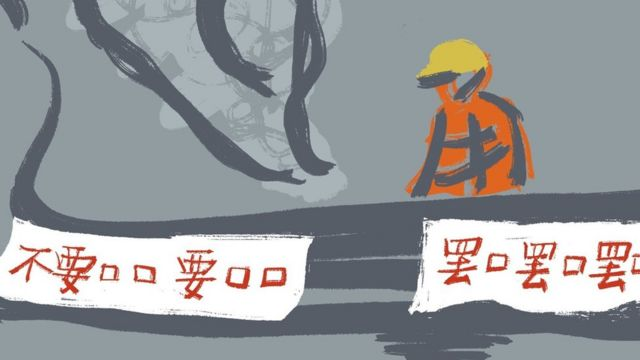
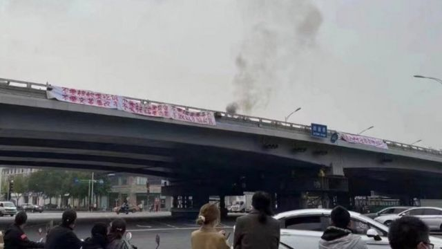
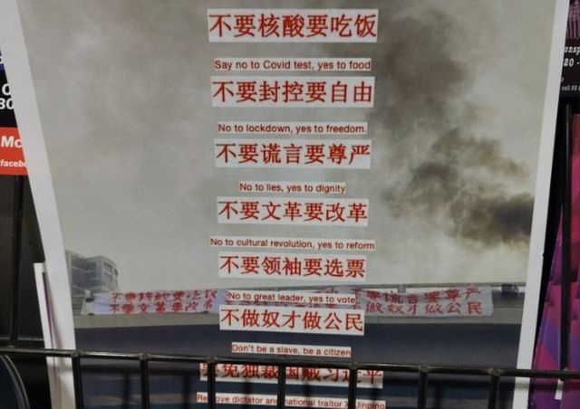
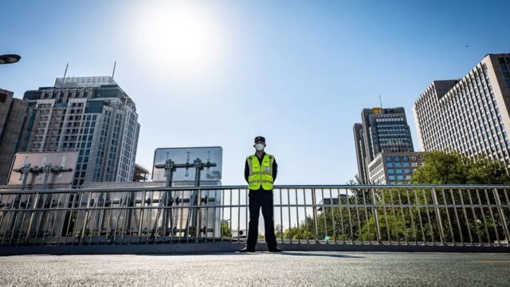

# [Chinese] 四通桥抗议事件启发下，“反习”行动在中国境内外蔓延

#  四通桥抗议事件启发下，“反习”行动在中国境内外蔓延

> 图像来源，  Internet

**中共二十大已经闭幕，领导人习近平如愿以偿留任，开始自己的第三任期，并在中共核心权力机构政治局和政治局常委安插自己的心腹。在受到严格审查的中国社交媒体上，这似乎没有引起任何波澜。**

但越来越多的迹象显示，在习近平打破任期惯例以及他不近人情的防疫措施导致民生和经济危机日益严峻，不满情绪迅速升温并蔓延。

本周一（10月24日），香港警方宣布以“煽动意图罪”拘捕了一名27岁的中国大陆男子。他被控近日在香港立法会告示板张贴三张海报。

据香港媒体公布的图片，他张贴的内容包括北京四通桥抗议事件的照片和标语。另一张海报包含一幅习近平画像，上面印有“独裁者下台”（Out Dictator）字样。

警方称，他涉嫌“煽动他人对中央政府或中央领导人产生憎恨”。

二十大召开前夕，有抗议者在首都北京西北部的四通桥上悬挂横幅，指责习近平是独裁者，并要求他下台。据信他很快被捕，但该事件促使中国境内外的许多人站出来表达他们的不满。

在推特上，一些抗议视频也在悄然流传。一条影片显示，在貌似上海的一条繁忙商业街，有两名女子夜晚拉开了一条白色横幅与同伴一起前进。有片段显示，她们还唱起了《国际歌》。

影片显示，横幅上是手写的黑色汉字“不要 要 不要 要 不要 要”。这几个类似密码的文字可能对很多人来说不明所以，但也有许多人迅速将其与四通桥抗议联系起来。

四通桥事件中，其中一条被悬挂在高架桥上的横幅写着：“不要核酸要吃饭，不要封控要自由，不要谎言要尊严，不要文革要改革，不要领袖要选票，不做奴才做公民。” 另一条横幅则要求罢免习近平。

在中国，类似的公开抗议近年已非常罕见，尤其是涉及国家领导人反抗行为，会导致严厉的刑罚。2018年，一名女子在上海一座大厦前向带有习近平画像的宣传画泼墨，表达不满，她随后被送入精神病院。

中国公共场所无处不在的摄像头和人脸识别设施，也让抗议者无所遁形。

> 图像来源，  Twitter
>
> 图像加注文字，四通桥抗议现场

在四通桥抗议后，北京显著加强了安保措施，城市的很多桥上都部署了额外的警察和志愿者。一些人把他们称作“看桥员”。

但是，根据推特和Instagram等海外社交媒体上流传的图片，在中国监控摄像头未覆盖的一些地方——例如公共厕所或浴室——不断有类似抗议标语出现。

据称是在北京一家影院的厕所，墙上被人喷上了“反独裁，反核酸”的黑色大字。

“8964的精神永远不会被扼杀，”四川一个公共浴室里的涂鸦写道，其指的是1989年中共在天安门对争取民主的学生的血腥镇压。

> 图像来源，  Twitter
>
> 图像加注文字，澳大利亚墨尔本一所大学的海报。

一些人还使用了更隐匿的方式。据报道，有人使用苹果（Apple）手机的隔空投送（Airdrop）功能，在地铁车厢或校园内向其他人的手机发送抗议标语的图片。

这股反抗的精神也蔓延到了海外。美国、英国、澳大利亚等国的多所大学校园和地标建筑上都出现了类似的标语和海报。

在伦敦的中央圣马丁学院（Central Saint Martins），一幅海报上留有“到站下车，引咎辞职”和“再见近平”（Good Bye Jin Ping）字样。一些法国华人还举行了“喜迎习主席登基”的讽刺表演。

近几个月来，中国诸多城市因新冠疫情遭轮番封锁。继上海、西安、成都和深圳后，西部城市西宁和兰州再次封锁了大片居民区，很多居民因食物短缺和无法就医在互联网上求助。

台湾大学社会学系的何明修教授指出，自邓小平改革开放以来，中国领导人的执政趋向于在收紧和放宽之间循环。

“但习近平没有那个循环，只有逐步升级的控制。‘清零’政策只是一个越来越独裁的系统的其中一个特征，它对人们自由的限制越来越大。”

> 图像加注文字，四通桥抗议事件发生后，北京显著加强了安保措施，城市的很多桥上都部署了额外的警察和志愿者。一些人把他们称作"看桥员"。

不过，由于中国当局对这种异议声的严厉打击和惩罚，有人认为这些反叛声音不久后就会消散。

“这种个人化的抗议远非共产党担心的集体行动……而且他们能够扼杀比四通桥抗议者更大的威胁。”约翰斯·霍普金斯大学（Johns Hopkins University）政治经济学专家孔诰烽说道。他指的是中国当局近年来针对知识分子、活动家和律师的打压。

他表示，民间抗议提醒中共注意这种“不满的种子”，并为其提供了进一步加强控制的借口。

