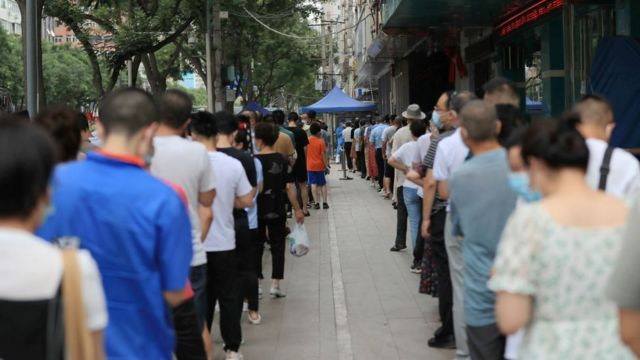

# [Chinese] 中国兰州男童封锁期间失救死亡，新冠“次生灾难”再引公愤

#  中国兰州男童封锁期间失救死亡，新冠“次生灾难”再引公愤

> 图像来源，  SUPPLIED
>
> 图像加注文字，三岁男童妥文轩的死亡事件，在社交媒体上引发公愤。

**中国甘肃省兰州市一名三岁男童在新冠疫情封锁期间煤气中毒，未能及时获得所需抢救而死亡，引发公众舆论对有关“过度防疫”的愤怒。**

该名男童在周二（11月1日）于兰州七里河西园街道一户使用液化气灶的店铺内一氧化碳中毒，当时街道正处于新冠疫情“静默管理”期间，遇事家庭则是开手抓肉店，因封控而被关在店内。

男童的父亲向BBC表示，在求救期间，有关当局“不作为”，延误了送医时间。

当地警方通报指，警察到场时，现场有二人中毒昏倒，其中一名儿童当时已无呼吸，送院抢救无效死亡，另一人在送院后生命体征平稳。

兰州当地官员在周三强调要“坚决防止疫情防控简单化一刀切”。

专家向BBC中文表示，目前中国大陆因为严控防疫政策而造成的“次生灾害”，可能是比新冠疫情本身更大的危机。

##  “没有任何人管”

当地居民向BBC表示，事发的居民区从10月初开始就被封锁——现在中国大陆将新冠疫情防控的封锁措施称作“静默管理”。

当地警方通报指，他们在周二13时43分接到群众救助，14分钟后到达现场，经调查和鉴定，事件起因为“使用液化气灶不当，造成一氧化碳中毒死亡”。

而男童的父亲妥世磊向BBC表示，他当时有超过一个小时的时间不能将儿子送出被疫情防控封锁的居民区。

“孩子的死亡原因是意外，但我们求救的过程，有人躲避，不作为，就是过度防疫，”妥世磊接受BBC电话采访时表示。

他表示，事发当天中午左右，他们一家被封在小区的店铺里，因为“条件不好”，就用液化气灶烧水给没有暖气的房间取暖。

稍后，他听见妻子摔倒，然后“挣扎着起来”。他随即关掉气灶，并给妻子做心肺复苏。在妻子状况好转后，他又发现，儿子也出现中毒情况。

据妥世磊描述，儿子当时昏迷但是有呼吸，他在此期间向社区发求救信息，并亲身去封锁卡口向两个值班的社区工作人员求助。

“两个人一个说没有带手机，一个说你找社区别找我们，”妥世磊说。

他表示，他们还要求他出示最新的核酸检测结果，但他并没有。

然后他回到家中为儿子急救，还表示有群众看到他发到网上的视频后前来协助，他的儿子此期间一度能睁开眼睛。

他表示，群众当时帮忙联系找车和打急救电话，但持续一个多小时“没有任何人管”，于是他们抱着男童前往封锁卡口，在发现仍然没有人帮助之后，“我就强闯出来”。

据悉，救护车在他们离开之后才到达小区。

妥世磊的儿子妥文轩被送到离小区约10分钟车程的医院，经抢救无效，在下午15时过后不久宣告死亡。

> 图像来源，  Getty Images
>
> 图像加注文字，兰州市自10月初以来一直处于疫情防疫措施下。

##  公愤再起

周二晚上，兰州当地有居民走上街道表达愤怒。当地人向BBC传送的视频显示，有警员在场维持秩序，其中有一名男子被一组身穿黑色制服的人员拉拽和踢打。

中国媒体报道，​​甘肃省委常委、兰州市委书记朱天舒在周二到访居民小区、医院和食品采购中心“现场协调解决”防疫问题，但未知是否有前往发生中毒事件的七里河西园街道。

《中国新闻周刊》的官方微博引述朱天舒强调，在新冠疫情防控上要“坚决防止简单化、一刀切”，还指“对能够解决的问题坚决不拖延”。

自新冠疫情全球大流行以来，中国大陆“动态清零”的防疫政策一直持续，不定期的强制封锁和大规模核酸检测及隔离措施令经济承受巨大代价，民怨积聚。

因“动态清零”防疫措施而导致人命伤亡的事件也时有发生——9月在贵州一辆连夜运载封锁区居民前往强制隔离地点的大巴，凌晨时分在高速公路意外翻侧，造成27人死亡，而据官方数据，该省自疫情开始以来的新冠死亡病例为两例。

进入历史性第三任期的中国最高领导人习近平此前在中共二十大上仍然表示会坚持“动态清零”政策。

兰州男童的中毒死亡事件在中国社交媒体上引发公愤。至周四，与事件有关的话题标签在新浪微博上的阅读量超过1.5亿。

“他才三岁，疫情三年，那是他的一辈子！”新浪微博上有关此事件的一条评论这样说道。

也有一些评论指，当地疫情的实际状况可能未明确，不能因此事件而否定防疫政策。

专家指，目前中国的公众舆论显示，虽然已有迹象显示有人希望中国大陆的防疫政策作出一些改变，但是总体上对于新冠疫情的恐惧仍然很严重，这可能使得放宽防疫的过程受阻。

“现在有迹象显示想要改变（防疫政策），但是国家这么大，改得太快也会有问题，”香港大学生物化学教授金冬雁向BBC中文表示。

他指出，中国民众在数年防疫的宣导下形成了对新冠病毒的巨大恐惧，在防疫政策上“怕躺平”，但是实际上世界多地放宽防疫，并不等于“躺平”。

他说，要调整政策不能太快，只能“一步步来”，才能避免“大恐慌”。

但他同时认为，改变对疫情的看法是必须走的一步，否则“继续这样下去，只会有社会的动乱”。

他表示，中国大陆防疫政策的“次生灾难”已经很严重，兰州男童事件只是又一起。

妥世磊表示，他希望向有关人员问责。

“所有涉及的这些工作人员，问题出现在哪里，为什么没有第一时间出手救助？”他说。

他一直有在中国社交媒体上发声讲述他经历的事件经过，还表示担心自己的安全。

据兰州当地政府数据，周四有50例新增本土无症状确诊新冠病例，妥世磊所居住的七里河区有9个确诊场所

