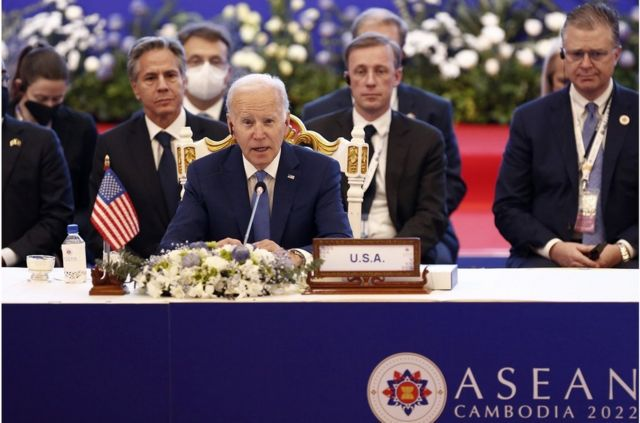
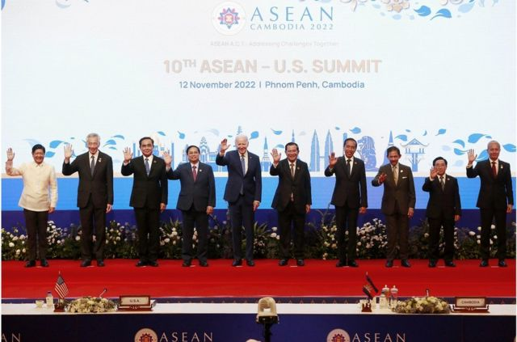
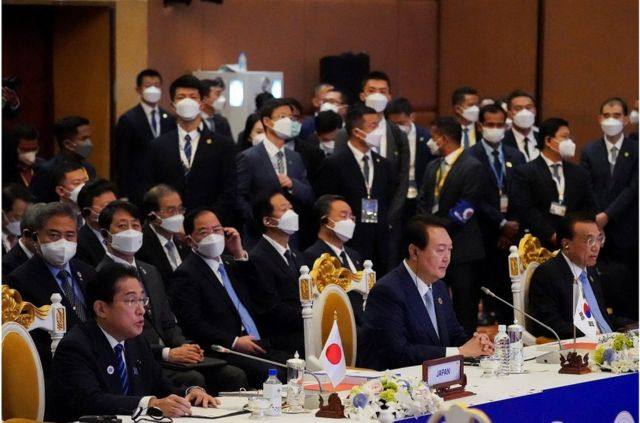
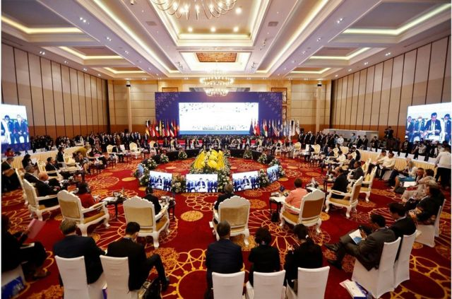

# [Chinese] 柬埔寨东盟峰会：中美在东南亚角力 拜登G20前确立与东盟“全面战略伙伴关系”

#  柬埔寨东盟峰会：中美在东南亚角力 拜登G20前确立与东盟“全面战略伙伴关系”

> 图像来源，  EPA
>
> 图像加注文字，美国总统拜登出席第十届东盟-美国峰会，宣布与东盟建立“全面战略伙伴关系”。

**中美地缘政治角力延伸到东南亚国家。美国总统拜登在会晤中国国家主席习近平前夕，宣布与东盟确立“全面战略伙伴关系”；中国总理李克强则大打经济牌，并说愿同东盟妥善处理南海问题。**

中美竞争之际，美国总统拜登11月12日在柬埔寨金边出席东盟峰会，表示与东盟建立的“全面战略伙伴关系”，有助共同解决“这个时代最重大的问题”，包括气候、卫生安全，以及抵抗对规则为本国际秩序和法治的重大威胁。

拜登重申，东盟地区是美国“印太战略”的核心，期待建立“一个自由开放、稳定繁荣、有弹性和安全的印度洋太平洋”，解决从南海到缅甸的挑战。

他还说，华府对东盟的支持非口惠而已，美国在过去一年对东盟投放超过2.5亿美元，2023年将提供8.25亿美元援助，协助东盟发展电动汽车生态系统及可持续基建等。

> 图像来源，  EPA
>
> 图像加注文字，拜登重申，东盟地区是美国“印太战略”的核心。出席第十届东盟-美国峰会的各国领导人大合照。

中国去年11月已经与东盟宣布建立“全面战略伙伴关系”，这次美国跟随其后，甚有拉拢意味。美国智库战略及国际研究中心东南亚项目主管格雷格·波林（Greg Poling）指出，美国此举并不意味着有什么具体事情，“但在象征意义上使美国与中国处于同等水平”。

##  李克强称“选边站队不应是选择”

> 图像来源，  Reuters
>
> 图像加注文字，11月12日，在柬埔寨金边举行的东盟峰会期间，日本首相岸田文雄（左）、韩国总统尹锡悦（中）和中国国务院总理李克强（右）出席了第25届东盟加三峰会。

同一时间，中国总理李克强在金边出席中国－东盟（10+1）领导人会议，以及东盟与中日韩（10+3）领导人会议。他在10+1会上表示，中国与东盟是“命运与共、休戚相关的全面战略伙伴”，选边站队不应该是选择，开放合作才是克服共同挑战的必由之路。

就南海争端，李克强表示欢迎会议发表“纪念《南海各方行为宣言》签署20周年联合声明”，高度评价“南海行为准则”磋商取得积极进展，“我们完全有信心、有智慧、有能力把解决南海问题的钥匙掌握在自己手中”。

他说，中方愿同东盟各国根据包括《联合国海洋法公约》在内的国际法，在相互尊重的基础上妥善处理南海问题。

李克强说，疫情近3年来中国东盟贸易逆势增长，已互为最大贸易伙伴，他提出设立“中国东协共同发展专项贷款”，加大疫后复苏合作，并支持东盟基建、能源项目的投资，提高通关效率，建设公共卫生科技合作中心，以及未来3年为东盟国家培训1000名数字人才。

> 图像来源，  EPA
>
> 图像加注文字，11月13日，作为第40届和第41届东南亚国家联盟（东盟）峰会及相关峰会的一部分，与会领导人和代表出席了在柬埔寨金边举行的第二届东盟全球对话。

东南亚一连举行多场会议，包括11月10至13日在柬埔寨金边的东盟系列峰会，15至16日日在印尼峇里举行的二十国集团（G20）峰会，18至19日在泰国曼谷的亚太经合组织（APEC）领袖非正式会议。

拜登是自2017年以来首次参加东盟峰会的美国总统，他在14日预料将与中国国家主席习近平在印尼峇里举行面对面会谈，为拜登在2020年上任以来两人首次会面，料谈及台湾问题、朝鲜核问题及俄罗斯入侵乌克兰等议题。

美国总统拜登表示，在美国选民通过内华达州的凯瑟琳·科尔特斯·马斯托（Catherine Cortez Masto）的连任将参议院的控制权交还给民主党后，他预料将在周一与中国国家主席习近平进行一场紧张的会谈。

拜登说，他很了解习近平，习近平也很了解他，两人经常有直截了当的讨论，从未有错误估计对方立场。

拜登指出：“我们几乎没有什么误解。我们只需要弄清楚红线是什么。”

