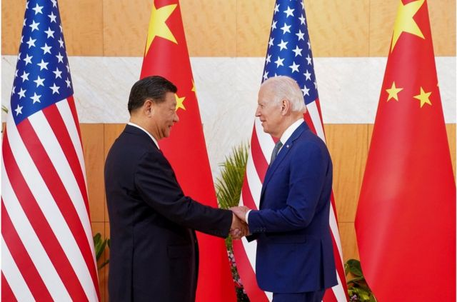
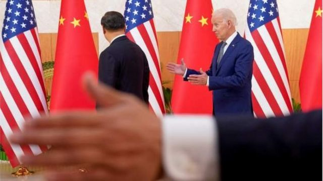
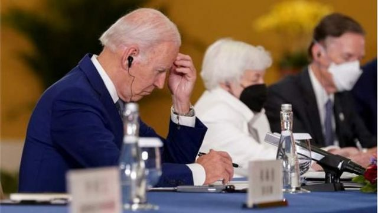
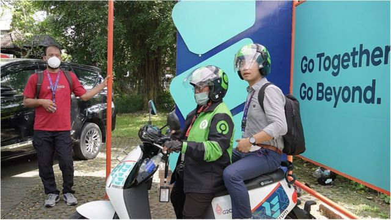
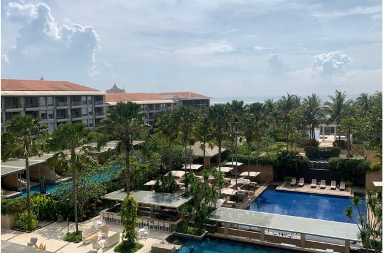
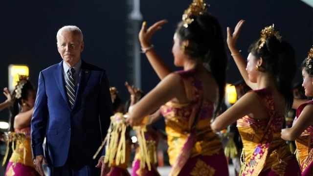
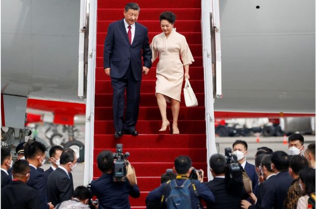
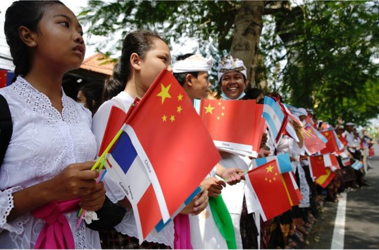

# [Chinese] G20巴厘岛峰会：习近平拜登正式会面 美官员称“俄罗斯入侵让中国感到有点尴尬”

#  G20巴厘岛峰会：习近平拜登正式会面 美官员称“俄罗斯入侵让中国感到有点尴尬”

  * 陈岩发自巴厘岛， 常思颖发自美国 
  * BBC中文记者 

最近更新： 7 小时前

> 图像来源，  Reuters

**11月14日下午，中国国家主席习近平和美国总统拜登在印尼巴厘岛举行双边会谈。拜登就任总统后，两人曾通过电话和视频进行过五次会谈，但此次为首场面对面会谈。**

两位领导人在下午5点40分进入会场，他们边走边聊。

“见到你太好了（It's just great to see you）。”拜登伸出胳膊迎了一下习近平。在记者面前，拜登表示，“作为两国领导人，在我看来，我们有共同责任，中国和美国可以管控分歧，防止竞争变成冲突，找到方法，一起应对需要互相合作的全球紧急问题。”

习近平随后发言表示，回顾两人最后一次见面是在2017年的达沃斯论坛，尽管经常通话，但没法替代当面交谈。

习近平继续说，“历史是最好的教科书。我们应该以史为鉴、面向未来。当前，中美关系面临的局面不符合两国和两国人民根本利益，也不符合国际社会期待。我们作为中美两个大国的领导人，要起到把舵定向的作用，应该为两国关系找到正确的发展方向，推动中美关系向上提升。”

开场词之后，双方进行闭门会谈。两位领导人预计讨论台湾问题、乌克兰局势和朝鲜核问题。

> 图像来源，  Reuters

虽然开场词听起来颇为友善，但中美两个超级大国的关系，已经降到了几十年来最低点。近年来，从香港、台湾到南海，再到贸易不平衡和技术封锁，中美在一系列问题上分歧严重，使双边关系不断下探。

8月，美国众议院议长佩洛西 (NancyPelosi) 访问台湾后，紧张局势进一步加剧。被激怒的中国，在台湾附近举行了军事演习，并切断与美国在气候变化等八个领域的合作。

美国官员表示，在过去两个月里，北京和华盛顿在悄悄努力修复关系。路透社引述拜登政府的一位官员称，这次面对面会谈不是孤立事件，它是一些列持续接触的结果，“我们在幕后进行了严肃的、持续性的、安静的、长达几十个小时的外交互动。”

##  会晤后双方都怎么说？

会谈后白宫发布通报说，拜登在会谈中表示，美国将继续与中国进行激烈的竞争，但他重申，这种竞争不应转向冲突，并强调美国和中国必须负责任地管理这种竞争并保持开放的沟通渠道。在台湾问题上，拜登详细阐述了美国的一个中国政策没有改变，美国反对任何一方对现状的单方面改变，但美国反对中国胁迫性的和日益侵略性的对台行动。

白宫的通报中还表示，拜登总统和习近平主席重申了他们的共识，即核战争永远不应该打，也不可能赢，并强调他们反对在乌克兰使用或威胁使用核武器。

会后中国官媒新华社发布新闻稿称，会谈中，习近平强调，台湾问题是中国核心利益中的核心，是中美关系政治基础中的基础，是中美关系第一条不可逾越的红线。解决台湾问题是中国人自己的事，是中国的内政。总统先生多次讲过不支持“台独”，无意将台湾作为谋求对华竞争优势或遏制中国的工具。希望美方将总统先生的承诺落到实处。

关于两国间的竞争，稿件中称，“习近平强调，中美是两个历史文化、社会制度、发展道路不同的大国，过去和现在有差异和分歧，今后也还会有，但这不应成为中美关系发展的障碍。任何时候世界都有竞争，但竞争应该是相互借鉴、你追我赶，共同进步，而不是你输我赢、你死我活。”

关于俄乌问题，新华社稿件中称，面对乌克兰危机这样的全球性、复合性危机，有这么几条值得认真思考：一是冲突战争没有赢家；二是复杂问题没有简单解决办法；三是大国对抗必须避免。

“这似乎是一次富有成效的会议，”牛津大学国际关系教授傅若诗（Rosemary Foot）表示，因为双方都以直接而文明的方式澄清各自的立场，包括美国对台湾的立场。美国和中国官员之间似乎也有机会进行进一步会晤。中美两国间的竞争，似乎是必须对抗的时候就对抗，但同时能合作时也会合作。必须看到，这次会谈后“我们更接近于此”。

> 图像来源，  Reuters
>
> 图像加注文字，拜登强调了避免冲突的重要性

##  屋子里的大象

俄罗斯总统普京不会出席G20峰会，但几乎任何一个场合，俄罗斯的影响都在场。

印尼财政部长丝莉•慕利亚妮（Sri Mulyani）向BBC中文表示，2008年时全球领袖们在金融海啸的压力下，当时的G20有种团结的精神，本次财长们开会则有些紧张，这种紧张关系来自地缘政治冲突，尤其是二月以来的俄乌冲突。

近年来，习近平和普京因为都不信任西方，关系日益密切。但在俄罗斯入侵乌克兰后，中国一直很谨慎，没有提供任何可能引发西方对其制裁的直接物质支持。

一位美国官员向多位记者介绍了中国总理李克强在柬埔寨的东盟峰会上关于俄乌战争的评价。

这位希望保持匿名的官员称，李克强详细谈到了中国对战争的看法，并谴责了“不负责任的核威胁”。普京曾多次暗示准备使用核武器。

“在一些领域，中国和俄罗斯已经在合作，经济关系进一步加深和扩展，”这位官员说，“但在一些重大问题上，我认为北京对我们所看到的俄罗斯的鲁莽言论和行为，不可否认地感到有些不安。”

“我认为同样不可否认的是，中国可能对俄罗斯的军事行动感到惊讶，甚至有点尴尬。”

英国《金融时报》则援引一位中国官员的话说，两位领导人在2月份宣称“不设上限的友谊”会晤时，普京没有告诉习近平俄罗斯即将入侵乌克兰。

“普京没有告诉习近平真相，”这位不愿透露姓名的中国官员说。

##  习拜交情

在私人关系层面，很少有领导人能像拜登和习近平那样熟悉对方，很难说这两位能否称为“老朋友”，但至少可以称得上老熟人。

2011年时任总统奥巴马派遣当时的副总统拜登访问中国，尝试与即将上任的习近平建立关系。当时，习近平陪拜登一起到四川青城山看看风景，和中学生打打篮球，然后到成都共进晚餐。拜登当时说，美国并不害怕、甚至欢迎中国的崛起。

之后不到两年，两人频繁互访，见面至少8次，拜登说他们私人会谈超过25小时。

那时人权和贸易问题上的分歧尚且可控，因为两国在更广泛的领域有共识基础，比如共同将经济从2008年的金融海啸中拉出来，再比如打击恐怖主义。

后来在特朗普时代，中美关系急转直下，拜登上台后也未得到更多改善。

这次习拜会，是两人时隔九年再次面对面。

> 图像来源，  BBC News Chinese
>
> 图像加注文字，G20峰会会场为采访的媒体记者提供了电动摩托车服务。图为BBC中文记者乘坐峰会提供的电动摩托外出采访。

> 图像来源，  Reuters
>
> 图像加注文字，11月14日，习拜会将在印尼巴厘岛穆丽雅酒店举行。

虽然无论当年的四川青城山，还是如今的印尼巴厘岛，都是风光无限的地方，但两国关系已经处在急风骤雨之中。

香港中文大学政治与行政学系教授李磊（Pierre Landry）表示，尽管习近平和拜登在奥巴马时代发展出不错的私人关系，但在两国关系的博弈中，这份私人关系将会非常边缘化，因为两国关系的冲突是结构性的，从安全问题、贸易问题、科技封锁、脱钩等等，这张问题清单非常长。

李磊进一步表示，此次习拜会不是国事访问，而在第三国举行，这种安排使双方都不会显得软弱。值得注意的是，2017年特朗普访华后，中美元首就再也没有进行过国事访问，所有双边会谈都在第三国，在国际会议的间隙举行，折射出两国关系的恶化。

“但这种会谈不是全无意义，疫情后，领导人习惯了虚拟会面，因此面对面会谈成了一种工具，用来释放信号，表达两国对话的意愿愿。但这类会谈注定很难有实质结果。”

> 图像来源，  Reuters
>
> 图像加注文字，拜登总统抵达巴厘岛国际机场时观看印尼文化表演。

> 图像来源，  Reuters

##  中美关系能改善吗？

没有实质结果，但会有什么样的结果呢？

拜登直言不讳地表示，把目标定在“划定红线”上。双方似乎把避免两国关系失控陷入战争作为新的共识基础。

中国方面在会前多少表示出善意，二十大前王毅访美，二十大刚开完王毅就见美国大使，而且也跟布林肯通话，提了三个确定性：一、中美必须要找到和平共处的确定性；第二，中国会继续给美国做生意的确定性；第三、中美共同应对全球挑战的确定性。

“我觉得中国现在态度已经很清楚了，就是不愿意把跟美国的关系搞得这么僵，想跟美国恢复关系。球现在应该在美国一边。”美国卡特中心中国项目主任刘亚伟表示，拜登总是说中美关系应该建护栏，反复强调“我们不是寻求冲突”。

“但中国的看法就是嘴上说一套，实际做另一套。比如，嘴上说坚持一个中国，但在台湾问题上搞了很多小动作。所以中国的想法是，要不要跟你合作，要看你的实际行动。”刘亚伟说。

另一方面，刘亚伟评价，美国做事，经常是板上钉钉，让你吃不了兜着走；中国做大部分事都是嘴上功夫。比如这次芯片禁令，釜底抽薪。如果这次美国不接受中国的好意，继续加码制裁会如何？

“拜登和习近平会面，希望会有点突破，但是可能性不太大。 因为西方解读二十大的结果，就是权力更加集中，因此对中国的观感更差，那这种情况下我为什么要给你更多面子。”刘亚伟解释。

政治学教授、G20研究组织（G20 Research Group）创始人约翰·柯顿（John Kirton）则相对乐观。他认为，“这不仅仅是一次约会，而是一段关系，这意味着他们不能背叛对方，否则在下次遇到时就会付出代价。所以会有合作。”

但柯顿也提醒，他们肯定会在一些事情上坚持自己的立场，比如两人都不会在台湾问题上让步。拜登可能会利用俄罗斯最近在乌克兰战争中挫败来向习近平表示，“听听，鉴于赫尔松发生的事情......习近平先生，入侵台湾可能是个坏主意。”

> 图像来源，  EPA
>
> 图像加注文字，巴厘岛学生在国际机场附近的一条街道上，挥舞着G20成员国的旗帜，欢迎出席峰会的领导人抵达巴厘岛。

