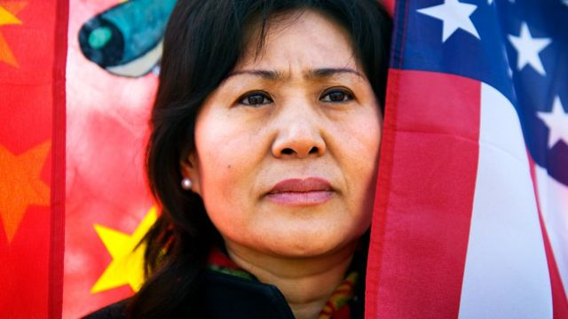
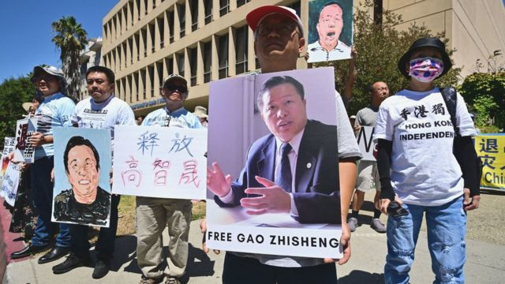
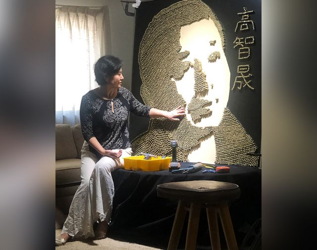

# [Chinese] 高智晟失踪五年 BBC专访耿和：“我被迫在丈夫和孩子之间做选择”

#  高智晟失踪五年 BBC专访耿和：“我被迫在丈夫和孩子之间做选择”

  * 白麦克（Micheal Bristow） 
  * BBC记者 

> 图像来源，  Getty Images
>
> 图像加注文字，耿和多年来积极活动，希望让外界更多关注高智晟的遭遇。

**耿和，本是生活在中国的一个普通女性，但作为妻子和母亲的她，却遭受了迫害、监视和骨肉分离。在习近平刚刚连任中共最高领导人开始第三个任期之际，她这些年的遭遇揭示了中国的黑暗面。**

耿和清楚地记得她第一次意识到国家政权的强大是在哪个地方。那一天，她带女儿去北京的一个理发馆理发。

突然间，几十个人闯了进来，让她们跟他们走。那些都是秘密警察。

起初，耿和不知道发生了什么事，也不知道这些人是谁。她问是否可以理完头发再走。回答是：不可以，必须马上走。

她走到外面一看街上有更多警察；回到住处楼道口下，还有警察在等着他们。

她说：“我抬头一看，一楼二楼整个密密麻麻的，都满了。”

他们住的公寓被搜查，她被告知丈夫高智晟在他姐姐山东的家里被捕了。

那是2006年，从那以后他们一家人的平静生活就走到了尽头。

##  维权律师

耿和的丈夫高智晟是一名律师。他曾经被评为中国十大优秀律师之一，但后来他开始为那些当局不希望保护的人维权。

他帮助维权的对象包括被取缔的法轮功成员、地下教会的基督徒和反对强行征地的上访者。

在高智晟被捕后的几年里，他先是被控煽动颠覆罪判刑入狱，刑满之后仍然受到软禁。

至于软禁，警察在高智晟耿和夫妇公寓楼下特别盖起了房子，派人入住其中方便全天24小时监控他们。

耿和回忆说：“我有时候会打开窗帘看看有多少警车在下面，是什么情况，我是有点害怕和恐惧，我就老担心明天又有更大的事情出现，我就会问丈夫今天晚上有多少警车在楼下。”

“他说你看他们干什么，你为什么要给他们脸子。”

##  出逃

> 图像来源，  Getty Images
>
> 图像加注文字，2022年8月13日，活动人士在美国洛杉矶中国领事馆外举行活动，呼吁立刻释放高智晟。

这种监视居住的情况变得越来越无法忍受；他们甚至很难找到一所愿意接受女儿上学的学校。

耿和不得已做出一个艰难的决定，带着16岁的女儿和5岁的儿子逃离中国，把丈夫留下。

说到这里耿和哽咽流泪：“我一直很纠结，因为我必须在丈夫和孩子之间做出选择，而我选择了孩子。”

2009年，在人权活动人士的帮助下，她和两个孩子逃离了中国。耿和和高智晟虽然早就商量好他们应该离开，但出走的那天非常匆忙，事先都没能告诉他。

她不愿透露他们离开中国投奔自由的细节。她解释说：“其他人可能还需要使用同样的路线。” 但是，这包括他们曾躲在公交车的行李舱中度过的一段时间。

最终，他们被偷渡出中国到了泰国，在那里美国同意给他们提供庇护。

在美国的生活最初非常艰难。面对完全不同的语言环境，耿和疲于应对，现在也仍在挣扎。她总是担心孩子们。

可以想象，没有父亲的他们日子很难过。高智晟和耿和的女儿耿格曾经因为精神健康问题在医院接受治疗。

13年过去了，孩子们已经接受了他们的过去，并在美国建立了自己的生活。现年28岁的耿格刚刚结婚。

儿子耿天宇今年19岁，已经被大学录取学医。耿和为孩子感到骄傲，她说：“他很乐观，每天都很开心。他专心学习，还打一份工。一切都很有希望。”

##  失踪

但高智晟在家人逃往美国后境况更加恶劣。

他说自己在监狱内外都受到酷刑折磨。2014年他刑满出狱时，身心健康都严重受损，很多牙齿都非常松动，可以随手拔出来。

美国有位中国法律专家把这种情况称为“非释放型释放”。

耿和有时还能打电话给高智晟，问问他的情况。但她没有想到的是，五年前她与他的一次通话，竟是他们的最后一次。

耿和回忆说：“我不记得我们到底谈了什么，因为我就像往常一样打电话给他，问他怎么样了。他的情绪不错，说他很好。他就是那种人，总是积极向上。”

可是几天之后，当她再打电话时，却没有人接听。此后，她再也没有听到丈夫的消息，甚至不知道他是否仍在人世。

耿和想到了最坏的结果。“我最害怕的是，共产党会以新冠病毒为借口，让他永远消失。”

她担心中国当局会说高智晟死于新冠病毒，这样正好能免除政府的责任。

中国驻伦敦大使馆拒绝回答BBC记者就高智晟情况提出的询问。

##  株连

高智晟受到如此打压的同时，针对他的行动也波及到他家庭中的其他成员。

他第一次被捕是在姐姐家中，从那以后他姐姐总是为他担惊受怕。她忧郁成疾，两年前自尽身亡。

耿和的姐夫也有类似的遭遇。他有重病，但得不到适当的治疗，因为警察拿走了高智晟亲属的身份证。 他也自杀了。

所有这些发生在亲人身上的事情可想而知让耿和绷紧神经保持高度警惕。

几年前，在她旧金山附近的住所院子里突然出现了一个陌生人。她在明处对方在暗处所以很难看清楚，但她担心这可能是与中国当局有关的人，于是拿起放在屋里的手枪，开了一枪警告。这起到了预期的效果：那个陌生人逃走了。

##  寻找高智晟

但耿和并没有被压垮。随着孩子逐渐安顿下来，最近几年，她把注意力转移回到丈夫身上，因为随着时间的推移高智晟所受的磨难已经逐渐在中国内外为人们淡忘。

> 图像来源，  Geng He
>
> 图像加注文字，耿和用空弹壳做的高智晟像

耿和现在专心寻找丈夫的下落，并四处奔走活动希望高智晟的名字不会彻底消失在公众视野。

今年8月，为了纪念高智晟失踪五周年，她将高智晟的脸部图像投射到中国驻洛杉矶领事馆的外墙上。

9月，她揭幕了一个用7000多个空弹壳做成的高智晟头像雕塑。

她还在北京聘请了律师，为她继续寻找高智晟的下落，但没有人愿意告诉他们任何事情。

北美各地大约有几十个像耿和这样的异议人士的家属，他们都在努力解救仍然还在中国的亲人。

但要知道中国到底监禁了多少异议人士非常困难，因为中国政府根本就不承认有任何政治犯。

耿和坦承，在她到美国定居之前，她从未真正了解过她丈夫工作的危险性。现在尽管他们生活在不同的国家，而且可能一辈子都将如此分离，但她觉得在某种程度上离他更近了。

她说：“我现在觉得，我就像一个与他并肩作战的同事。这给我的生活带来了新的意义。”

面对中国共产党这样一个强大的政权，耿和为寻找救助高智晟所做的各种努力显得非常无力，难以成功。但她还是决心继续下去。

回顾过去的一切，她说：“我自己的小家庭遭受了太多的痛苦，但我觉得我获得了一个更大的家庭。”

“我遇到了很多人，他们都努力想让中国变得更好。他们都特别善良。”

对耿和来说，将高智晟留在未知命运中的那种内疚感可能永远不会消失。但是，有孩子们的成功、有新朋友、有对未来更加美好的信念，希望应该也是有的。

