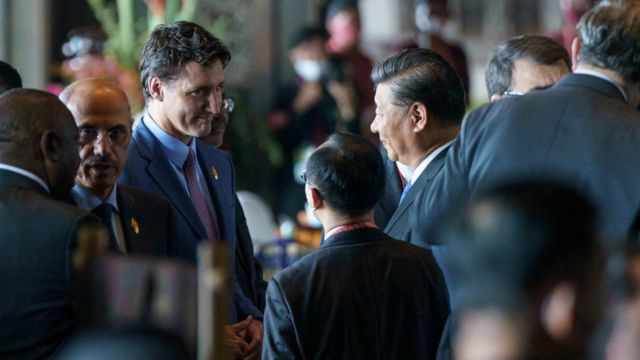
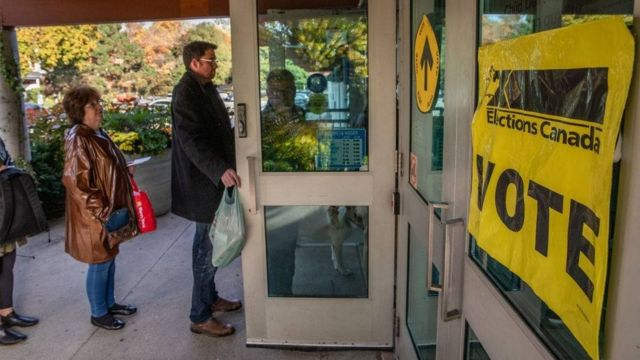
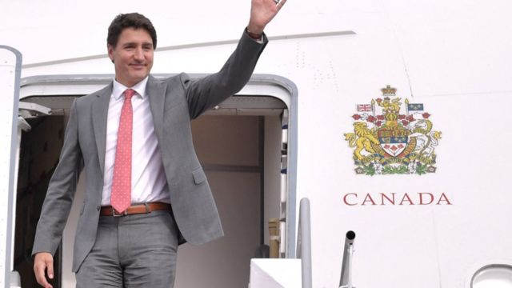
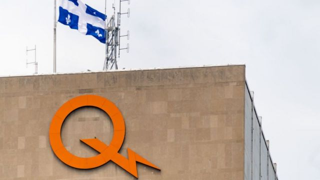

# [Chinese] 特鲁多被习近平“教训”：G20印尼峰会罕有视频反映的中加关系

#  特鲁多被习近平“教训”：G20印尼峰会罕有视频反映的中加关系

> 图像来源，  Prime Minister's Office Canada/Reuters
>
> 图像加注文字，特鲁多（中左）与习近平（中右）在训斥事件前一天曾短暂交谈10分钟，加拿大总理府其后对外发布消息与照片。

**中国国家主席习近平在印尼巴厘参加二十国集团（G20）峰会期间，当众批评加拿大总理特鲁多（Justin Trudeau）向媒体泄漏两人对话内容，过程被摄像记者拍下并曝光。**

这段对话发生在星期三（11月16日）的活动上。习近平透过翻译指责特鲁多缺乏“诚心”，估计是与加方透露两人在此前一天讨论了加方指控中国情报人员涉嫌干预加拿大选举的内容有关。

特鲁多与习近平星期二（15日）的简短交谈是两人多年来首次当面对话，当时并无媒体记者在场。

中国官方媒体一向十分严谨地处理最高领导人言论，有关星期三这场言论交锋的视频暴露了习近平罕见的一面。

##  特鲁多与习近平都在吵什么？

加拿大电视公司（CTV）议会事务记者安妮·伯杰龙—奥利弗（Annie Bergeron-Oliver）是其中一位最先披露该片段的媒体记者。 据她所称  ，片段来自加拿大联合采访队的摄像镜头。

影片中可见两人站得很近，没有配戴口罩，一名中方翻译员居中。其他与会国家领袖在大厅的周边寒暄。

习近平面带笑容对特鲁多说：“我们所有的讨论内容被泄漏到报纸，这不合适。”

“如果有诚心，咱们就应该以互相尊重的态度来进行很好的沟通，否则这个结果就不好说了。”

特鲁多微笑点头，然后回应说：“我们在加拿大相信的是自由、开放和坦率的对话，我们一直以来都这样。我们会持续寻求建设性合作，但也许过程中也有意见分歧的时候。”

习近平打断特鲁多说，“创造条件，创造条件”，然后笑着跟特鲁多握手便离开。

BBC驻北京记者麦笛文（Stephen McDonell） 形容对话气氛“颇为紧绷”  ：“当特鲁多开始回应，习近平不想直视他，并继而在某程度上否定他的说法。我估计加拿大的领导人也不会接受中国元首的言论。”

“当然，录影中的镜头靠近，也改变了动态。”

##  习近平指责加拿大走漏风声都在指什么？

> 图像来源，  Getty Images
>
> 图像加注文字，加拿大环球电视新闻网（Global News）11月初发表调查报道，指控中国涉嫌透过驻加拿大使馆资助11名联邦大选参选人。

在星期二另一场各国领袖在参与正式活动前，习近平与特鲁多也曾在人群中短暂交谈。加拿大总理府后来对外发布了现场照片与对话内容，路透社引述加方消息人士称，对话历时10分钟。
 加拿大广播公司（CBC）引述总理府公布说  ，特鲁多向习近平就中国情报人员涉嫌干预2019年加拿大联邦大选表达关切。 加拿大媒体近日报道  ，北京涉嫌在该次选举中暗地里支持11名参选人。

总理府称，特鲁多还就12月份联合国《生物多样性公约》缔约方大会第15次会议（COP15）第二阶段会议，以及中国在气候变化方面的重要性，向习近平施压。这次会议原定在中国昆明举行， 今年6月决定  将改到加拿大蒙特利尔举行，但仍将由中国担任主席国。

渥太华的公报并未提到习近平如何回应特鲁多，而在北京， 中国外交部发言人毛宁星期三被问到这次会面的情况时回答  ：“目前我没有可以提供的消息。”

特鲁多星期三被习近平当面批评后，出席了己方的新闻发布会，证实他向习近平“提起干涉我国公民一事”，并称能有这样的对话“很重要”。

实际上特鲁多不是唯一在巴厘向中方提出干涉选举问题的加拿大代表。外长梅拉妮·乔利（Melanie Joly；赵美兰）星期三与国际贸易部长伍凤仪会见加拿大记者时说，她在会晤中国外长王毅时提出，干涉选举行为“不可接受”。

##  加中两国媒体与国际舆论如何评价特习互动？

中国媒体未见有谈论习近平与特鲁多的两场对话，但谈论了特鲁多在巴厘与英国首相苏纳克（Rishi Sunak；辛伟诚） 把酒言欢  ，和指控他 在Twitter上引用假消息批评伊朗之后删帖  。

加拿大媒体与国际社交媒体则在热烈讨论习近平如何“数落”特鲁多。《多伦多太阳报》（Toronto Sun）专栏作家布莱恩·李利（Brian Lilley）形容“ 小土豆被中国国家主席习近平当众削皮了  ”——“小土豆”是特鲁多2016年访华期间从中国网民处获得的昵称，因“土豆”读音与特鲁多相似。
 据CBC报道  ，在野新民主党外交事务评论员麦克弗森议员（Heather McPherson MP）批评这位执政自由党党魁挑起“外交事件”。

英国诺丁汉大学政治与国际关系学院助理教授 傅洛达博士（Dr Andreas Fulda）说  ：“习近平把特鲁多当成小学生一样狠狠训斥。习近平表明，加拿大希望跟中共领导的中国对话，并非毫无条件。”

> 图像来源，  G20 MEDIA CENTER/Reuters
>
> 图像加注文字，特鲁多2021年8月突然宣布提前大选，执政自由党险胜，让他获得第三个总理任期。
 《多伦多星报》（Toronto Star）专栏作家苏珊·德拉科特（Susan Delacourt）则形容  ，特鲁多被习近平责骂，说明他“在认真工作”。

她指出，习近平所指责的“泄漏”是加拿大总理府处理本国与外国领袖对话的标准操作，外长乔利在巴厘召开记者会谈及有关内容，也算是参与其中。“被中国领袖教训何谓保密责任，有点像被特朗普（Donald Trump）教训何谓外交。”

德拉科特还指出，从片段可见，当特鲁多从翻译得知习近平其实在教训他之后，“总理马上直接盯着习近平，并走近了他——特鲁多每逢遭遇挑战时都这样做”。

“加拿大人普遍喜欢看到他们的总理紧张应对充满争议的世界领袖。”
 美国智库兰德集团国家安全分析师格罗斯曼（Derek Grossman）评论说  ：“我从不认为加拿大总理特鲁多与习近平有过良好的个人关系。习近平在此突出了这信任缺失。”

##  华为事件以来的中加关系

> 图像来源，  LightRocket via Getty Images
>
> 图像加注文字，发生在魁北克省的华人间谍案成为加中两国之间的最新事态。

中加领袖这次简短的交流凸显了自2018年华为高管孟晚舟被捕事件以来两国之间的紧张关系。北京后来也逮捕了两名加拿大公民， 三人最终在2021年9月先后获释  。

但就在特鲁多与习近平在巴厘接触之际，加拿大皇家骑警拘捕魁北克水电局（Hydro-Quebec）前任华裔工作人员王跃生， 并起诉其间谍罪  ，说明紧张仍未消退。

加拿大皇家骑警表示，王跃生“获取行业秘密以使中华人民共和国得益，损害加拿大的经济利益”。

中国外交部发言人毛宁星期二说：“我不了解有关情况。加方应依法处理有关个案，不要将其政治化。”

而就在G20峰会开幕前一周，加拿大外长乔利在一场演讲中称中国越来越具破坏性，并称将加强与台湾关系，引起了北京不满。中国外交部称已向加方提出交涉。

她说：“今天的中国已非1970年的中国，中国是个越来越具颠覆性的强国，中国试图塑造一个让利益和价值离我们越来越远的国际环境。”

中国外交部发言人赵立坚反击说：“加方有关涉华言论违背事实，充满意识形态偏见，公然干涉中国内政。”

