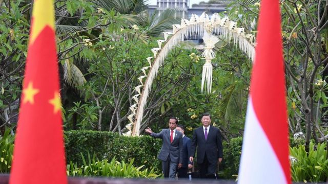
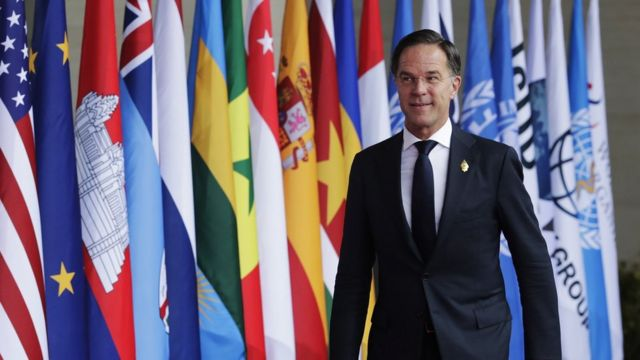

# [Chinese] 习近平“外交派对”：G20密集会见11国领袖，中国能否摆脱“国际孤立感”

#  习近平“外交派对”：G20密集会见11国领袖，中国能否摆脱“国际孤立感”

  * 陈岩 
  * BBC中文 发自印尼巴厘岛 

> 图像来源，  Reuters

**如果去参加一场派对，你会跟多少人聊天？**

习近平的答案，11个。在印尼巴厘岛，根据中国外交部的发布，G20峰会期间，中国领导人在三天时间里与11个国家领导人举行双边会谈，此外还有个联合国秘书长。别忘了，他还出席G20会议、换上印尼传统服饰、参加一场盛大晚宴，似乎所有其余时间，都被双边会谈填满。

11国包括美国、法国、荷兰、南非、西班牙、阿根廷、塞内加尔、韩国、澳大利亚、印尼和意大利。G20结束第二天他飞抵泰国参加APEC峰会，又会见了日本、新加坡、菲律宾三国领导人。

引发广泛讨论的习近平和加拿大总理特鲁多的交谈并没有被中国官方列入会晤范畴。根据加拿大媒体报道，特鲁多与习近平星期二（15日）进行了约10分钟的简短交谈。

习近平的密集外交，在飞机落地巴厘岛前，就已饱受关注，不少国家的记者都收到本国领导人将与他会面的消息。

G20主办方在会场不远的酒店设置新闻中心——巨型大厅，一排排电脑和桌子，密密麻麻排开。即便如此，早上还要去抢座位，因为有75个国家上千名记者每日驻扎于此。

大厅设置着一个巨大屏幕，直播巴厘岛机场的画面，每个领导人抵达，其本国记者都会站起或侧身，特意关注一下。14日下午中国领导人抵达时，有一阵隐隐骚动，一大片记者都抬着头，盯着屏幕，折射出其关注度。

##  走出“冷和平”

在新闻中心，一个记者打趣说，这么多会谈都是因为疫情，就像解封后的第一个周末，去报复性消费，购物、聚餐、看电影，晚上还要去酒吧、俱乐部，简直是“外交派对”。澳洲国立大学政治学者宋文笛称，“这是习近平在‘二十大’上巩固了国内权力后的亮相派对。 ”

> 图像来源，  Reuters
>
> 图像加注文字，这次G20峰会被视为习近平在“二十大”上巩固了国内权力后的亮相派对。

当然，其中有些是为了弥补因为疫情取消的双边会谈。比如习近平原本计划2020年4月正式访问日本，时任官房长官菅义伟称，这对中日关系来说是件大事，因为差不多每十年才会有中国领导人访日。

甚至在2020年疫情来袭后，双方仍未放弃访问计划，民间和官方都在酝酿气氛。当年2月，日本松山芭蕾舞团甚至演唱《义勇军进行曲》为武汉加油，随后日本援助物资上“山川异域，风月同天”的诗句，在中国广受赞誉；到了2月底，日方还表示两国外长通话确认访日准备工作仍在推进。

但最终还是取消。一晃过去两年多，日本不仅换了两次首相，当年推动访问的安倍晋三也已遇刺身亡。

疫情席卷全球之际，各国领导人都放缓和取消出访行程，整个2020年面对面的双边会谈乏善可陈。圣路易斯华盛顿大学东亚系副教授马钊称之为“冷和平”，即国家间关系紧张但大致和平，由于缺乏外交互动，暂时处于冷却状态。

去年以来，各国放开防疫限制的步伐不同，但都陆续走出“冷和平”，参加到“外交派对”里来，而还在孜孜不倦坚持“清零”的中国，成了最晚抵达派对的客人。

再加上中国与西方关系紧张，俄乌战争又进一步考验中国的外交站位，宋文笛形容为“国际孤立感”。而这正是此次“外交派对”上想要摆脱的，因此找了最多人叙旧。

马钊认为，虽然疫情期间有外交官员代表出访或视讯会议，但是毕竟无法替代首脑见面交流，这些双边会谈，是增进首脑关系的举措。

##  习拜会铺路

习近平下飞机仅仅几个小时，就已经与拜登面对面而坐，最终两人三个小时的会谈突破了计划的时间，密集外交由此展开。虽然这次会面并没有达成什么新的成果，但并非毫无作用。

> 图像来源，  EPA

美国外交关系协会（Council on Foreign Relations）主席哈斯（Richard Haass）说，在国际关系中，如果两方在某件议题上都不肯让步，无法达成一致，那么有少数国家会选择回去拿起枪直接开战，比如在中东问题上一些国家就是这么做的。

哈斯表示，而大部分国家会继续接触、会谈，即使无法在最想要的东西上达成一致，至少在最不愿看到的事情上达成一致，比如都不想要核战；在冷战中，美苏的双边会谈大多以此为目的。

习拜会的意义正在于此。拜登在会谈中表示，美国将继续与中国进行激烈的竞争，但他重申，这种竞争不应转向冲突，并强调美国和中国必须负责任地管理这种竞争并保持开放的沟通渠道。

马钊认为，此次峰会的背景是俄乌战争和中美矛盾，其实背后都有美国的因素。有鉴于此，宋文笛认为，习近平知道，其他国家在看到中美领导人友好互动后，与中国交往就会感到更加舒适，因此随着疫情接近尾声，习近平抓住这一势头，更积极地谋求与这些国家重新建立关系，这次G20是一个绝佳时机。

“鉴于美国着力打造以核心议题（issue- based）为基础的盟友或伙伴国家网络，中国也要试图寻找不同议题，拉拢分化各国。因此，双边会谈有利于寻找国家之间的共同利益。”马钊阐释。

##  同行的互动

> 图像来源，  EPA
>
> 图像加注文字，习近平的会见日程上还包括荷兰首相马克·吕特，荷兰被认为是全球芯片产业的重要技术来源地。

这次G20，各国领导人们频繁互动，很难说建立友谊，但至少打破“冷”的状态。

有趣的一幕发生在第一天晚宴，习近平进入会场与印尼总统佐科打招呼后，然后看到印度总理莫迪，笑着上前跟他握手，莫迪似乎也心情不错，两人站着聊了好一会儿。摄像机很配合对准这个场景。印度媒体把这一刻大书特书，因为这是在两年半前中印边境冲突后，两国领导人首次直接交谈。

这一幕产生了颇为有趣的联想——中国互联网两大巨头阿里巴巴和腾讯，在各个领域都激烈竞争，公关团队更是互相攻击，乐此不疲，但在公开场合碰到一起，他们的老板马化腾和马云却时常在公开场合谈笑风生，很有得谈。

它似乎暗示了一个可能性，虽然国家领导人们代表各自国家利益，但全世界干这份工作的人屈指可数，互相之间工作性质类似，反而产生某种同行之谊，这也是为什么在外交场合，领导人之间互称同事。

还有个例证是习近平和拜登的第一次见面。曾在白宫任职的丹尼·罗素2011年曾陪同拜登访华。罗素回忆，在行程最后一晚，“在一个很小、很私密的场合”，拜登和习近平共进晚餐，此时他们已经完成正式议程，有机会聊聊天。习近平坦诚地聊了对于阿拉伯之春的看法，在这个罕见的自由交流的时刻，罗素当时的想法是“这个人应该没什么人可以说话”，潜台词是，在拜登这位国际同僚面前，反而有同行间交流的默契。

##  关键议题和最大花絮

从特朗普时代的贸易战开始，中美关系开始呈现“自由落体”态势，互关领事馆，逮捕孟晚舟，相互制裁，科技封锁，言辞上交锋更激烈，直至今年8月美众议长佩洛西访问台湾和中国进行“环台军演”，两国关系跌落谷底。

“新冷战”这个词，过去几年不断冲击大众视野，外界对中国与西方关系的期待已经非常低了。

在此背景下，国际战略研究所（IISS）分析师詹姆斯·考伯垂（James Crabtree）表示，习近平和拜登、阿尔巴尼斯等领导人进行双边会谈，本身就已有极重大的意义，他们要是还能连带聊聊一些G20关心的议题（气候、俄乌、粮食）等，就已经算是成功了。

中国似乎还带着一份礼物——对俄态度的转变。会前有中美官员私下透露，中国对俄罗斯入侵乌克兰的真实感受是“惊讶而尴尬”。

在跟中国闭门会谈后，各国领导人似乎都对解决俄乌更有信心，比如法国总统马克龙在记者会上称，“（对于俄乌）我相信中国可以在未来几个月内，站在我们这一边，发挥更重要的调解作用。”

拜登也在会谈后，回答记者说，“我绝对相信，（中美）无须进入一个新冷战。”

在长达数年的关系恶化下，现在有这样的表态，前新加坡外交官马凯硕形容，“已经松了一口气”。

不过这并不代表中国和西方国家之间的紧张关系不会持续，这种关系可能像拜登所说会维持“激烈竞争”。马钊分析，中国目前面临疫情反弹、经济疲软等多重问题，已经没有能力维持拓展大规模国际合作。

“我估计中国依然会在现有的多边组织中继续发声，但是不会大力发展诸如‘一带一路’、’人类命运共同体‘等项目，中国目前会更注重实际收益，而非象征意义。”马钊认为。

有趣的是，虽然进行了这么多外交努力，但在所有会谈都已结束之时，一段不到一分钟的视频在网上疯传并抢夺了眼球——习近平与加拿大总理特鲁多的简短交谈，内容被加方泄漏，习近平第二天在会场直接“告诫”了特鲁多，分开后还用中文评论了一句“很天真”。

颇为“八卦”的这一幕使全球观众热情席卷网络，风头似乎盖过了之前所有的会谈，成为习近平这场“外交派对”计划之外的另类高潮 。

