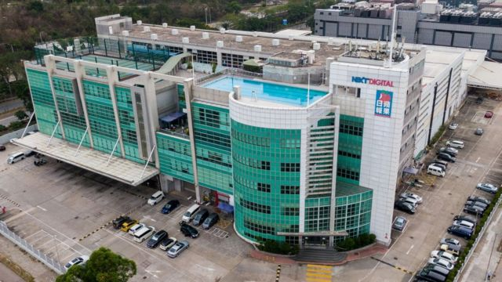
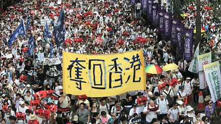
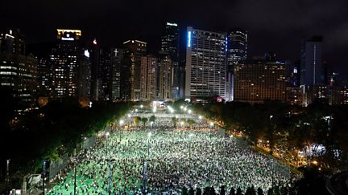
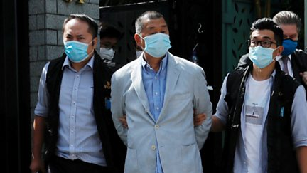
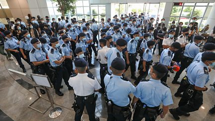
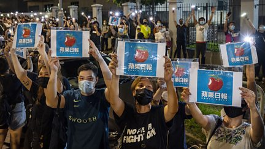

# [Chinese] 黎智英力高欺诈案：香港法院将壹传媒创办人判监五年九个月

#  黎智英力高欺诈案：香港法院将壹传媒创办人判监五年九个月

> 图像来源，  AFP
>
> 图像加注文字，法官认为黎智英有意向特区政府持有的科技园公司隐瞒力高在壹传媒大楼内运营。

**壹传媒创办人黎智英被起诉《香港国安法》下的“勾结外国或者境外势力危害国家安全罪”案件处于停摆之际，香港特区区域法院以欺诈罪判处黎智英监禁5年9个月，罚款200万港元（25.69万美元；179万元人民币），取消担任公司董事资格8年。**

香港国安警察于2020年12月起诉黎智英欺诈罪，指控涉及一家黎智英名下顾问公司力高在壹传媒与《苹果日报》报社大楼内运营，构成对地主香港科技园公司欺诈。法院于10月25日裁定其有罪，押后判刑至今。主审法官陈广池星期六（12月10日）判决时称，被告人黎智英“没有一丝一毫悔意”。

在此之前，刚于星期四（18日）在狱中度过75岁生日的黎智英目前因四起未经批准集结案件合共被判监20个月，部分案件正在等候上诉。

“勾结外国势力”案则因为特区终审法院驳回律政司阻止黎智英聘用英国御用大律师，引发行政长官李家超提请中国全国人大常委会就《香港国安法》释法，高等法院同意押后开审。

这起欺诈案同案被告尚有原壹传媒集团行政总监黄伟强，法庭判处他21个月。

另一名被告人——壹传媒营运总裁兼时任财务总裁周达权——获控方批准转为特赦证人，暂不予起诉。控方此前在法庭上表示，周达权将于“勾结外国势力”案中作证。

##  **黎智英牽涉《香港國安法》案件時序**

###  **反對《逃犯條例》修訂案第三次遊行**

Media playback is not supported on your device.

上百萬群眾上街遊行，抗議《逃犯條例》修訂案，「反送中」抗議浪潮全面爆發。黎智英當天走在主辦單位民間人權陣線領頭隊列。

###  **黎智英訪美**

> View on Twitter > 

黎智英在美國先後獲美國副總統彭斯（Mike Pence）與國務卿蓬佩奧（Mike Pompeo）接見，中國外交部駐港公署指責美方「別有用心」。

###  **中共官媒標籤黎智英「現代漢奸」**

 AFP

中共《人民日報》旗下小報《環球時報》發表社評，指控黎智英與民主派元老李柱銘等人是「典型的現代漢奸」。8月13日，官方新華社再發文指責各人是「亂港頭目」。

###  **黎智英大宅遭縱火**

黎智英位於九龍大宅遭投擲汽油彈，黎智英並未受傷。10月13日，黎智英二子黎耀恩持股的三家餐廳遭潑油漆。

###  **韓國瑜：黎智英「把台灣弄得腥風血雨」**

 Getty Images

台灣舉行總統選舉電視辯論，中國國民黨候選人韓國瑜公開指責黎智英把《蘋果日報》與《壹週刊》引進台灣，「把台灣弄得腥風血雨」。韓國瑜挑戰民進黨籍蔡英文連任總統失敗收場。

###  **黎智英因恐嚇、非法集會被捕**

 AFP via Getty Images

黎智英、民主黨元老楊森與支聯會高層成員李卓人清晨被捕。三人涉及2019年8月31日集會，被起訴未經批准集結罪；黎智英另被起訴在2017年「六四」集會上恐嚇敵對報紙記者，後來被裁定無罪。

###  **黎智英再次被捕**

 NurPhoto via Getty Images

黎智英與李柱銘、李卓人等15名泛民主派人士被捕。警察指控各人涉嫌組織及參與2019年8月18日、10月1日及10月20日的未經批准集結，落案起訴各人。

###  **在港中國官媒曝光「力高案」**

 Ta Kung Pao

直屬中國中央政府駐港機關的《大公報》指控黎智英在壹傳媒總部內運營其個人名下的秘書公司力高，涉嫌違反與特區政府香港科技園公司訂立的地契。

###  **中國全國人大決議草擬《香港國安法》**

 AFP via Getty Images

中國全國人民代表大會第13屆第三次會議閉幕，通過制定《香港國安法》決議，交全國人大常務委員會立法，再直接加入香港《基本法》附表三頒布實施。

###  **《蘋果日報》推出英文版**

 LightRocket via Getty Images

《蘋果日報》推出英文版，透過網站與手機應用程序提供新聞，並邀約專欄作家撰寫評論文章。創刊當天中文版以《【打國際線】《蘋果》英文版免費試睇！》為題發表宣傳稿。

###  **黎智英與支聯會等疫下「六四」點燭光**

Media playback is not supported on your device.

香港警察以新冠病毒病（COVID-19）疫情為由，首次禁止「六四」燭光晚會。黎智英與多名支聯會常委依舊到維多利亞公園，後被起訴「煽惑他人參與未經批准集結罪」。

###  **香港警察首就力高案搜查**

香港警察商業罪案調查科搜查灣仔一處辦公室，調查力高顧問公司不當使用科技園公司補貼土地指控。

###  **中國頒布《香港國安法》**

 Hong Kong Information Services Department

中國全國人大常委會通過《香港國安法》，香港特區行政長官林鄭月娥深夜簽署公布，即時生效。

###  **國安警察拘捕黎智英，首次搜查壹傳媒**

Media playback is not supported on your device.

黎智英與壹傳媒多名高層被香港警察國家安全處以涉嫌「勾結外國勢力」拘捕，超過200名警員來到壹傳媒總部暨《蘋果日報》報社搜查，兩天後方獲准保釋。期間壹傳媒在香港交易所股價暴漲。

###  **「毒品調查科」偵辦壹傳媒股價波動**

香港警察拘捕15人，稱他們疑似操控壹傳媒股價，涉嫌串謀詐騙與洗錢罪名，當中並未包括黎智英。偵辦此案的單位是毒品調查科財富調查組。

###  **國安警察接辦力高案，搜查辦事處**

黎智英就2020年「六四」未經批准集結案出庭之際，黎智英位於九龍觀塘的一處辦公室遭警察搜查。《蘋果日報》稱該處為力高公司辦事處，香港警察證實搜查由國安處執行，意味著案件已由國安處接辦。

###  **黎智英助手Mark Simon捲入拜登情報造假案**

 South China Morning Post via Getty Images

美國總統大選投票日臨近，全國廣播公司（NBC）披露一份指稱民主黨總統候選人拜登（Joe Biden）兒子亨特·拜登（Hunter Biden）與中國有利益聯繫的調查報告涉嫌造假。《蘋果日報》其後承認與黎智英的私人助理馬克·賽門（Mark Simon）有關。

###  **國安警察起訴黎智英欺詐**

黎智英12月2日依令到警署報到後被扣查，翌日被落案起訴欺詐，帶到法院提堂。控罪書證實案件由香港警察國安處偵辦，案件提堂也由國安法指定裁判官聆案。黎智英被拒絕保釋，收押候審。

###  **警察加控黎智英「勾結外國勢力」罪**

 REUTERS/Tyrone Siu

正在還押的黎智英成為被起訴《香港國安法》下「勾結外國或者境外勢力危害國家安全罪」第一人。該罪行可判處最高無期徒刑（終身監禁）。

###  **黎智英獲保釋候審 演變成終審法院訴訟**

 EPA/JEROME FAVRE

香港高等法院批准黎智英保釋候審，律政司向終審法院上訴。中共《人民日報》發表網上評論文章，質疑香港法院無力管轄，提出中國中央政府駐香港維護國家安全公署有權介入，即行使管轄權接管案件偵查，交中國最高檢察院指定檢察機關，再由中國最高法院指定法院審理，整個過程按照中國《刑事訴訟法》等規定進行，不再適用香港特區法律。

12月31日，終審法院批准律政司就黎智英保釋上訴，期間黎智英須恢復收押。

2021年2月9日，終院裁定律政司勝訴，黎智英繼續還押候審。

###  **英國律師辭任黎智英集會案外包檢察官**

 South China Morning Post via Getty Images

英國御用大律師大衛·佩里（David Perry QC，現David Perry KC）向香港特區律政司辭任黎智英等人2019年8月18日煽惑參與非法集結案的外聘檢察官。律政司司長鄭若驊稱，留意到英國多家媒體針對佩里作出攻擊，對此感到驚訝。

此前，英國外交大臣拉布（Dominic Raab，藍韜文）形容佩里受聘「就像一名僱傭兵」。

###  **中國主管香港事務官員要求嚴懲黎智英**

 Xinhua

中國國務院港澳事務辦公室主任夏寶龍出席官方智庫研討會時，點名黎智英、香港大學法律學院前副教授戴耀廷、前香港眾志秘書長黃之鋒三人為「反中亂港分子當中的極端惡劣者」，要求「依法給予嚴懲」。有關演講稿在3月1日由中國中央級國有企業名下雜誌《紫荊》刊登公開。

###  **黎智英一天兩案判囚14個月**

 NurPhoto via Getty Images

香港區域法院裁定黎智英等人在2019年8月18日維多利亞公園流水式集會案中「組織及參與未經批准集結罪」成立，另黎智英就在同年8月31日遊行的「明知而參與未經批准集結罪」認罪，同時審理兩案的法官胡雅文（Judge Amanda Woodcock）對黎智英分別判囚12個月和8個月，合併執行14個月監禁。

###  **港府凍結黎智英財產**

時任香港特區保安局局長李家超宣布援引《香港國安法第43條實施細則》頒令凍結黎智英財產，包括其壹傳媒股份，價值約3.49億港元（4494萬美元；2.89億元人民幣；12.7億元新台幣）。

###  **黎智英被加刑至20個月**

黎智英等人承認在2019年10月1日中共建政70周年當日遊行犯有「未經批准集結」罪行，同樣由區域法院法官胡雅文判刑。黎智英獲刑14個月，部分合併此前刑期，共監禁20個月。

###  **美國半官方基金嘉獎黎智英**

根據美國國會決議成立的共產主義受害者紀念基金會（Victims of Communism Memorial Foundation）向黎智英頒發該組織最高榮譽獎項杜魯門—里根自由獎（Truman-Reagan Medal of Freedom）。

###  **國安警察二度搜查壹傳媒並凍結資產**

Media playback is not supported on your device.

香港警察國安處清晨出動500警員與探員搜查壹傳媒總部暨香港《蘋果日報》報社；保安局局長李家超宣布凍結《港蘋》三家關聯公司與1800萬港元資產。五名壹傳媒編採高層被捕，其後增至八人。

###  **香港《蘋果日報》與《壹週刊》停刊停運**

Media playback is not supported on your device.

因資金緊絀和編採員工相繼離職，壹傳媒董事會決定即時結束營運。香港《蘋果日報》當晚完成出版6月24日報紙後停刊，已數字化的《壹週刊》於子夜停止運作。

###  **法院頒令壹傳媒清盤（清算）**

 LightRocket via Getty Images

香港特區財政司司長陳茂波9月引用《公司條例》，以「公眾利益」為理由，向高等法院申請將壹傳媒清盤獲准。代表政府一方的律師在法庭上指出，壹傳媒虧損達2.47億港元，無形資產值6.58億港元，拖欠職工工資1.2億港元。

###  **黎智英與原《港蘋》職工獲新聞自由獎**

世界新聞出版協會（WAN-IFRA）向黎智英與香港《蘋果日報》編採人員頒發自由金筆獎 （Golden Pen of Freedom Award）。

###  **2020年「六四」集會案黎智英有罪**

 LightRocket via Getty Images

香港區域法院裁定黎智英在2020年「六四」週年當晚「未經批准集結」罪成立，判監14個月，但與既有刑期同期執行，即仍為20個月監禁。

###  **台灣文化部要求《台蘋》拒絕執行香港清盤令**

台灣文化部聲明，要求除非香港法院委任的清盤人向台灣法院聲請並裁定同意，否則台灣《蘋果日報》應拒絕香港法院及指定清盤人的任何指令及要求，並宣布依照《個人資料保護法》限制《台蘋》「不得跨境傳輸所保有的所有個人資料」。

###  **黎智英與《蘋果》編採高層被加控煽動罪**

黎智英等人「勾結外國勢力」案件在法院提訊時，檢察官提出加控《刑事罪行條例》下的「串謀發布煽動刊物罪」，涉及《香港國安法》生效前至《蘋果日報》停刊為止所發表的文章。

###  **《台蘋》停擺**

 Anadolu Agency via Getty Images

壹傳媒遭香港特區政府清盤後，台灣資產變賣處置陷入法律爭端。潛在買家，新加坡商人潘杰賢出資另起爐灶，已數字化的台灣《蘋果日報》（蘋果新聞網）「暫停更新」，大部分員工轉場新平台。至此壹傳媒所有媒體業務結束。

###  **黎智英獲准僱用英國大律師出庭**

 REUTERS/Tyrone Siu

香港高等法院批准黎智英以「專案認許」方式僱用英國蒂莫西·歐文御用大律師（Timothy Owen KC），在「勾結外國勢力」案中為其出庭辯護。其申請遭特區律政司與香港大律師公會反對，大律師公會提出上訴。

###  **《蘋果》勾結案六編採高層認罪**

 Getty Images

壹傳媒前行政總裁張劍虹、前《蘋果日報》副社長陳沛敏、前總編輯羅偉光、前執行總編輯林文宗、前英文版執行總編輯馮偉光（筆名盧峯）與前社論主筆楊清奇（筆名李平）承認「串謀勾結外國勢力」罪。法官裁定全部被告還押，待該案黎智英部分審判結束後再量刑。

###  **港府阻黎智英僱英大狀終審敗訴 特首提北京「釋法」**

 China News Service via Getty Images

香港特區終審法院駁回律政司反對黎智英僱用歐文御用大律師（Timothy Owen KC）的上訴許可申請，行政長官李家超宣布向北京提交報告，請求中國全國人大常委會首次就《香港國安法》「釋法」，澄清沒有香港全面執業資格的律師能否參與國安案件。律政司向法院提出延期開審黎智英「勾結」案。

顯示更多

##  黎智英“隐瞒力高存在”

黎智英等人各被控两项欺诈罪。控方最初指控黎智英、黄伟强与周达权三人未有按租契而使用新界将军澳工业邨——现称将军澳创新园——一处地址，并向科技园公司隐瞒有关用途，导致科技园公司蒙受不利，或令苹果日报印刷有限公司或力高顾问有限公司获利。

香港科技园公司是特区政府法定机构，作为业主管理香港各专门产业园区，包括香港科学园、香港创新中心和三个工业邨。壹传媒与《苹果日报》总部建于将军澳工业邨内。

力高顾问有限公司则是黎智英与外籍助手马克·西蒙（Mark Simon）自1988年起便在经营的企业，登记地址曾是壹传媒总部大楼内。

2020年5月，一家亲北京媒体指控力高公司在壹传媒总部内经营，涉嫌违反租契。力高公司其后迁至湾仔与观塘两处办公室，香港警察商业罪案调查科6月份曾搜查湾仔力高办事处。

同年6月30日深夜，中国《香港国安法》颁布实施，警察国安处成立，8月10日国安处拘捕黎智英等10人，并派出200警员搜查将军澳壹传媒总部，10月15日再搜查力高观塘办事处。

12月2日，黎智英到警署报到时再次被捕，由国安处落案控告欺诈罪， 并将黎智英收押  。主审法官陈广池曾确认其为《香港国安法》下，由香港行政长官委任的国安法指定法官。

> 图像来源，  South China Morning Post/Getty Images
>
> 图像加注文字，法官质疑黎智英以“家天下”的手法来运营壹传媒等公司。

法官此前裁定被告人有罪时说，力高属黎智英的私人公司，但他并未为力高向科技园公司申请在壹传媒大楼营运的牌照。黎智英是集团主事人，且有签署公司文件与会议纪录。法官认为黎智英是刻意隐瞒力高的存在。

辩护方曾在庭上称，力高公司只占用壹传媒大楼总面积0.16%，力高又曾参与壹传媒集团业务“苹果动新闻”，因此大楼的主要用途仍是出版，力高在壹传媒大楼内运营不构成违反租契，黎智英也只是出于方便，且有向苹果日报印刷公司缴纳租金，金额也在公司年报内公开。

法官质疑辩方混淆概念，违背“特别用途的租契”原意和精神。而即使壹传媒旗下公司与力高会互相协助处理对方业务，也只说明黎智英以“家天下”的手法来经营，不等于变相把力高转为壹传媒的关连公司。法官还质疑获得方便也是获得了无形利益。

##  关注与谴责

这起诈骗案判刑前正值黎智英生日，一些人权倡议组织趁机表达对黎智英遭受不同审判的关注。总部设于美国华盛顿的人权观察组织（Human Rights Watch）说：“新闻业不是犯罪。香港政府应该立即无条件释放黎智英。”

人权观察中国部高级研究员王松莲在判刑后评论说：“这起由北京精心策划，针对黎智英的刑事案件，是对一位香港民主和媒体自由领头支持者的报复。”

由前美国驻港外交官、前香港美籍媒体人、中国流亡异议人士等组成的香港自由委员会基金（Committee for Freedom in Hong Kong Foundation）也呼吁持续推动香港民主。基金发展总监早泰娜（Tara Joseph）近日就特区政府提请释法 对英国《金融时报》评论说  ，释法与特区政府对外宣传香港欢迎外籍律师与法官前来的形象不符。

总部设在法国的无国界记者组织（Reporters Without Borders, RSF） 本月初也再次呼吁马上释放黎智英  。

在此之前，美国国务院在10月份欺诈案有罪裁决颁下后 发表声明  ，称美国对港方法院裁决予以谴责，并促请中国政府“恢复尊重香港的出版自由”。

发言人普赖斯（Ned Price）说：“虽然黎的欺诈审判并非基于《香港国安法》，但地方当局依然对此非国安法案件施加《香港国安法》更具限制的法律程序。”

“这些行动削弱了中华人民共和国在《中英联合声明》下维持香港高度自治，保障权利与自由的义务，而这是一部有约束力的国际协约。”

香港特区政府 反驳美方批评  “背离事实”， 中国外交部驻香港特派员公署称  ：“美方所作所为只会进一步暴露其与反中乱港分子勾结的卑劣行径，暴露其政治凌驾法律、破坏香港繁荣稳定的险恶用心！”

