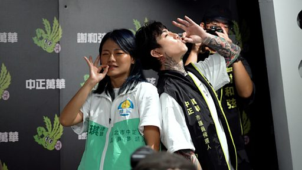

# [Chinese] 台湾九合一选举：大麻合法化议题受到关注

#  台湾九合一选举：大麻合法化议题受到关注

**台湾九合一选举：大麻合法化议题受到关注**

2022年的台湾九合一选举，台北市中正万华选区一度有两位市议员候选人表态支持大麻合法化。律师李菁琪与歌手谢和弦的参选让大麻合法化运动再次引起社会关注。

开放大麻的倡议于近年在台湾能见度提高，许多支持者认为社会应该正视其医疗价值、放宽相关制品管制；反对者则担忧将大麻除罪最终会走向娱乐用合法以及滥用。

李菁琪所属的绿党曾于2020年提出医疗用大麻合法化，是台湾选举史上首次出现此类政见。

在本届选举中，李菁琪的同区参选人有刘耀仁、郭智亭、钟小平、吴沛忆、徐立信、吴志刚、曾琳诒、吴怡萱、邵维伦、李有宜、张荣法、应晓薇、王麒杰、陈树霖、郭昭己、洪婉臻以及吕增塔。

