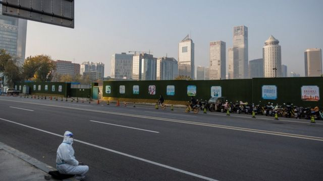
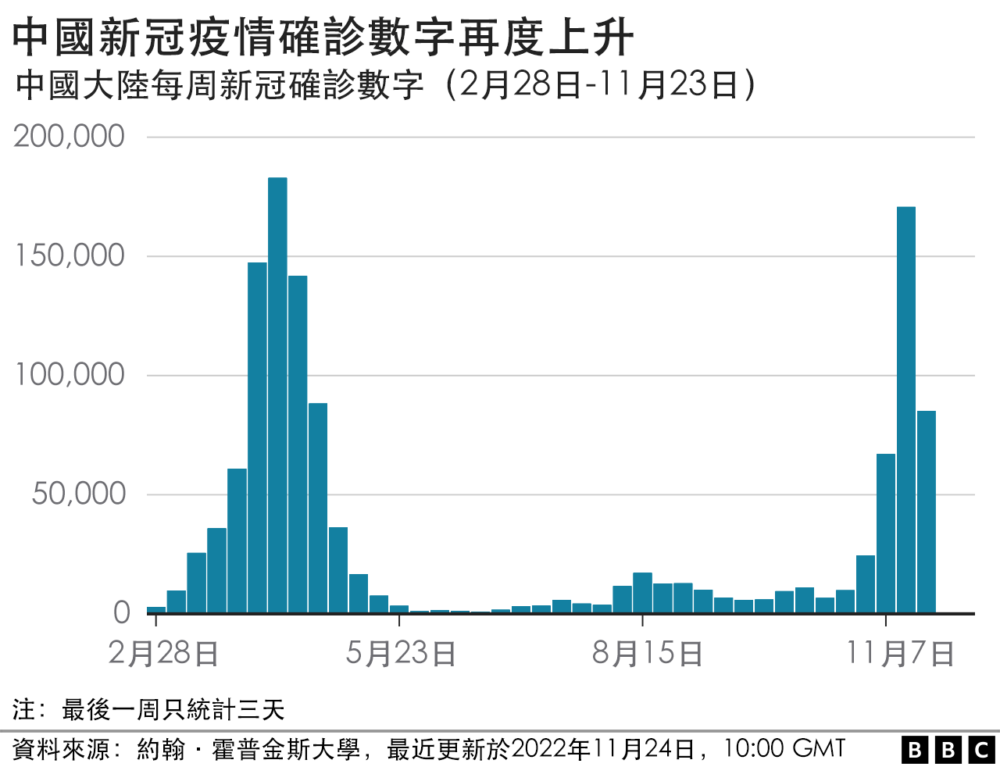
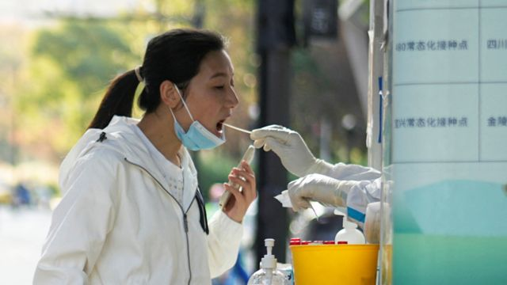
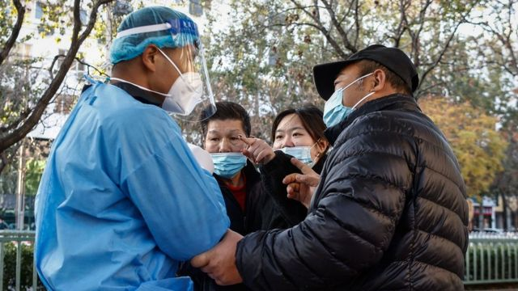

# [Chinese] 新冠疫情：中国全境新增确诊人数持续创新高

#  新冠疫情：中国全境新增确诊人数持续创新高

  * 毛远扬（Frances Mao）、帕特里克·杰克逊（Patrick Jackson） 
  * BBC记者 

> 图像来源，  Reuters
>
> 图像加注文字，北京中心商业区路边的防疫工作人员。

**中国再度录得新冠疫情全球大流行以来的最高单日确诊数字，而严厉的管控措施仍然持续。**

包括首都北京和南部大城市广州在内的主要城市仍然处于疫情爆发的阶段。

周五（11月25日）公布的前一天单日新增确诊数字是32695宗，连续第二日创新高——此前四月份时的单日确诊高峰数字是2.8万。

在全国14亿人口当中，这个确诊数字仍然相对较小，而官方公布的疫情开始以来死亡数字是5200多人。

这相当于中国每100万人当中有三例新冠病毒致死病例，相比之下美国每100万人有3000宗死亡，英国则每100万人有2400宗，但是不同国家之间的直接比较实属困难。

虽然中国的清零防疫政策无疑减少了人命损失，但是也对经济和普通民众生活造成了沉重的打击。

几个星期前，中国大陆开始稍微放宽部分限制措施。

> 图像来源，  Reuters

密切接触者的隔离期从七天集中隔离减少为五天集中隔离加三天居家隔离，同时不再记录次密切接触者，这使得很多人不再需要被隔离。

当局也尽量试图避免实施如今年较早前第一大城市上海所经历的封城措施。

但是在北京再次出现确诊数字急升，以及数月来首宗死亡案例的情况下，官员已经在部分区域实施限制措施，商铺、学校和餐厅停业。

位于华中的城市郑州当局也宣布，将从周五起对600万民众实行实际上的封城措施。

此前，iPhone制造厂富士康的大型工厂区发生暴力抗议。该公司已经为其支付系统的“技术错误”致歉。

一些民众因此受苦和绝望的事件在网上流传，更加深了公众的不满。

上周，有报道称一名婴儿因为新冠防疫限制措施而延误救治最终死亡，引发巨大反响。

今年以来一些最严厉的新冠防疫措施包括：

  * 1月，在人口1300万的旅游城市西安，一些居民在一次半夜撤员行动中被迫从家中离开，由大巴送至隔离点，同时有令人不安的消息传出，有人因此得不到必要的救治 
  * 3月，上海宣布封锁，原本只是不到一星期，但是最终全市2500万名居民在家中封锁了两个月 
  * 9月，成都封锁期间发生地震，居民却被围困在家中。在其他地方，救护人员被要求先做新冠病毒检测，才能开始救人 

##  疫情下的心力交瘁

_——_ _**BBC驻中国记者麦笛文（Stephen McDonell）分析**_

昨晚忽然来了消息，我们的住宅小区将会封锁，所有居民留在家中。

这在中国已经不再令人觉得意外。任何时候，一宗感染或者确诊密接就可能意味着大家都不能出去。

北京正处在一场新冠疫情大爆发中，但是即使在这之前，去过某个感染者的商店或者大楼都意味着要居家隔离。

现在，首都的朝阳区大多数商铺都关闭了。在数以千计的高楼里，所有居民都被下令留在室内，至少要持续几天。

然后，再想象一下，全国各地多个城市也都差不多是如此。

在新疆和西藏，封锁已经持续了几个月。

在2023年初，中国将进入这场危机的第四个年头，无论是真是假，“清零”防疫政策感觉上是永无止境。

人们已经被疫情和破坏经济的政府应对措施拖得心力交瘁。

官方没有解释出路在哪里，更加加重了不确定性。

这里的科学家能够看到，中国的疫苗接种率仍然太低，特别是易感人群。而且，并没有调度足够的资源，来应对开放之后大规模出现的病人。

不过短期的状况是，我住的小区告诉我，在几轮大规模检测之后，我们就能出去。

只是对于大多数居民来说，这差别也不大，因为外面几乎没有什么是开的，包括他们的办公地点。

> 图像来源，  EPA
>
> 图像加注文字，每日感染人数现已超过4月份的记录，几个主要城市爆发了疫情。

中国是最后一个仍然通过大规模检测和封锁令来试图实现新冠“清零”的主要经济体，而目前在31个省都录得新增感染。

当中的部分原因是疫苗接种率仍然低于其他发达国家，80岁以上人群只有一半接种了第一针。

虽然有证据显示国产疫苗效力不如外国疫苗，但是中国已经拒绝进口疫苗。

中国领导人习近平坚持，需要通过严格限制来保护这个国家数量庞大的长者。

新冠“清零”政策已经逐渐成为其统治及威权官僚机制的一个首要标志。

这种政策将在3月之前继续营造出一种控制和稳定的表象，届时中国“两会”将举行，习近平将开始其国家主席的第三任期。

“封锁避免新冠的广泛爆发，”剑桥大学中国发展事务教授威廉·赫斯特（William Hurst）最近接受BBC采访时表示，“但是他们也施加了不可思议的严厉社会控制。”

