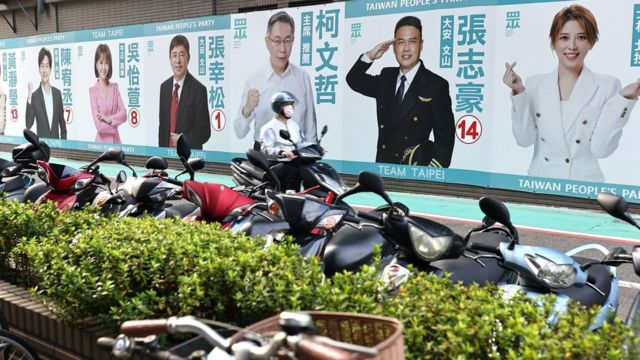
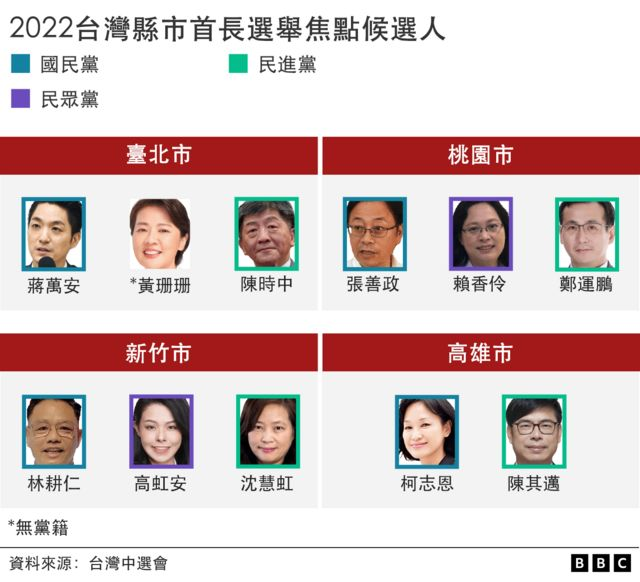
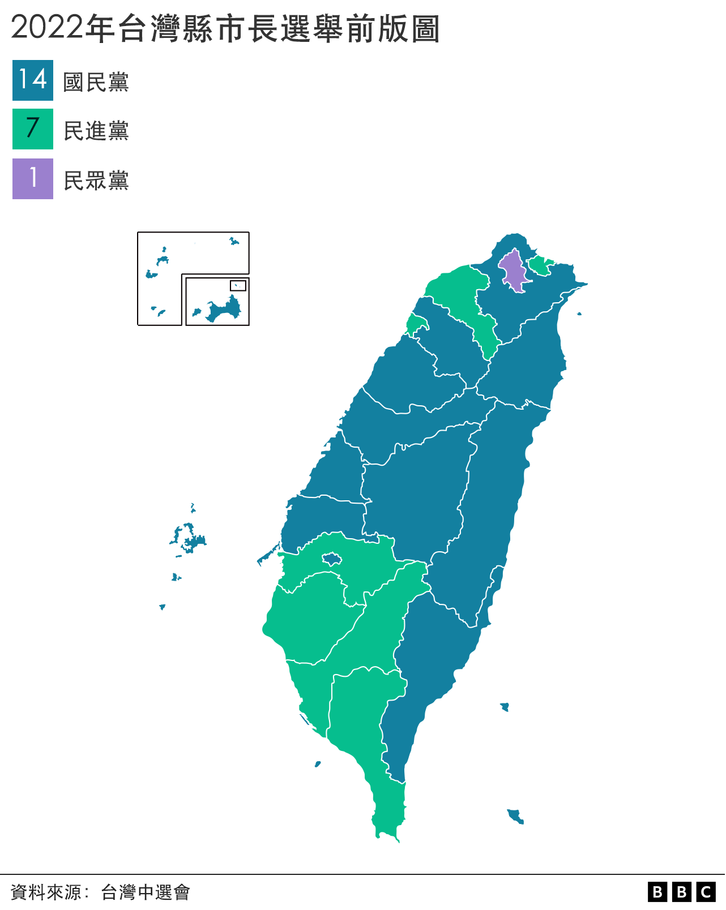
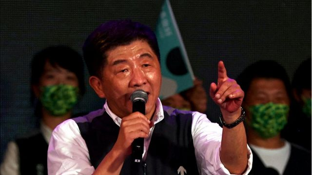
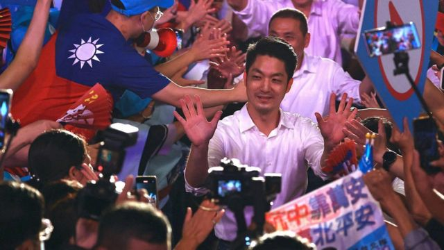

# [Chinese] 台湾九合一选举观察：台北市长选战进入最后肉搏，“抗中牌”对垒“蒋家牌”

#  台湾九合一选举观察：台北市长选战进入最后肉搏，“抗中牌”对垒“蒋家牌”

> 图像来源，  Reuters

**台湾2022九合一地方选举明天投票，谁胜谁负即将揭晓。如同过去，台北市长一直被认为是地方选举的焦点，被视为下届总统大选的前哨战，更会事关台湾政党版图气势消长。**

根据台湾各媒体在民调封关前之报道，代表民进党参选台北市长的陈时中与国民党的蒋万安势均力敌，民众党支持的前台北市副市长、无党派人士黄珊珊则疾赶直追。

许多评论提到，2020年初的总统大选在2019香港示威的背景下举行，民进党的蔡英文以“抗中保台”大胜，连任成功，击退劲敌韩国瑜。

但是，也有声音提及，此次地方选举，市民未必会将两岸因素视为投票依据，尤其台北市选民结构，一向以军公教背景或“外省”家庭居多，这些选民多半在情感上与国民党较近，在大陆经商定居的家庭者众，辅以民众对于防疫政策的批评，让原本被看好拿下台湾首都的前防疫总指挥官陈时中，在选战中意外打得辛苦。而自1998年之后，台北市从未有民进党候选人拿下大位，虽然他们曾全力支持柯文哲在2014年以无党籍胜出台北市长选举。

> 图像加注文字，台北市长的竞争者中，黄珊珊是无党派，但得到了民众党的支持。

蒋万安则持续打“蒋家牌”，以蒋家后代自居，获得国民党提名及许多国民党选民支持。蒋万安发言中也强调希望传承祖父蒋经国精神，与人民在一起。

但国民党在台北的传统影响也并非绝对。从事艺术创作，父辈来自中国大陆的吴先生说，他满意陈时中的防疫。住在台北最富裕的行政区大安区的吴先生告诉BBC， “我刚才跟我妈在讨论说陈时中的艺文政策是三个人里面最好的，他也是最可信赖的候选人。至于中国因素，对我们这一代人来说，当然也很重要。”

可以说，国民党及民进党都已经将此次大选设定为比地方议题更广的战场。

譬如，蔡英文在这几天公开提到国际正在关注此次选举，“台湾将为世界发出什么讯息”。前总统马英九则发文抨击民进党政策将两岸带入战争的风险，“票投民进党，青年上战场”。

此次台北市长选举，再次折射台湾复杂的族群认同及地方政治光谱。

##  绿营“抗中保台”牌

在国民党来势汹汹的挑战下，蔡英文及副总统赖清德这一两周以来到全台到处为民进党候选人站台。尤其是面对其信任的陈时中陷入苦战，蔡英文这个月以来，一星期至少数次到台北市各大庙宇举办的讲台，为陈时中站台。陈时中每场大型造势晚会，蔡英文也几乎都拨空出席，为他说尽好话，这在过往并不多见。

> 图像来源，  Getty Images
>
> 图像加注文字，现任总统蔡英文（前排右二）11月12日在台北为民进党候选人陈时中（前排右一）拉票。

除此之外，许多民进党人担任地方县市首长，施政被媒体评比为“五颗星”的大城譬如桃园、新竹及基隆市，他们推出的接班人却一直深陷苦战，引发台湾舆论辩论。台湾政治评论者陈敏凤在台媒说，民进党内已经开始在检讨，为何这次选战打得如此辛苦？

尤其陈时中此次打选战，并未特别凸显“抗中保台”或“亡国感”作为选战主轴，他强调政策甚至在其上周末选战前最后一个周末的“黄金周”游行，仍以“为爱而走”，但陈时中一直无法稳定领先的态势，已经引起支持民进党支持者焦虑。他们有些人甚至认为，陈时中应该将此次将对抗中共当做选战主轴，拉抬死忠绿营支持者出来投票。

> 图像来源，  Reuters
>
> 图像加注文字，在过去两年领导台湾抗疫的指挥官陈时中角逐最重要的台北市长。

据此，蔡英文近日打出“中国牌”。在10月底，她先强调这场地方选举是国际关注，表示“如果选举结果不好，国际间会猜问‘台湾人民是不是改变主意了’”。上周她帮陈时中站台时又说，“有些人说，今年的地方选举，跟国家整体发展没有直接关系。”她强调并非如此，“越是团结的台湾，就会越强壮、越安全，国际对我们的支持，也会更强劲。”

台湾独派团体则持续推动《捍卫台湾绝不投降承诺书》连署。其中民进党六个直辖市候选人都签署了这一承诺书。

但是国民党台北市长候选人蒋万安日前表示，签署这件事情“很白痴”、“没人会投降”。台北市长柯文哲隶属的民众党候选人也拒绝签署，认为这是意识形态之争。

本周，台湾前总统马英九亦不甘示弱，再提海峡情势紧张，民进党是火上添油，需要全民在此次此选战以选票抵制，并支持国民党和缓两岸关系，创造和平情势。

台湾“独派”政党台湾基进党吴欣岱则批评蒋万安说，“记得你们的副主席夏立言才刚从中国回来吗？如果连个抗中保台都不愿意表态，选民要如何将台北市的未来托付给你？”

不过，因协助无党籍的柯文哲拿下台北市长大位被称为“造王者”的台湾中山大学教授姚立明，就曾经在台媒称，在台北市“蓝大于绿”的结构下，陈时中若要打赢选战，最好集中火力在市政推销上，少提“抗中保台”议题。他在这几天接受台媒访问时称，陈时中的气势在上周末造势游行后回笼，谁胜谁负还不清楚。

##  国民党打“蒋家牌”加抨击过往防疫政策

> 图像来源，  Reuters
>
> 图像加注文字，蒋万安被视作国民党中生代最受瞩目的政治人物之一。

此次代表国民党参选的市长的蒋万安，以蒋家后代自居，由国民党提名，他以仅有连任一次立委的政坛经历，仍够代表国民党参选。彭博社评论称，蒋万安角逐台北市长宝座，“这可能有助于恢复他曾祖父所属政党国民党的声望”。

蒋万安原名章万安，1978年出生于台北市。父亲为前国民党副主席、前台湾外交部长及总统府秘书长蒋孝严，是国民党政二代。蒋万安被视作国民党中生代最受瞩目的政治人物之一。

但是，因为蒋万安与蒋家并没有任何法律认证，所以蒋万安是否是蒋家后代，仍无法律证实。但他被国民党支持者视为蒋家传人，无庸置疑。

蒋万安此次选举除了持续抨击对手陈时中防疫一败涂地，并称陈时中是股恶势力“染指”台北市，认为自己的血统才是台北市正统市民。他最近也与台湾前威权领导人蒋经国过去住处七海官邸的侍卫官等家臣们会面。当时，后者“指证历历，认证蒋万安是‘七海蒋家人’，更亲自为他别上蒋经国生前用过的徽章”。

许多支持他的选民认为，蒋万安父亲蒋孝严，多年游走两岸，甚至与习近平会面过，蒋万安胜出可以维系两岸和平。一位70岁的退休人士Kathy Wang告诉彭博社说，“现在只希望我有生之年不要看到战争发生”。她来自所谓的蓝营家庭，倾向于支持国民党。

蒋万安则回应说，高速公路、台积电都是蒋经国的政绩，所以自己也会秉持同样的蒋经国精神好好跟人民站在一起。

据此，来自台北的英文政治评论网站“破土”（New bloom Magazine）主编丘琦欣对BBC中文分析称，国民党在地方选举或有优势，这来自该党的支持网络（包含人脉及金脉）能追溯到数十年前国民党在台一党独大的威权统治。国民党支持网络亦特别深深扎根于台湾乡村地区：“在这个意义上，即使国民党在选举中表现良好，也不应该被解释为是由于中国因素，或者是台湾人现在开始偏爱中国的指标。”

