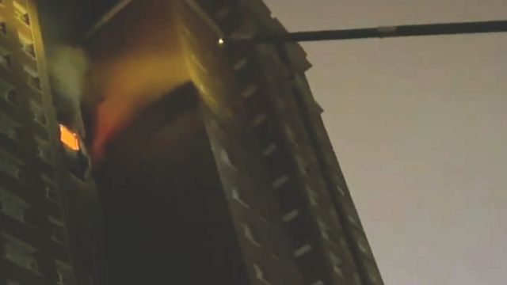
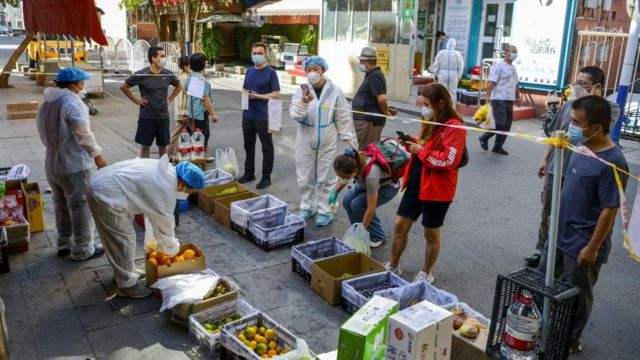

# [Chinese] 新疆乌鲁木齐高楼火灾导致十人死亡 网民质疑防疫措施

#  新疆乌鲁木齐高楼火灾导致十人死亡 网民质疑防疫措施

> 图像来源，  Supplied
>
> 图像加注文字，居民拍摄的视频截图

**中国新疆首府乌鲁木齐一栋高层住宅楼周四（11月24日）晚发生火灾。 中国官媒报道称，火灾造成10人死亡，9人受伤。**

据报道，火灾由接线板着火引起，火势由15楼起，其后蔓延至17楼， 烟气扩散至21层。

报道称，大约三个小时之后明火被扑灭。

中国官媒报道还说，发生火灾的吉祥苑小区为新冠肺炎疫情低风险区，居民可下楼活动。

由于乌鲁木齐自8月10日以来大部分地区都因疫情持续被封锁，中国社交媒体上，许多民众质疑封控是否阻碍了救援，并对此表示愤怒和不满。

多段网络片段显示，有消防车疑似因无法靠近火场，只能远程喷水。 还有画面显示，有身穿白色防护服的工作人员似乎在紧急破拆围栏和路障。

一名事发小区居民对BBC证实了这些影片的真实性。

> 图像来源，  Reuters
>
> 图像加注文字，乌鲁木齐自从八月起开始采取严格疫情防控措施

##  网上质疑和讨论

乌鲁木齐高层建筑火灾的消息在中国互联网上引发广泛关注和讨论。

截止周五（25日）下午，与这起火灾有关的话题在网上阅览已经超过8亿次。不少网民要求当局公开事故高楼的居民是否能够逃离。

微博上一名网民评论要求彻底调查防火通道是否畅通，并说，“代价太沉重了”，“每一场悲剧都比奥密克戎还糟糕”。

一名火灾附近小区的居民对BBC称，他所在的小区属于低风险小区，但每天仅有“一到两个小时的自由活动时间”，他在其他时间“不敢下楼，因为这是违法的”。

他说，他从8月7日起被告知居家。

该居民还表示，他很担心出现类似的紧急情况。

前中国官媒《环球时报》主编胡锡进发微博称，疫情防控是否阻碍了救援“需要官方做出调查鉴定”，但是乌鲁木齐“这样超长时间封控显然是不合理的，超过了人们身心能够承受的限度”。

他还说，在这种情况下，“公众自然会把这座城市里发生的不好事情都往防控上关联，无论它们之间实际关系的强弱，以此迁怒防控。”

中国安全标准缺乏或者执行不严导致火灾多发。

本周早些时候，河南安阳一座工厂厂房的火灾导致38人死亡。该起事故是中国近年来最致命的火灾之一。

中国官方媒体将起火原因归结为违规电焊操作。

