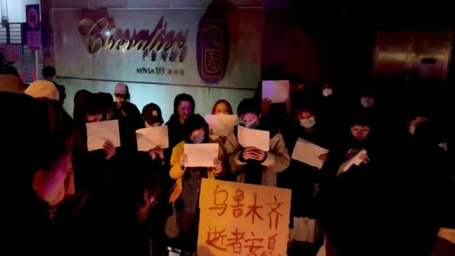

# [Chinese] 上海民众走上街头集会，中国严苛防疫政策再遭抗议

#  上海民众走上街头集会，中国严苛防疫政策再遭抗议

> 图像来源，  Reuters
>
> 图像加注文字，中国上海， 人们为乌鲁木齐大火死难者举行烛光悼念会。

**中国上海， 有成千上万的人周六（11月26日）走上街头抗议该国严苛的新冠限制措施并缅怀新疆乌鲁木齐公寓大火的死难者。**

有外国记者在社交媒体上发布的视频显示，有数以百计的人齐声呼喊，要求中共领导人习近平下台。

周四， 新疆乌鲁木齐的一座公寓楼发生火灾，造成 10 人死亡。 之后， 针对新冠病毒限制措施的抗议活动似乎愈演愈烈。

尽管当局否认这一点， 但许多人将这次火灾归咎于对住宅楼的封锁。

乌鲁木齐当局周五晚些时候不同寻常地向公众道歉，誓言要惩罚任何逃避职责的人。

在上海的集会上，有人为乌鲁木齐的遇难者点燃蜡烛和献花。

还听到有人高喊“习近平，下台”和“共产党，下台”等口号。一些人还举着空白的白色横幅。

类似抗议活动近年在中国并不常见，任何对当局和习的直接批评都可能面临严厉的惩罚。

有现场视频显示，上海的一些抗议者还对警察大声辱骂，聚集在街道两旁警察并没有即刻采取行动。

但一名抗议者告诉美联社，他的一个朋友在现场被警察殴打，另外两人被喷胡椒喷雾。

该地区的局势在周日早上已经平静下来，但 BBC 看到当地街面的警力有所加强，街上有数十名警察和保安，也有便衣警察的身影。

在中国其他地方，几所大学学生抗议的照片和视频周六晚上在网上传播。最大的聚会似乎是在南京传媒学院。

其中许多视频显示人们表达了对当局和中共领导人异常明确和直言不讳的批评，但对这些视频做独立核查非常困难。

最近一段时间，针对中国的新冠“清零”措施的抗议活动不断， 对政府和习近平本人的批评也越来越大胆。

作为一个世界主要经济体，中国当局称， 坚持"动态清零"政策的部分原因是该国的疫苗接种水平相对较低，以及需要保护老年人。

但大范围的封城和封锁以及地方政府层层加码让百姓疲惫不堪，生计大受影，民众的不满和愤怒也在不断积聚，触发了最近从郑州到广州的暴力抗议活动。

尽管采取了严格的措施，中国每日新冠病例数不断打破大流行开始以来的历史记录。周六，中国大陆报告近40000宗确诊个案，再创单日新高。

