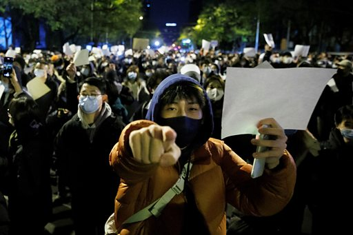

# [Chinese] 中国多地爆发反封控抗议：民众高举白纸悼念乌鲁木齐火灾遇难者

#  中国多地爆发反封控抗议：民众高举白纸悼念乌鲁木齐火灾遇难者

**中国多地爆发反封控抗议：民众高举白纸悼念乌鲁木齐火灾遇难者**

在过去的一个周末，反对封控的抗议蔓延中国各地。新疆乌鲁木齐火灾引发中国各地民众聚集哀悼和抗议。

在刚刚过去的周末，上海乌鲁木齐中路连续两天发生抗议事件。周日（27日），北京清华大学多达近千名学生聚集在校内“紫荆园”进行抗议。同一天夜晚，亮马桥一带，市民高举白纸悼念火灾遇难者。警察劝离后，民众于深夜散去。

有关抗议表达了中国大陆民众对国家罕见的愤怒情绪。当前的严格封控和限制措施造成的经济和社会成本正不断上升。

周日（11月27日），《人民日报》发表在头版的社评称，“我国新冠肺炎死亡病例数、住院病例数远低于全球平均值，无论是发病率还是死亡率，中国人受疫情的影响都是最小的。”

##  相关报道：

