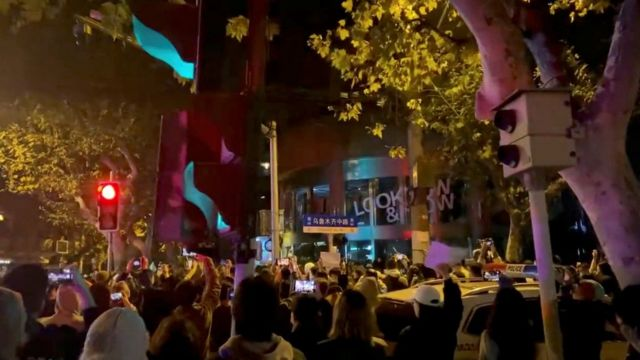

# [Chinese] 中国新冠“清零”抗议：BBC记者报道时被警方殴打拘押

#  中国新冠“清零”抗议：BBC记者报道时被警方殴打拘押

9 小时前

> 图像来源，  VIDEO OBTAINED BY REUTERS
>
> 图像加注文字，在上海乌鲁木齐中路的抗议活动有数百人参加，警方拘捕了一些人。

**英国广播公司（BBC）记者埃德·劳伦斯（Ed Laurence）在上海乌鲁木齐中路报道抗议中国新冠“清零”政策活动时被警方拘留并殴打。**

劳伦斯从现场带走并被关押几个小时后获释。

英国广播公司发表声明表示：“我们的一名记者在执行工作任务时受到如此攻击，令人非常担忧。”

中国政府就此表态说，劳伦斯当时没有出示他的记者证。

周日（11月27日），劳伦斯在上海乌鲁木齐中路拍摄中国最大规模的一起抗议活动。

在社交媒体上广泛分享的视频显示，几名警察抓住了劳伦斯并将他按在地上。BBC说，他被警察拳打脚踢，然后被戴上手铐带走。

英国广播公司BBC说，记者的如此遭遇“极其令人担忧”。

英国广播公司还在声明中表示，“除了后来释放他的官员声称警方拘捕他是为了他好，以防他从人群中感染新冠病毒”之外，并没有收到中国方面的正式解释或道歉。

声明说：“我们认为这不是一个可信的解释。”

在周一（11月28日）的例行新闻发布会上，中国外交部发言人也没有特别就警察暴力对待并逮捕一名获中国认证的外国记者事件道歉。

中国外交补发言人赵立坚说：“根据我们从上海有关部门了解到的情况，他没有表明自己是记者，也没有主动出示记者证。”

> 图像加注文字，埃德·劳伦斯（Ed Lawrence）是BBC在中国的记者

劳伦斯周一转发了BBC的声明，并补充说，他知道当时在场至少有一个当地人因为“试图阻止警察打我”也被逮捕了。

外国媒体驻中国记者俱乐部（FCC）表示，对报道抗议活动的记者所受到的待遇感到“极为不安”。

周日，至少还有一名瑞士籍的外国记者在上海其他地方报道时也被短暂拘捕。

外国媒体驻中国记者俱乐部说：“来自多家媒体的记者在报道抗议活动时受到警察的人身骚扰，至少有两名记者被拘留。”

“在一起特别令人震惊的事件中，一名英国记者被多名警察摔倒在地，然后被带离。”

外国媒体驻中国记者俱乐部指出，根据中国法律，外国记者“有权在中国不受限制地进行报道”。

上周新疆乌鲁木齐发生的一场火灾造成10人死亡后，中国一些城市爆发了反对中国政府及其新冠清零封城政策的抗议活动。

许多人认为，由于新冠隔离措施，乌鲁木齐被封锁的这座公寓楼里的居民无法逃生，消防人员也无法及时施救。当地政府虽然否认这一说法，但中国民众因此产生的愤怒使得多个城市出现街头抗议行动。

至今中国政府对有关的抗议活动既没有承认也没有以任何正式方式作出回应。然而，尽管中国实施严格的言论审查制度，但抗议活动的消息还是通过中国的社交媒体迅速传播。

英国政府谴责中国警方拘留BBC记者劳伦斯的行为，商务大臣沙普斯（Grant Sharps）对英国媒体表示，中国警方的行动“不可接受”、“令人担忧”。

他还强调：“无论发生什么，新闻自由是神圣不可侵犯的。”

