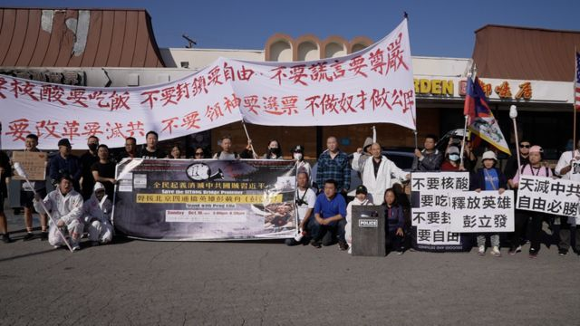
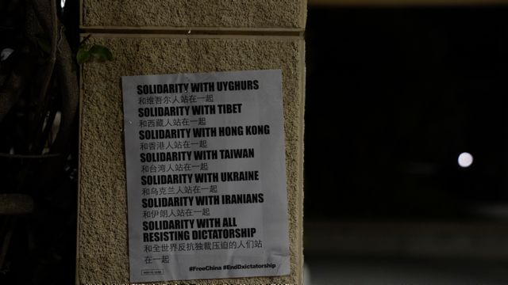
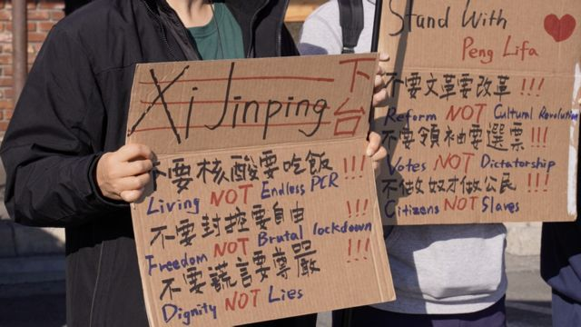
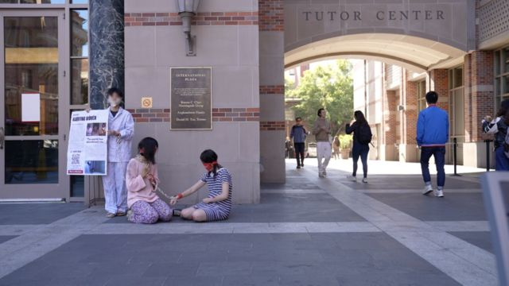
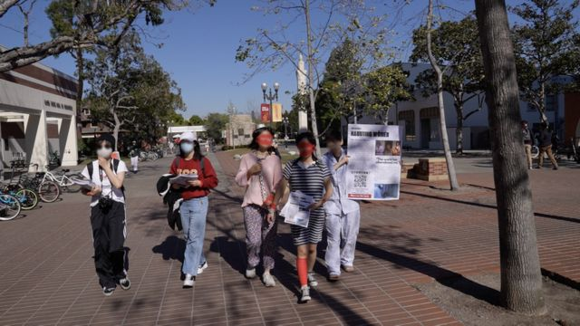
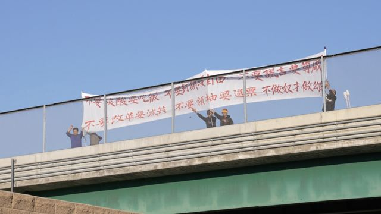

# [Chinese] 北京四通桥事件催生美国年轻华人政治表达

#  北京四通桥事件催生美国年轻华人政治表达

> 图像来源，  BBC Chinese
>
> 图像加注文字，中国首都的四通桥抗议鼓舞了许多海外异议人士，他们开始站出来公开表达自己的不满。

**10月13日，两条反对中国最高领导人习近平和防疫政策的横幅出现在北京西北部的一座繁忙的立交桥上。抗议发生在中共二十大前夕，当时外界广泛认为中共领导人习近平即将获得连任，延续他的权力。**

习近平在二十大后确实顺利开启了他的第三任期。但发生在中国首都的这场罕见抗议鼓舞了许多在美异议华人，他们开始站出来公开表达自己的不满。

“不要核酸要吃饭，不要封控要自由，不要谎言要尊严，不要文革要改革，不要领袖要选票，不做奴才做公民，”这条出现在北京四通桥的横幅内容已经在美国广泛传播。

##  四通桥抗议的鼓舞

20岁的X同学目前就读于加利福尼亚大学尔湾分校，四通桥抗议者的勇气让他感到很震撼，让他想起2011年的茉莉花运动，当时中国曾发生短暂的反对中国共产党的示威。

“我最大的震撼在于它对于政权的抨击是如此激烈，我可以想象得到的上一场类似的抗议活动，只有茉莉花运动。” X同学说。

X同学认为，虽然茉莉花运动本质上是一个反政府运动，但是诉求和表达方式非常温和。这一次四通桥的横幅，意味着过去这么多年中国都没有人敢发声后，有人愿意以非常激进的方式唤醒民众。

今年19岁的Panda在南加大读大二。四通桥抗议的新闻让她想到，自己是不是也可以行动起来，做一些事情。

> 图像来源，  Twitter
>
> 图像加注文字，四通桥抗议现场

“他在北京都愿意承受那么大的风险去挂上那两条横幅，我觉得可以说是不要命了。我们作为在国外的留学生，我们其实是有更多的空间和自由去做这些事情的。”Panda说。

25岁的王涵曾就读于南加大，他与Panda有类似的感受，“一个身处境地比我们都危险的人愿意去勇敢地发声，那我们还有什么责任去推卸我们发声的责任呢？”

##  行动

他们能想到的第一个抗议方式是张贴海报，表达自己的诉求。

四通桥事件后，X同学与几个朋友一起，打印了以中国疫情吹哨人李文亮、新疆西藏问题等为主题的海报，贴在学校的布告栏上和墙上。

> 图像来源，  BBC Chinese
>
> 图像加注文字，四通桥事件后，X同学与几个朋友一起，打印了以中国疫情吹哨人李文亮、新疆西藏问题等为主题的几款海报，贴在学校的布告栏上和墙上。

其中一张海报用中英文写道：“和维吾尔人站在一起，和西藏人站在一起，和香港人站在一起，和台湾人站在一起，和乌克兰人站在一起，和伊朗人站在一起，和全世界反抗独裁压迫的人们站在一起。”海报上还加上了“Free China”（自由中国）和“End Dxictatoriship”（结束独裁）的标签。

另外一张海报则以被胡乱涂抹的习近平的头像为底，写着“Do you hear the people sing”（你可曾听见人们的歌唱？）

X同学说，他这边有五六个志愿者定期在学校贴海报，但他发现现在很多不认识的人也开始去贴类似的海报，估计学校至少有两位数的人在参与这场活动。

王涵这批示威者则效仿了四通桥抗议者的海报。白底红字的横幅上写着“不要核酸要吃饭，不要封锁要自由，不要谎言要尊严，不要改革要灭共，不要领袖要选票，不做奴才做公民”。

11月12日，王涵和其他约20名抗议者，举着这个横幅，在洛杉矶华人社区蒙特利公园（Monterey Park）喊口号，还有抗议者打扮成中国防疫人员“大白”，朝华人商铺喊“做核酸”、“出示二维码” ，演示做核酸的过程。

> 图像来源，  BBC Chinese
>
> 图像加注文字，王涵这批示威者效仿了四通桥抗议者的海报。

他们最后在洛杉矶十号公路上的一座立交桥上停留，有的抗议者手里还拿着其他抗议标语，上面写着“习近平下台”、“释放英雄彭立发”等等。

王涵说，他明白很多中国留学生会有一些安全上的顾虑，不愿意站出来游行示威反对中共，但至少张贴海报是一种形式，能够表达诉求；而且以前绝大部分中国留学生只愿意在平台上发发牢骚，甚至大部分发牢骚都不敢，现在真正走向了线下。

“向人们表示说，我们不只在线上，我们也可以在线下，我们可以在未来的某一刻进一步地走出来，我们要去游行示威，我们有勇气去游行示威去反抗。”

这次大家自发的活动也让王涵感到，他不是孤单一人。“之前我们在做活动的时候，我感觉我是在黑夜里一个人前行，现在我至少能看到了一些星光，就是有一些人和我的想法是一样的。”王涵说。

> 图像来源，  BBC Chinese
>
> 图像加注文字，Panda和几名同学装扮成江苏徐州丰县铁链女。

Panda的抗议方式则更有创意。在万圣节前夕，她看到经常发布中国时事内容的Instagram账号“北方广场”有人呼吁女性在万圣节那天装扮成江苏徐州丰县铁链女。作为女权主义者的Panda认为，中国政府的封锁让这则新闻在网络上消声，她觉得扮成铁链女可以唤起大家对铁链女的关注。

她花了两三周的时间和朋友们一起思考、准备这个活动。11月14日活动当天，他们先在图书馆集合，穿上提前准备好的衣服，用铁链拴着自己在校园里走了一圈。三个女生扮演了铁链女，另外两个女生在活动时向路人发传单，还有几个同学帮忙拍照。

因为她们的装扮特别，整个活动很吸引眼球，走在路上许多人围观，他们就一个箭步冲上去塞传单，跟路人讲解发生在徐州的事情。绝大多数人都接过传单听他们的讲解，但也有一些外表看起来像是中国人的学生选择了避开。

##  自救

Panda说，发声和抗议都是为了“自救”。

“我不想要被陷入在这种无力的沼泽感，就是像现在比较流行的词叫政治抑郁，或者是就不想让自己感到无力，想要自己做些什么事情。”

作为女同志，Panda在中学时接触到女权和同志运动，那是她权利意识的启蒙。

她非常清楚，自己来自中产阶级家庭，如果不关心这方面的问题，她可以活得很好，吃好穿好，父母也会给钱，毕业后也是高材生能找到报酬丰厚的工作。

> 图像来源，  BBC Chinese
>
> 图像加注文字，Panda说，发声和抗议都是为了“自救”。

但她觉得自己有更多自由和空间去做一些示威的活动，也希望通过自己的行为，去影响同样来自中产阶级家庭的留学生，对国内的一些不公义的事情有所帮助。

来到美国后，她想参与到一些大的社会运动中，一开始她参加洛杉矶当地的公益组织，给流浪者送水和食物。直到北京四通桥事件，她突然意识到，在谈论社会议题时，政治是绝对绕不开的一个概念。

王涵的转折点则是在2018年修宪之后。“我感到非常绝望，或者说非常震撼，”他说，“我就是彻底认为共产党完全没有救，中国政府完全没有救。”

2019年，香港争取民主自由的抗议更加激励了他。当他看到同龄人已经有勇气走上香港街头反抗极权的时候，觉得自己很懦弱，没有香港人勇敢。2020年武汉爆发疫情，他更加感受到，极权不但能让民众失去自由，同样还能伤害生命。

##  未来

在X看来，海外的留学生团体的政治观点已经开始有所松动、有所改变了。据他观察，在纽约大学和斯坦福大学等高校，很多中国留学生政治观点已经扭转，支持或者同情他们的诉求。

他认为，未来几年海外留学生群体政治观点会发生重大转变，这批人回到国内后或许会对国内的政治环境和社会带来一些积极的变化。

中国独立政治学者陈道银对BBC表示，北京四通桥的横幅播下了一颗抗议的种子。

"这颗种子到合适的季节就会开花，甚至结果。" 陈道银指出，这颗种子受到情境的渲染就会衍生出新的抗议，包括随后乌鲁木齐火灾引发全国反封控抗议。

陈道银指出，如果海外异议人士能向所在国政府施压，甚至向当地企业施压，要求他们停止与中国的合作，海外发声抗议会更有效果。

> 图像来源，  BBC Chinese
>
> 图像加注文字，王涵说，即使活动没有效果，他还是会继续做下去。这是他和一些示威者在洛杉矶十号公路上的一座立交桥上举起标语。

对于行动的目的，Panda说，我们只是时代洪流的小水滴，能够看到同温层的其他小水滴就已经很好。另外，作为来自中产阶级家庭的学生，自己在洛杉矶生活学习，掌握很多资源，可以把声音传播到更广泛的人群，让其他人都能够关注这些事情、给予帮助。

王涵的想法则是，通过一次次活动，至少让更多人知道这件事情，通过自己的勇敢行动，让更多人有勇气去表达去发声。

他表示，即使没有这些效果，他还是会继续做下去。

“因为我们认为我们做的事情是对的，我们认为表达我们这个思想是对的，我们认为言论自由是对的，我们认为人人平等普世价值是对的。”他说。

（尊重受访人意愿，文中X和Panda均为化名。）

