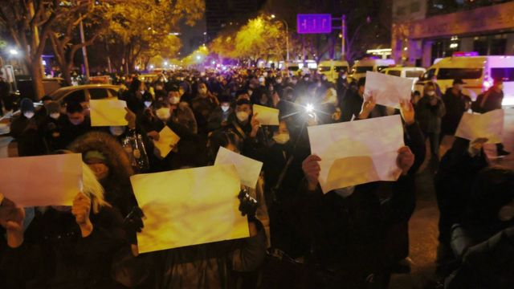
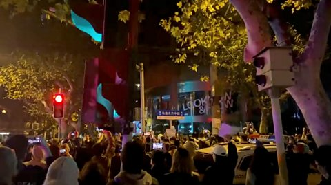
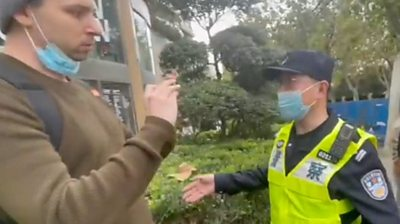
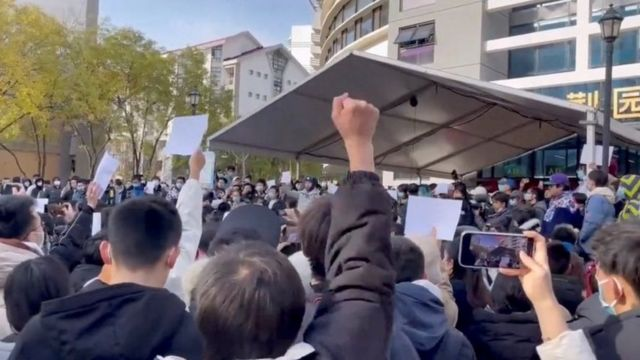
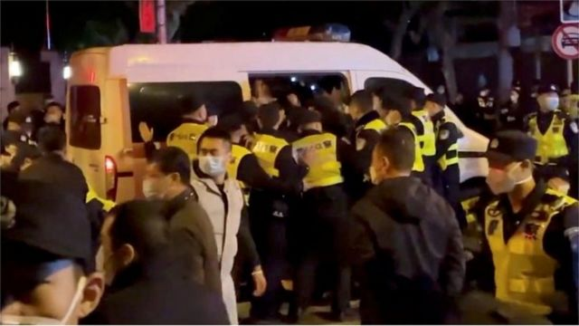

# [Chinese] 驱动中国反“清零”抗议示威的年轻一代

#  驱动中国反“清零”抗议示威的年轻一代

  * 毛远扬（Frances Mao） 
  * BBC记者 

> 图像来源，  Getty Images
>
> 图像加注文字，中国年轻人在一个压制异见的国家里长大，现在他们正开始发声。

**上周末的中国，新一代涌现了；当中的很多人是人生里第一次参加公开抗议。**

他们上街要求解除已经实施近三年的新冠清零防疫政策。

在上海，抗议者一开始很安静。他们是聚集起来悼念新疆乌鲁木齐一场公寓火灾中的受害者。很多人相信，是新冠防疫措施令一些人无法在火灾中逃生。

在大量警力在场之下，他们进行了悼念。他们在抗议中手举白纸，放下花束，一直保持着安静。

然后，一些人开始高喊：“自由！我们要自由！解封！”

随着夜色渐沉，人越来越多，也越来越大胆。至当地时间周日凌晨3点（格林尼治时间周六19:00），他们高喊：“习近平，下台！习近平，下台！”

一名20岁出头的参与者说，他是在家里听见人群的声音才跑上街的。

“我在网上看到过很多、很多人都很愤怒，但是没有一个人上过街抗议，”他向BBC表示。

他带上了相机，来记录这个他觉得是有历史意义的事件。“我看到很多人——警察、学生、老人、外国人。他们各自意见不同，但是至少能够说出来。”

“这样的集会是有意义的。我觉得这对我会是一种珍贵记忆。”

##  烏魯木齊火災引發中國五天的反新冠封控抗議

 居民拍攝的視頻截圖

新疆烏魯木齊公寓火災造成10人死亡，9人受傷。

Media playback is not supported on your device.

社交媒體上的視頻顯示有消防車被新冠防疫用圍欄阻擋而延誤救火，當地官員在新聞發佈會上指造成傷亡原因之一是「部分居民自防自救能力弱」，在中國大陸互聯網上引發眾怒。 另一些視頻顯示，烏魯木齊市有民眾走上街頭與警員對峙，推倒防疫用圍欄，並高呼要求解封。

 Reuters

上海等多個城市出現反對新冠防疫封控措施的抗議。

> View on Twitter > 

多個城市民眾走上街頭悼念烏魯木齊火災死者。 南京傳媒學院有數百名學生在校園集會，手舉空白紙張表達對當局噤聲的抗議。 全國各地包括清華和復旦在內的多個高校亦先後出現類似抗議活動。

Media playback is not supported on your device.

在上海烏魯木齊中路，民眾連夜抗議，期間有人高喊口號要求習近平下台。

 BBC

BBC記者埃德· 勞倫斯（Ed Lawrence）在上海拍攝抗議人群期間被中國警察毆打並短暫拘留。

> View on Twitter > 

有社交媒體照片顯示上海烏魯木齊中路的路牌被拆除。

 NOEL CELIS/AFP via Getty Images

北京、西安、成都等多個城市在同日均有抗議活動。

Media playback is not supported on your device.

烏魯木齊中路兩旁架設起了路障，在場員警要求路過拍照的民眾刪除手機照片。

 Louise Delmotte/Getty Images and Anthony Kwan/Getty Images  Louise Delmotte/Getty Images and Anthony Kwan/Getty Images

香港、台灣及倫敦等地均有學生舉行集會，聲援中國在內反對新冠防疫封控政策的抗議。

顯示更多

人群边的一名年轻女子表示，她觉得这是一个令人激动但同时也是稍纵即逝的时刻。“我这辈子都没在中国见过这样的事情，”她告诉BBC说。

“我感觉是一种释放。我们终于能够走到一起——去说一些我们很久以前就想说的东西。”

她说，新冠清零防疫政策偷走了他们人生中最好的年华。她的同辈人很多没有了收入和生计，也失去了教育和旅行的机会。有时候一封锁就持续好几个月，他们要和家人分离，也不得不延迟或者取消一些人生计划。

他们感到“愤怒、悲伤、无助”——一种炼狱般的状态。

那一个周末，全国多个大城市都能听到相似的呼唤。在北京的清华大学，学生们受到网上看到的示威启发，也聚集起来了。

一段现在已经被广泛传开的视频显示，一个女生对着扩音喇叭快速而略带胆怯地说着话。她话语间不时崩溃落泪，但是人群却为她鼓劲。“加油！不要害怕！”他们说。

“如果我们因为害怕被抹黑就不敢发声，我觉得我们的人民都会对我们失望，”她声音嘶哑地说，“作为清华的学生，我会后悔一辈子。”

> 图像来源，  Reuters
>
> 图像加注文字，11月27日，中国清华大学的学生在抗议。

##  精明还是天真？

对于年纪稍大的旁观者而言，这种政治示威是数十年未见的景象。它激起了对于1989年天安门广场的记忆，当时的运动也是由学生领导，呼唤一个更自由的中国。

但是一些人说，这一个世代的热忱来自于他们不了解过去抗议的结局是一场血腥镇压。

“年轻的理想主义——没有伤痛记忆的包袱而无所畏惧——令年轻人走上街头争取他们的权利，”人权观察（Human Rights Watch）中国部研究员王亚秋说。

另一些观点则认为，这样其实是低估了这些抗议者。澳大利亚国立大学（Australian National University）政治学者宋文笛表示，他们的年轻和他们对中国体系和规则的了解显得不太相称。

他对他们的“精明策略”感到惊讶。他说，今天的年轻抗议者“是中国教育程度最高的一代”。

“他们知道红线。他们试图在不逾越的前提下挑战极限，”他说。

上海的抗议者高呼要求习近平下台，但是在其他几乎所有的集会中，示威者都收敛了他们担心会过分政治化的诉求。

白纸成为了他们使用的象征——以此避免有任何可以被定罪的字句或图案。当警察叫他们停止呼吁结束清零政策时，他们以反讽的方式回应，转而高呼更多的检测和更多的限制。

“看看他们是如何深思熟虑和先发制人地将中国政府可以对他们作出的指控减到最小。”宋文笛说。

抗议者对于那些颠覆他们诉求的声音也有所警觉。

在北京，当有人警告说有“外国势力”的时候，他就被其他人大声嘲笑：“外国势力是指马克思和恩格斯吗？是斯大林？还是列宁？”

中国共产党将马克思主义定义为其意识形态指导思想。

> 图像来源，  Reuters
>
> 图像加注文字，上海的抗议升级成冲突，一些人被捕。

北京的抗议民众进一步追问：“是外国势力在新疆放火吗？是外国势力让贵州的转运车翻车吗？”

“是外国势力让所有人今晚来到这里吗？”人群中的一名男子喊到。人群则大声回应：“不是！”

##  “自由派民族主义者”

在新冠疫情全球大流行之前，中国年轻一代大体上对于自己的前景是满意的。

“我不能去全世界旅行，不能见我的家人，”在上海带着相机上街的那个年轻男子说。他向BBC表示，担心身患癌症的母亲，她自己待在广州。广州当地官员在周三（11月30日）解除了大多数区域的新冠限制措施。

“我真的很想见她。我现在已经很久没见她了，摸不到她的脸，也没有跟她吃饭，”他说，“我希望这种封控政策能够尽快解除。”

BBC之后获悉，他在当天稍后被拘留了。

很多接受BBC访问或者曾在网上视频出现的人都说，希望看见自己的国家进步。

在抗议中，人群一次次唱起中国国歌——特别是副歌当中呼唤人们保卫国家的一句“起来！起来！起来！”

宋文笛说，这一代特别不同的是，他们在中国崛起的时代之下长大，有着强烈的爱国情怀。

他将他们中的很多人标签为“自由派民族主义者”——他们对这些体系怀有强烈信仰，以至于当它失效时，他们要求问责。

“情绪可以非常迅速地从亲政府转变为反建制。”他说。

但是，仍然有一种集体性的渴望，去证明他们的抗议是合理，并且是合法的。

在清华校园的视频里，在演讲者提及抗议有可能被麻烦制造者利用而有所担忧时，人群高呼“这里没有人违法！”

一名男子的声音说：“如果我们控制不了这个，我们就输了。”

“我们做这个没有经验……但是我们会慢慢搞清楚。”

