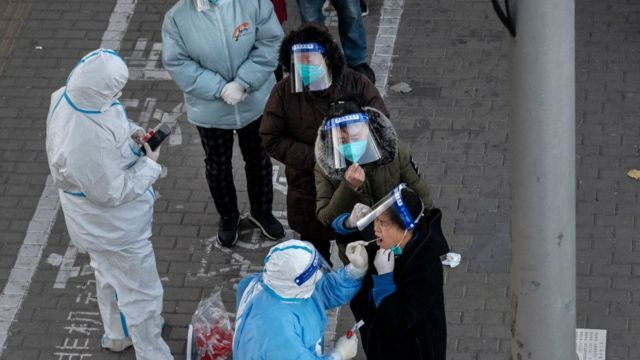
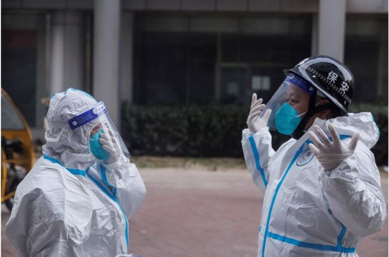
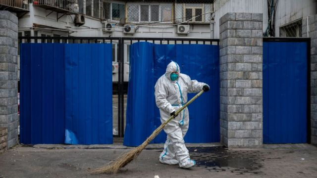
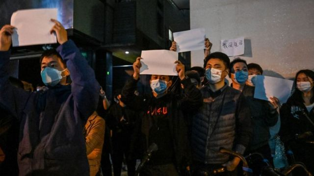

# [Chinese] 中国疫情：当局称奥密克戎病毒致病性减弱 结束“清零”是否指日可待

#  中国疫情：当局称奥密克戎病毒致病性减弱 结束“清零”是否指日可待

> 图像来源，  Getty Images
>
> 图像加注文字，中国副总理孙春兰连续两日表示奥密克戎病毒致病性减弱，将优化防控措施，她未提及要继续坚持“清零”政策。

**在中国爆发广泛的反封控示威后，中国副总理孙春兰连续两日表示奥密克戎病毒致病性减弱，将优化防控措施，她未提及要继续坚持“清零”政策，引发外界猜想，中国是否会在一定程度上改变“清零”政策。**

不过，根据中国国家卫健委的数据，中国的新冠病毒确诊病例仍在持续上升。周四（12月1日）中国报告确诊病例近35000宗，其中无症状感染者占大多数，超过3万例。病例主要集中在广东、北京和重庆等地。

##  当局称病毒致病性大幅降低

近日，中国政府高层连续两天召开疫情防控座谈会，中国国务院副总理孙春兰在两场座谈会上都表示，奥密克戎病毒致病性减弱，将优化防控措施。

> 图像来源，  Reuters
>
> 图像加注文字，穿着防护服的防疫工作人员准备进入一栋被封锁的公寓楼。

在周三（11月30日）的座谈会上，孙春兰说，防控政策持续优化，走小步不停步，不断完善诊断、检测、收治、隔离等措施，加强全人群特别是老年人免疫接种，加快治疗药物和医疗资源准备。

中国官方媒体的报道还称，这次座谈会上，张伯礼等8名专家发言提出了优化完善“二十条”措施的意见和建议。

而在周四（12月1日）的座谈会上，孙春兰称，经过近三年的抗疫，中国医疗卫生和疾控体系经受住了考验，拥有有效的诊疗技术和药物，全人群疫苗完全接种率超过90%，群众的健康意识和素养明显提升，加上奥密克戎病毒致病力在减弱，为进一步优化完善防控措施创造了条件。

与以往大多数会议不同的是，孙春兰这两次都未提到坚持“清零”政策，这引发外界猜想，中国是否会在一定程度上改变“清零”政策。

另外，中国官方媒体也发文称，奥密克戎致病力已大幅降低。

《环球时报》周四引述武汉大学病毒学国家重点实验室主任蓝柯称，他所带领的研究团队在病毒体外感染实验中发现，奥密克戎变异株感染人肺细胞（calu-3）的能力显著低于原始毒株，在细胞内的复制效率比原始株要低10倍以上。

蓝柯称，实验结果均可有效表明，相较于新冠病毒原始毒株，新冠病毒奥密克戎变异株的致病力和毒性已经大幅降低。这提示大家对于奥密克戎不必过于恐慌，对于普通人群，在疫苗的保护之下，新冠病毒对人体的危害性已大不如前。

##  将放宽疫情管控？

上周，中国曾出现针对防疫政策的广泛抗议。而中国官方媒体周四报道，中国多地相继调整防控措施，将有序恢复正常生产生活秩序。北京、石家庄、广州、成都、沈阳、呼和浩特等多地已宣布，部分区域恢复生产生活秩序，公共交通、经营活动恢复。

路透社引述消息人士称，中国在未来将宣布放宽隔离规定，并且减少大规模检测，这将是在广泛抗议后显著的政策转变。

> 图像来源，  Getty Images
>
> 图像加注文字，中国官方媒体周四报道，中国多地相继调整防控措施，将有序恢复正常生产生活秩序。

消息人士称，将公布的措施包括减少大规模核酸检测，以及在某些条件下，允许阳性病例和密切接触者居家隔离。

据路透社，野村证券（Nomura）分析师在一份研究报告中表示：“孙（早些时候）的讲话，加上广州昨天明显放松了新冠防控措施，发出了另一个强烈信号，即‘清零’政策将在未来几个月内结束。”

##  可以放宽管控吗？

目前中国大陆舆论对于疫情防控有两种观点。一种观点认为，目前新冠病毒已经减弱，应当马上放开管控措施，让大家复工复学，自由走动。另一种观点则认为，如果放开，新冠病毒仍然对老年人和小孩有较大影响，会导致死亡率上升。

香港大学李嘉诚医学院生物化学系教授、病毒学家金冬雁对BBC表示，此前中国推出的防疫"二十条"是想用科学精准防控删掉过去无效、低效的防控措施，往前走，为将来进一步开放做好准备。准备措施包括打疫苗、储备药物等。

> 图像来源，  Getty Images
>
> 图像加注文字，目前中国大陆舆论对于疫情防控有两种观点。一种观点认为，目前新冠病毒已经减弱，应当马上放开管控措施，让大家复工复学，自由走动。

金冬雁认为，现在中国不具备放宽的条件。其中最主要的是民众的思想准备，不少老百姓非常恐慌，觉得放宽后可能造成严重的后果。“就算病毒不杀人，恐惧都杀人。老百姓太恐惧了也出问题。宣导要做好，不能还是觉得新冠病毒像魔鬼一样。”

金冬雁还指出，政府要做好宣导工作，让民众意识到现在新冠病毒并没有那么可怕，而且在减少核酸检测的同时，要推广快速抗原检测。

“把核酸点撤了又不引导大家测抗原，真有疫情都不知道，那会爆发的，”金冬雁说。

