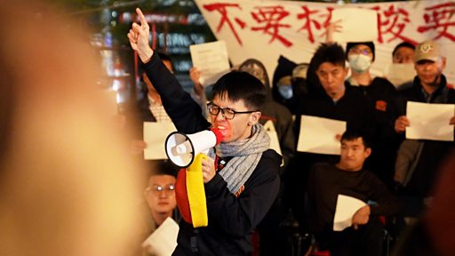

# [Chinese] 反“清零”抗议潮：美国的中国留学生如何用行动声援？

#  反“清零”抗议潮：美国的中国留学生如何用行动声援？

**反“清零”抗议潮：美国的中国留学生如何用行动声援？**

自2022年10月13日的北京“四通桥抗议”发生后，许多海内外的中国人开始响应并用各种方式表达自己对“动态清零”政策的不满。一个月后的新疆乌鲁木齐大火事故更引发中国多个城市的抗议潮，严格的封控措施成为众矢之的，上海甚至出现了反对习近平和中国共产党的口号。BBC中文记者在美国访问了一些中国年轻人，了解他们如何用自己的方式声援国内的抗争活动。

至于中国官方，针对中国的抗议潮，中共政法委日前表示“有必要依法打击敌对势力的渗透和破坏活动”，以及“坚决依法打击企图破坏社会秩序的犯罪行动，坚决保护社会稳定”。国家卫生健康委员会则说，中国政府一直根据病毒变异的特点和临床治疗的实践认识，边防控、边研究、边总结、边调整。

