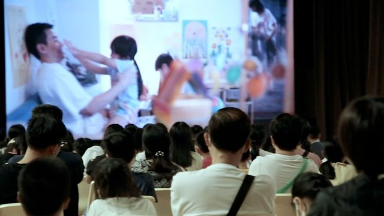
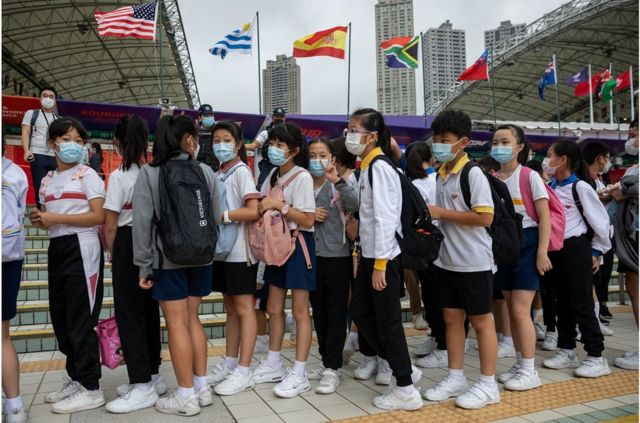
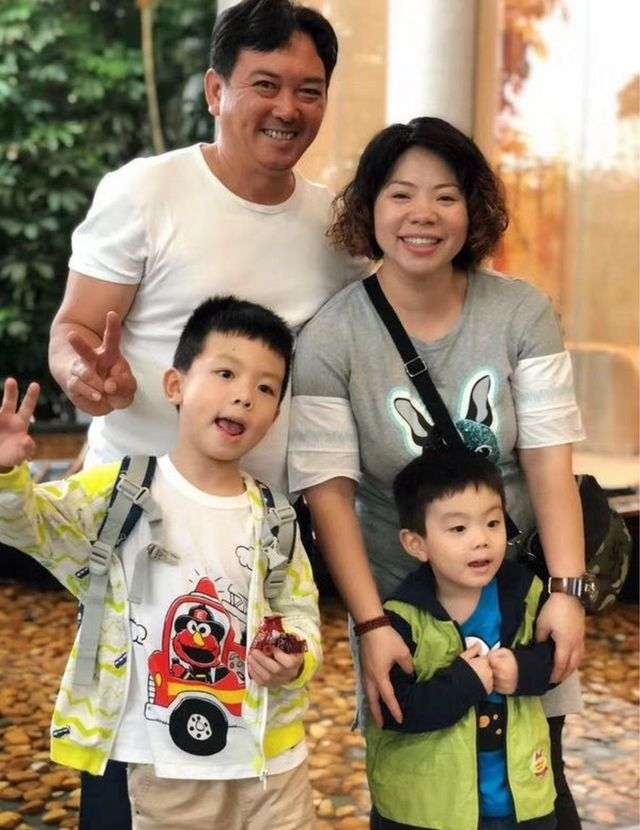

# [Chinese] 新冠疫情冲击下香港基层家庭及儿童面临哪些心理健康挑战

#  新冠疫情冲击下香港基层家庭及儿童面临哪些心理健康挑战

  * 吕嘉鸿 
  * BBC中文 

> 图像来源，  The WEMP Foundation
>
> 图像加注文字，基金会与学校举办电影放映讨论活动 邀请家长参与

**“有一次因为小孩可能在学校不知道发生了什么情况，情绪有点不稳定。我们坐公交车回来，总之他就是很不高兴，然后他到站了不做声地就冲出车门。我跟他哥哥因为还要背书包，来不及抓住他......我下车后开始找他。当时真的是又气又怕。因为我们搬到这边新区才一年多一点，他自己又这么小，才七岁左右，我整个下午都找不到他。我想他会不会自己上楼，跑回家，结果他也不在。当时因为爸爸也不在身边，我整个人都好像软了一样，塌下来了。还好，哥哥还跟着我一起，陪我找人”。**

这是家住香港九龙深水埗的徐女士的心声。

有研究指出，新冠疫情爆发后，各界对于儿童的心理健康越来越关注。在生活压力紧绷的香港，儿童心理健康也引受到了越来越多的关注。根据 香港“救助儿童会”  （Save the Children）慈善基金会2020年发表的综合研究报告，世界卫生组织（WHO）估算有近四成的香港中小学生可能有难以集中精神、感到焦虑以及失眠的问题。

尤其当新冠疫情爆发时，学童在家上网课，失去平常在学校习惯的人际互动，心理的调适比成人年需要更多时间，也会以电玩或耽溺网路、电视等方式转移压力，家长对此或不了解，产生越来越多的摩擦。儿童乃至家长的精神健康，都慢慢有了问题。

BBC中文访问了两个香港基层家庭的母亲以及专业人士，了解他们的心声，以及香港儿童心理健康面对的挑战。

##  儿童心理健康

> 图像来源，  EPA
>
> 图像加注文字，在生活压力紧绷的香港，儿童心理健康也引受到了越来越多的关注（图为11月4日，七人榄球赛球迷和学童站在香港大球场外准备入场观赛）。

今年40多岁的徐女士与许多来自基层背景的香港家庭相同，先生在外工作，自己尽全心照顾家庭。徐女士大儿子小时候被诊断有轻微自闭症，小儿子则诊断有过动症。她说，两个孩子“一动一静”，起初在缺乏了解的时候，自己与先生是用尽心力教导，但是由于来自劳工家庭，夫妻平常很难接触到专业协助或资源。

一开始，在面对小孩的情况时十分棘手，家务之外，要照顾先生和小孩，疲累的情绪也开始不知不觉影响到小孩。2020年疫情爆发，小孩开始上网课，几乎每天都是24小时要面对彼此，亲子间的摩擦越来越严重。

事实上，徐女士的案例并不特殊。最近越来越多的香港研究指出，在生活压力紧绷的香港，儿童心理健康的问题越来越难以忽视。

此外，中低收入的基层家庭在香港更难找到协助网络及资源。香港社区组织协会在2020年访问了近600名18岁以下的香港居民，发现有超过60%的受访学童表示心情差了，近50%更经常无故发脾气，亦有近40%小朋友时常与家人吵架争执。面对这些问题，一个特别关注基层家庭儿童的非营利基金会“爱望基金”（The WEMP Foundation）在去年成立后，参与协助香港儿童面对心理健康挑战。

##  疫情冲击

> 图像来源，  Getty Images
>
> 图像加注文字，2018年全港共有约102万18岁以下的儿童，其中约23万名儿童来自贫穷家庭，领取综援或父母从事低收入工作。

2020年新冠疫情爆发，对全球儿童及青少年来说又是一个更大的心理冲击。面对疫情，学校时而停课，学童在家上网课对他们及家长来说都是全新的体验及冲击。

据2020年5月联合国儿童基金会统计，由于新冠疫情145个国家决定停课关闭学校，全球共有16亿少年儿童受到影响。除了正常的学业被打乱，还有其他很多方面的学习也中断了。即便回到学校，遵行社交距离都不容易。

英国雷丁大学（Reading University）心理学教授杜德（Helen Dood）便向BBC解释，严格执行社交距离规定对年幼的孩子们特别困难。唯一能使规定执行的办法就是实施非常严格的控制措施，但“这对孩子的心理健康很不好。”

“儿童需要感觉他们有自主权，他们有自主空间，他们可以自己做决定，有一定程度的自我掌控。”

但是，除了疫情冲击之外，儿童面对疫情冲击下的心理调适，在贫富差距甚剧的香港，来自基层劳工家庭儿童面临的精神压力问题越来越显著。

换言之，不同阶层家庭的儿童面对的心理健康问题可能相似，但对于基层家庭的儿童，他们能够就医或寻求专业协助的资源，或身旁有社会网络的支持比起中上层的家庭少了很多。

据香港统计处资料，2018年全港共约102万18岁以下的儿童，其中约23万名儿童来自贫穷家庭，领取综援或父母低收入工作， “儿童贫穷率高达23.1%”  。

此外，根据“爱望基金会”对香港医管局数据的研究显示，2022年度香港儿童及青少年精神科专科门诊新症数目超过13,000宗，最长的轮候时间需约20个月。

##  支援与应对

面对困境，香港临床心理治疗师崔仲君（Nastassia Tsuei）对BBC表示，据她的临床经验观察，有关网课对偏远地区与基层的孩子，或对家庭来说都会成为负担：“除了通讯设备以及购买无限上网数据的费用，还需要足够的网速。”

崔仲君解释称，譬如住在新界郊区的话，许多地区没有光纤网路，而负责的电讯公司也只有一家，网速最快是6M，但是多家住户分流，可能每家网速也只有1M。她说：“所以对孩童来说，能否好好地上到网课都是一个问题，起跑点已经不同，都会造成心理压力。上课的时候网路断断续续，也一样让人心浮气躁，无法好好学习。大人小孩压力都很大。”

许多心理学研究也分析指，劳工家庭出身的儿童在当今社会面临更多的精神压力。譬如，美国 康奈尔大学2017年的研究  分析，在贫困中长大会使孩子承受更大的压力，这可能导致以后的生活容易出现慢性长期的心理健康问题。

“爱望基金会”因此将支援工作集中在家庭平均月收入少于2万港元（约2500美金）的地区，包括一些贫困家庭及中产的社区，并与小学合作为这些资源较少的儿童提供支援和服务。

> 图像来源，  The WEMP foundation
>
> 图像加注文字，徐女士一家四口的合照。

徐女士在电话中向BBC表示，以她的两个孩子为例：​​“一个安静，一个过动”。她说，跟他们沟通的话，又需要用很多不同方法。最后，在学校老师的推荐下，她参加基金会与学校举办的工作坊，希望学到亲子沟通技巧，以及自我情绪的调理。她说：“其实，有时候也会觉得挺累的。人家的小朋友可能到2到3岁时，表达能力可能就已经很好了，对吧？然而我的小朋友可能要讲10次、8次，甚至讲更多次，他也未必会听你的。对我来说，觉得这会比较苦恼。工作坊有时候也会教会我们一些怎么舒缓自己情绪的一些方法。我觉得这些还是挺有帮助的。”

有类似经验的还有张女士。住在新界的张女士，十多年来前从中国大陆移民到香港。与丈夫几年前因故分开，目前是一位单亲母亲，靠着政府补助支援以及打一些零工独力抚养两个小孩，生活并不容易。

疫情期间，十几岁的女儿与儿子，关在家里上网课，三个人相处，她看到小孩早晚打电玩游戏，自己除了担心疫情之外，对于小孩是否荒废学业也很紧张，与孩子们开始有很多摩擦。她告诉记者，特别是儿子有学习缓慢的问题，但她一开始没有认知到，看到小孩一天到晚打电玩，想要阻止或多说几句，因而跟小孩的摩擦越来越严重。张女士说，在面对困境时，家长也会有罪恶感，自己的身心情况，也出了问题。

张小姐说，学校老师发现问题后，即时提供协助并建议她参加工作坊，听从专业人士的意见，了解小孩心理健康的问题，以及解决办法。

崔仲君告诉BBC，虽然许多研究直指电玩或网路游戏对小孩的身心有负面影响，但她观察到的是，在疫情压力下，孩子打电动减压，有时也可以减轻无助感，亦是一种交流，“至少游戏中可以和其他同学一起玩”。

徐女士则感叹的说，有时候在地铁或巴士上，小孩情绪开始不稳定时，常看到乘客投射过来的眼光，似乎在指责家长怎么不会管小孩，“没有家教”，放任小孩吵闹。她说：“我也没有力气去解释说小孩其实有情绪问题，已经很努力了”。

她亦同意，这些年来自己有时候心情低落时，“为什么我的小孩会这样，别人家的小孩都不会”的类似情绪，难免会出现，“但两次他们主动过来帮我按摩时，说妈妈累不累了，这一切的辛苦都不算什么了”，她笑着说。

