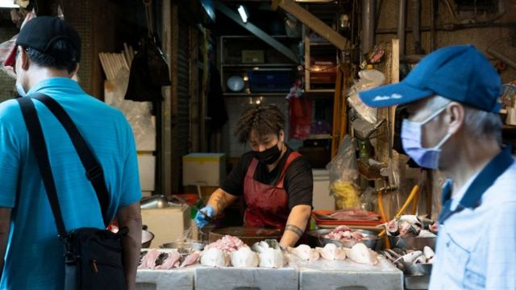

# [Chinese] 中国大陆对台湾水产品实施禁令？ 国台办称正常食安监管

#  中国大陆对台湾水产品实施禁令？ 国台办称正常食安监管

> 图像来源，  Getty Images

**两岸关系近来剑拔弩张。在中国大陆禁止进口台湾凤梨和石斑鱼之后，台湾当局又披露，近两百家企业对大陆出口的秋刀鱼、午仔鱼和鱿鱼等鱼类产品未获批准。**

台湾行政院院长苏贞昌星期五指出，这是继凤梨、石斑鱼等禁令后，大陆又再违反世界贸易组织（WTO）的相关贸易规范及世界贸易的通例，单独针对从台湾进口的相关食品要求申报登记特别严苛。

大陆国台办回应称，暂停进口台湾鱿鱼等水产品的报道与事实不符，要求台湾当局停止政治操弄。

##  为何被禁？

台湾农业委员会主任委员陈吉仲周四（12月8日）表示，中国没有准许台湾超过百家公司对其出口销售鱼类产品，如鱿鱼、秋刀鱼、午仔鱼等。

他指出，中国去年4月要求，输销产品到中国的各国企业须按照规定登记。目前台湾有100多家企业申请输往中国，只有1家得到批准。

对于应对措施，陈吉仲说，首先会让台湾卫生福利部食药署询问注册议题，希望补齐资料后顺利输销中国；其次是同步启动其他应对措施，鱿鱼、秋刀鱼进行外销，午仔鱼则内销。

陈吉仲指出，中国这次鱿鱼等产品暂停相关业者进口没告知，也没说明理由，而且中国通知台湾相关行业人员补件期限为8月底，比其他国家明年6月底的期限更加严格。

> 图像来源，  Getty Images
>
> 图像加注文字，陈吉仲周五进一步表示，受影响的台湾企业约有178家。

陈吉仲周五进一步表示，受影响的台湾企业约有178家。从出口值来看，从2019年到2021年，鱿鱼平均出口值就有新台币18.3亿元，秋刀鱼4.4亿元。

消息发布之时正值美国又一次批准对台军售。近日，美国批准了两笔总金额为4.28亿美元的对台军售案。这也是总统拜登上任以来第七次批准对台军售。

##  各方回应

台湾总统蔡英文周五表示，中国再次以突袭方式让台湾水产品出口到中国受到阻碍。“这样的做法，对两岸贸易的正常往来是没有帮助的。”

她强调，政府除了严正关切，也在第一时间立即启动因应措施，并请相关单位持续沟通、了解原因。政府也会全力协助渔民，确保渔民生计、收入及权益得到保障。

台湾行政院长苏贞昌则指出，中国违反世界贸易组织（WTO）相关贸易规范及世界贸易通例，要求进口的相关食品都要进行申报，而且对台湾特别严苛。

他表示，政府会对中国的做法进行申诉，对相关受害有关行业的人，包括养殖、捕捞等产业等，会思考如何减少受害，为渔民打开更多外销通路市场。

中国国台办发言人朱凤莲周五回应称，海关总署在2021年4月发布《进口食品境外生产企业注册管理规定》，规定从今年年1月1日起实施。有关主管部门已通过既有联系渠道向台方通报有关事项和要求，并按照有关规定处理台湾输大陆食品生产企业注册。

> 图像来源，  Getty Images
>
> 图像加注文字，朱凤莲称，所谓"无预警禁止进口"纯属刻意炒作。

朱凤莲称，所谓“无预警禁止进口”纯属刻意炒作。据了解，部分台湾输大陆食品企业注册信息不完整，不符合大陆要求，主管部门未对这些企业给予注册。

她同时强调，这是中国大陆正常的“食品安全监管措施”，希望台湾当局停止任何政治操弄。

澳大利亚国立大学（ANU）亚太学院讲师宋文笛对BBC中文表示，现在判断这是否证明中国将贸易武器化还为时过早，因为还不清楚中国的意图是什么。

宋文笛指， 台湾方面称他们在查阅中国网站后发现遭禁，但他们没有收到中国海关方面的通知。他认为，健康的贸易关系有助于两岸建立积极的关系，不是基于公共卫生而是以文件等技术性理由暂停渔业产品，对将两岸关系引向积极方向无益。

