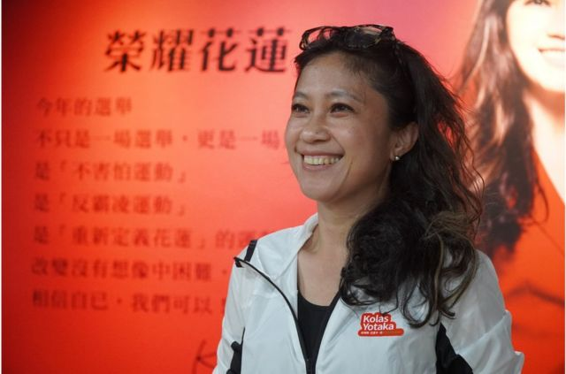
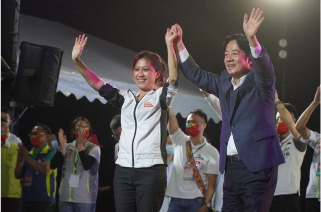
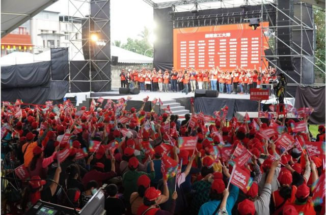
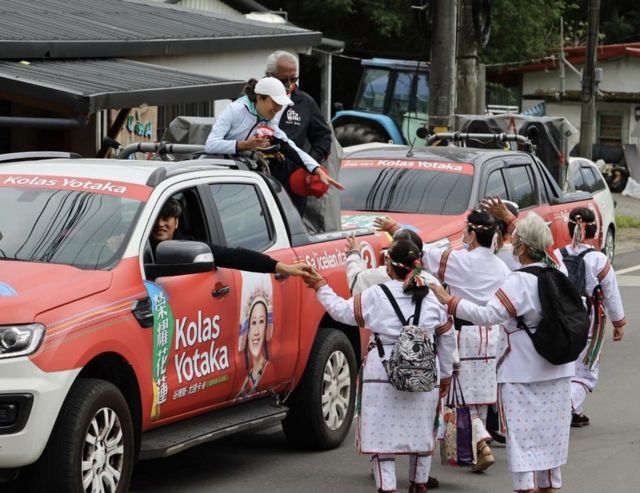

# [Chinese] 台湾阿美族女性：我藉选举发起了一场“原住民认同运动”

#  台湾阿美族女性：我藉选举发起了一场“原住民认同运动”

  * 李澄欣 
  * BBC中文 

> 图像来源，  BBC News Chinese
>
> 图像加注文字，Kolas Yotaka（谷辣斯·尤达卡）出生时取汉名“叶冠伶”，2003年当局修法准许原住民以罗马字登记族名后，她在2005、06年间恢复原名，其身分证、驾照、健保卡都使用罗马字名字。

**两年前，Kolas Yotaka（谷辣斯·尤达卡，曾用汉字名“叶冠伶”）成为台湾首名原住民总统府发言人，两年后，她回到自己的家乡花莲，试图踢破“蓝营铁票仓”。这位阿美族女性在选举期间坚持用罗马字原名和族语，虽然最后落败，但已在当地开启了一场革新运动。**

台湾“九合一”选举落幕，谷辣斯·尤达卡把脸书头像从一本正经的竞选宣传照，换回在总统府办公室随性自拍的旧照。

她对着镜头笑容灿烂，背后挂着一幅原住民艺术家优席夫的作品，画中是一位穿民族服饰的阿美族女性。她在留言写道：“我知道接下来不管我评论什么，后面这位都会很开心。”

无论身在何方，谷辣斯·尤达卡都对自己阿美族的身分十分骄傲，并在台湾“中文独大”的环境下，坚持使用阿美族母语的名字。

四个月多前，她辞去台湾总统府发言人一职，从台北回到家乡花莲，代表民进党角逐县长。她用族语标榜自己“O wawa nu Pangcah”（阿美族的孩子）的身分，成为当地选举史上首名原住民县长候选人。

不过她被视为“空降”，最终不敌深耕多年、连任的国民党籍徐榛蔚。

败选后她在花莲到处谢票，有支持者哭成一团，但她接受BBC中文专访时表示心情轻松：“我看待这场选举，是想要打破这个玻璃天花板，或者要踢破蓝绿对决的铁板。这次我认为我踢破了，看到有一些破口，版图的松动，是过去六十几年没有看到的。”

##  “不可能的选举”

花莲有“蓝营铁票仓”之称，全县三成人口为原住民，大部分是深蓝选民。这里过去68年都由国民党牢牢掌控，国民党籍傅崐萁与徐榛蔚夫妇档在当地轮流执政了13年，人们都戏称是“傅氏王朝”，当地亦频频传出贿选、黑金等丑闻。

Kolas Yotaka这次以“原住民支持原住民”号召选票，仍无法把花莲“蓝天变绿地”，但她指出，对手徐榛蔚的得票率从四年前的71%掉到64.7％，她则让民进党在当地得票率由上届的25.87％升至32％，此消彼长。“我们在整体投票率低落的情况下逆势成长，已经是不错的成绩，辛苦没有白费。”

她坦言，花莲县长选举本来就是一场“不可能的选战”，选前没有一个人看好她。“政治人物说你为什么那么笨，要选注定失败的选举，一般的花莲人也认为现在的县长一定连任，你不可能赢——更何况你是原住民。”

花莲原住民以阿美族最多，Kolas Yotaka拥有阿美族血统，理应是选举优势，却毫无把握。“我常常说，原住民的身分是双面刃，大家刻板印象觉得原住民都不懂，原住民不配，是次等人，没有可能。”

现年48岁的她是电视台记者出身，2014年进入政界后历任桃园市政府原住民族行政局局长、不分区立委、民进党发言人、行政院发言人、总统府发言人等职务，获台湾总统蔡英文、副总统赖清德青睐，被视为民进党“明日之星”，也可以说是“台湾位置最高的原住民”。

她拥有亮丽履历，却仍被一些非原住民用“番仔”蔑称。Kolas Yotaka引述多名支持者说，曾在花莲市区、吉安、玉里等地亲耳听到有中老年人说“不要给番仔当县长”。“台湾400年来那么多移民进入花东，族群冲突是历史的共业，是很难解的情结。”她叹道。

台湾的原住民属于南岛民族，根据考古学家已在岛上生活了数千年，与菲律宾、印尼、纽西兰某些民族来自同一个祖先族群。17世纪开始，大量汉族人及外族移入台湾，原住民在明清、日治、国民党时期都被掠夺资源，政治、经济、文化上都遭受压迫及同化制度的对待。

1980年代在原住民自觉运动的推动下，台湾当局才开始修法，陆续将“山胞”正名为“原住民”、成立行政院原住民委员会、推出《姓名修正条例》、《原住民基本法》等。

不过几个世代下来，原住民族至今仍较少机会从大学毕业，往往是低收入或者从事高危工作的一群，他们甚至因为部落医疗资源匮乏，比整体台湾人的平均寿命短10年。

> 图像来源，  BBC News Chinese
>
> 图像加注文字，台湾副总统赖清德与Kolas Yotaka关系非常密切，曾三度为她站台。

##  不被认可的名字

台湾官方目前认定有原住民16族，共有58万多人，占台湾总人口不足2.5%，光是名字已经常常为他们惹来麻烦。

谷辣斯·尤达卡在选举看板、单张、网路专页都使用其罗马字原名Kolas Yotaka，辅以字体较小的中文译音，她说拜票时有选民责怪她不用汉名，“他们说你这样子害我记不住你的名字，我不想投给你”。

这不是头一遭，她在2020年上任台湾史上首位原住民总统府发言人，履新第二天就被民众写信投诉其名字，指她“不使用中华民国的国字，不配当发言人”。

日常生活中如是，她每次搭乘国内航班，机票上的名字总是不完整，被写成“古拉斯·”或“古拉斯尤”，因为航空公司的电脑系统只有中文，而中文名字预设最多四个字。去医院看病，药袋上的名字也不曾打对，医生总是误会她是东南亚移工。银行亦不是每家都接受原住民名字，她跑了很多家才成功开户。

阿美族没有姓氏，但清朝政府曾对原住民“普赐汉姓”，日治时期要求他们改日本名字，国民政府迁台后又强制使用“中国姓名”。

Kolas Yotaka出生时取汉名“叶冠伶”，2003年当局修法准许原住民以罗马字登记族名后，她在2005、06年间恢复原名，其身分证、驾照、健保卡都使用罗马字名字，但台湾民间大部分系统仍只有汉字，不接受罗马字。“这个社会还没准备好接受有一批人，虽然只占了台湾人口2%，但他们有这个需求（用罗马字）。”

她和很多原住民一样在西部长大，学生时代在台中念书，除了阿美族语，也精通华语、英语、台语、客语。她说坚持用族语是一种身分认同，“是我的根”。

她透露，民进党内曾有人劝她为了选情采用中文名，但她坚拒妥协，更在政纲及选举公告上附上罗马字。她对BBC中文说：“我不能浪费这次参选的机会，不能刻意隐匿我的文字，我必须自然地使用我的文字，要让花莲人、全部台湾人以及媒体觉得就是这么的自然，要习惯我们的生活环境是有原住民的语言。”

她表明，用罗马字不是装饰性的表态，而是有实际功能的语言系统，西方传教士很早就到原住民部落建立教会，1950年代用罗马字把《圣经》翻译成阿美族语，一些部落里的老人家只看得懂罗马字，“台湾人不能逼着原住民一直使用汉文”。

##  用“红色”包装“绿色”？

> 图像来源，  BBC News Chinese
>
> 图像加注文字，以现场一片“红”的盛况，若不是民进党高层蔡英文和赖清德站台，参加者可能会忘记Kolas Yotaka是代表民进党的“绿”营出选。

“O wawa nu Pangcah！”（阿美族的孩子）、“荣耀花莲”、“Kolas、Kolas、Kolas，冻蒜、冻蒜、冻蒜！”台上的Kolas Yotaka用阿美族语和中文喊口号，台下的支持者热烈和应。

谷辣斯·尤达卡在选前举办了四场大型造势大会，逾千名群众冒雨出席，大部分是中老年人，很多都是原住民。他们戴着主办单位派发的红色帽子，挥动印有Kolas Yotaka名字的红色旗帜，台上大萤幕的动画和口号都是红底白字，现场工作人员的背心也是红色。

“红色是典型的原住民颜色，我要从颜色上就告诉大家，我是阿美族的孩子。花莲虽然三分之二不是原住民，但大家都跟原住民生活在一起，大家应该能理解为什么我选择用红色。”她对BBC中文解释。

早期编织染技还没有发展时，阿美族的传统服饰主色为黑色，后来随着歌舞、商演需求，为求喜庆而改成红色。现时鲜红色已是花莲原住民的代表颜色，每年当地最大庆典“丰年祭”都可以看到穿红衣、戴头饰的阿美族男女载歌载舞。

以现场一片“红”的盛况，若不是民进党高层蔡英文和赖清德站台，参加者可能会忘记Kolas Yotaka是代表“绿”营出选。

被问到是否刻意淡化民进党色彩时，她极力否认道：“我要百般地强调这是一个巧合，并不是我有意设计的策略，我采用红色完全是以原住民认同为出发，不是为了把民进党的绿色藏起来而用红色。”

不管是有意或无意，这个策略都奏效了。在造势大会上，一位背着民族特色斜肩包的阿美族妇女一边听着谷辣斯·尤达卡讲话，一边激动地擦泪，她对记者说：“我们很骄傲有这么优秀的孩子。”另一名阿美族大叔表示，这次为了“支持原住民”，决定“顶住压力”不投给国民党。

国民党此前牢牢把握原住民铁票，在政治上，国民党早期“党政一体”，于1950年代开始在各地广设乡党部（民众服务站），组织人脉和行政资源，与原乡选民建立了密不可分的互利关系。而文化上，不少原住民对民进党人的“闽南沙文主义”反感。

谷辣斯·尤达卡的家族本身也是深蓝，她说老一代对民进党的刻板印象是“暴力党”、“坏人”，她在2015年加入民进党时就曾引起长辈们“惋惜”。“简直是以办丧事的语气，说这么好的人怎么会去民进党呢，好像痛失英才！”

这种刻板印象在本届选举似乎有改变，她引述选举结果数据指出，花莲13个乡镇之中，她在其中7个的得票率高于在全县的得票率，而这7个乡镇的原住民人口几乎都过半。在得票率比上届增加10%至15%以上的乡，人口比例都是原住民多于非原住民。

她说：“可以粗略推论，原住民为了支持原住民当县长，有更多人抛开了政党的枷锁，不再看Kolas是不是民进党，而是看Kolas是不是原住民。”

她形容这是一场原住民的“赋权运动”，过去原住民是台湾社会中的经济弱势，处于金字塔底端，长期自我质疑与否定，这次选举给了他们希望。“对很多原住民来说，县长已经很伟大，他们从来不曾想过这是一种可能，所以当我出现，是挑战和解放了大家的想像力，原来原住民是有能力、有可能的，甚至连汉人都为Kolas拍手、喊冻蒜，这对很多原住民来讲很感动。”

##  用选举做一场社会实验

> 图像来源，  Kolas Yotaka
>
> 图像加注文字，Kolas Yotaka引述选举结果数据指出，花莲13个乡镇之中，她在其中7个的得票率高于在全县的得票率，而这7个乡镇的原住民人口几乎都过半。

事实上，选前连她自己都对于汉人支持度没有把握。“会不会有非原民因此不接受我呢？我其实心里没底，我完全不晓得。选举是一个台湾是否进步的指标，不只是民主政治的投票行为，也是台湾人能不能接受不同族群作为首长的实验。”

在选举过程中，她的竞选团队中很多志工都是汉人，而不少支持者本身是中间选民，多数是20岁到40岁的学生、青壮年和年轻父母，因为认同她的能力和理念而捐款、投票给她，她说对此感到惊喜。

“我觉得大家都看到了我是原住民，但不只是原住民。我利用选举去推动一场运动，看见了选民不一样的底线。你以为选民只在乎选票、政治上的辩论跟斗争，但其实形而上的理想与辩论还在。这是一场原住民的运动、公民权的运动，不要觉得这些东西在现代的选举没有票。”

台湾副总统赖清德与谷辣斯·尤达卡关系非常密切，曾三度为她站台。他在选前的最后一场说，黑人奥巴马能成为美国总统、身为女性的蔡英文当选台湾总统、印度裔苏纳克上任英国首相，都体现了种族和性别平等，若她当选花莲县长，也会象征台湾社会的进步与文明。

这次她没选上，将回到中央工作。随着赖清德宣布角逐民进党党主席，外界预期他将参选2024年总统大选，赖日后会否邀请她成为幕僚或副手，甚至做“台湾的贺锦丽（美国副总统卡马拉·哈里斯）”？谷辣斯·尤达卡哈哈大笑，想了一想后这样回应：“我希望台湾可以有这么一天，这个人不一定是我，但如果我有生之年可以看到这一幕，那会是台湾最大的进步，也会是世界的进步。”

