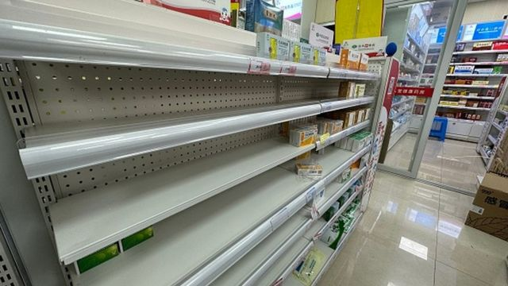
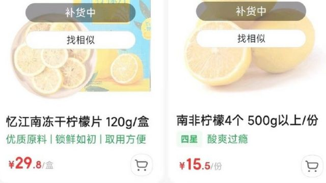
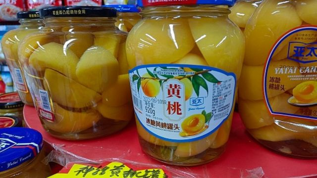
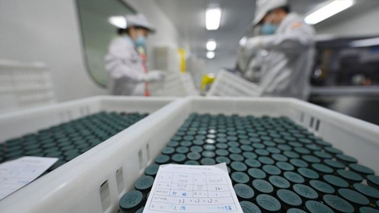

# [Chinese] 从黄桃罐头到电解质水：中国放开防疫限制后出现“恐慌性抢购”

#  从黄桃罐头到电解质水：中国放开防疫限制后出现“恐慌性抢购”

  * 凯丽·艾伦（Kerry Allen） 
  * BBC国际媒体观察部 

> 图像来源，  Getty Images/VCG
>
> 图像加注文字，许多药店的止痛药、感冒药/流感药和维生素都卖光了。

**中国在一周前放松了最严厉的新冠防疫政策后，目前正面临物资储备问题。**

在社交媒体上，很多人表示正争相购买布洛芬、感冒药和新冠病毒检测试剂盒。

用于居家治疗的产品现在在网上基本无处可寻，包括富含维生素C的柠檬和黄桃罐头，以及电解质水。

囤货是一个常见的全球性问题，但这可能是封锁放松后首先出现的问题。

和世界其他地方一样，在中国，严格的“居家隔离”令实施之前，人们经常在网上分享大城市空空如也的超市货架照片。

但现在中国放松了溯源规则，允许人们在家自我隔离和自我检测抗原，人们似乎在恐慌地购买药物，以应对冬季潜在的新一波疫情高峰。

地方政府被要求在本月底之前升级改造重症监护病房，并开放发热门诊，以便“为感染浪潮做准备”。

已经有迹象表明，中国的卫生系统正迅速地不堪重负。本周流传的一段视频显示，有病人在车中接受输液，“因为诊所已满”。

官方英文媒体《中国日报》报道了居民对止痛药、维生素和感冒及流感药物的“需求爆炸式增长”。

一些媒体发布了药店过道上空空如也的照片。很多媒体本周一直在报道制药公司的生产线如何“满负荷运转”，以应对激增的需求。

《中国日报》指出，恐慌性购买现象非常普遍，以至于广州市政府呼吁人们“理性消费”。

“不盲目抢购，不大量囤积物品。”当局在一份声明中表示。广州是最近几周新冠病毒感染者最多的城市之一。

上周，《环球时报》还观察到，随着中国新冠疫情政策放宽，新冠病毒检测试剂盒的销售量增长了300%以上。据报道，在京东健康等大型网购平台上，试剂盒很快就售罄了。

##  经常性缺货

> 图像来源，  Sina Weibo
>
> 图像加注文字，柠檬在一些购物平台上已经无货。

新闻网站《澎湃新闻》补充说：“近日消费者对于维生素C需求暴增”。

据报道，柠檬在一些购物平台上已经无货，“柠檬片、柠檬百香果茶，甚至柠檬味糖果、柠檬味气泡水”也已售罄。

《中国日报》发现黄桃罐头也出现了类似的情况。报道指出，由于这些产品“富含维生素C”，且“保质期更长”，它们已成为线上和线下的热门产品。

“在一些网购平台上，黄桃罐头的需求急剧上升，以至于经常被贴上‘断货’的标签。”报道称。新浪新闻称，网上有传言称“黄桃罐头可以缓解新冠症状”。

> 图像来源，  Future Publishing
>
> 图像加注文字，黄桃罐头也在网上销售一空。

然而，医生们对此提出异议。一些医生在中央电视台警告人们不要“过量”服用维生素C泡腾片。有专家甚至警告说，过量食用桃子可能会“加重症状”。

其他一些据称对缓解症状有帮助的产品也很快在网上被抢购一空。

“梨视频”观察到，在很多网络博主宣传电解质水“在发烧出汗后对补水很有帮助”之后，大批人争相购买。

《环球时报》警告网上流传着“大量饮酒”可以“预防”或“杀死病毒”的谣言，而这样做只会对健康造成危害。

很多报纸上充斥着医生对人们“盲目”购买药品、混合用药或服用过量的警告。

> 图像来源，  Getty Images/VCG
>
> 图像加注文字，中国官媒在报道制药公司的生产线如何“满负荷运转”，以应对激增的需求。

中国国家药品监督管理局敦促药品相关企业确保新冠治疗药物的“质量、安全和供应”，其已承诺加强对此类产品生产和流通的监管。

市场监管部门警告消费者不要在网上购买被吹捧的新冠感染治疗方法，除非直播者有正当的医疗资质。当局建议人们通过可信渠道购买产品，以避免买到“假药”。

据报道，很多地方正在安排“健康包”，以保障脆弱患者的生命安全。

据《中国日报》报道，在中国最早爆发疫情的武汉市，老年居民和慢性病患者正在收到装有药物、抗原检测试剂和咽喉糖浆的包裹。

