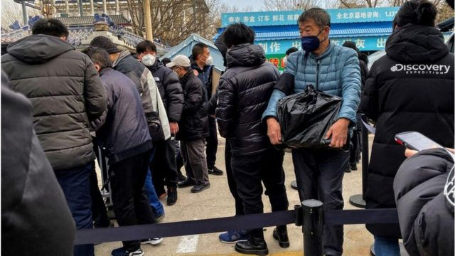
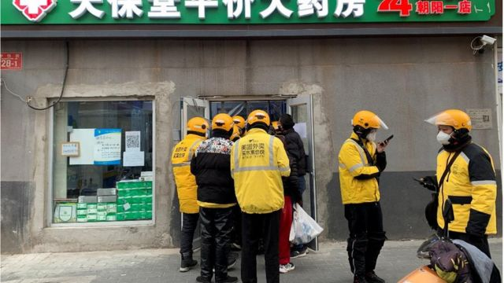
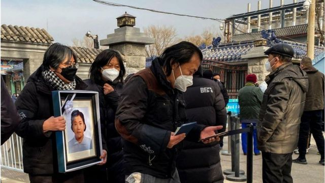

# [Chinese] 中国新冠疫情：火葬场外的长队和难以追踪的数字

#  中国新冠疫情：火葬场外的长队和难以追踪的数字

  * 彼特拉·齐维奇（Petra Zivic） 
  * BBC国际部记者 

> 图像来源，  Getty Images
>
> 图像加注文字，12月20日，北京的一家火葬场

**多家媒体报道，在中国政府决定解除严厉的新冠“清零”防疫政策后，该国多地的火葬场正疲于应付目前的状况。**

驻北京的美联社记者姜大翼（Dake Kang）探访了首都的东郊殡仪馆及火葬场，这里被列为新冠死者指定火葬场地。

“人们把棺材推出来，念着死者的名字，同时有一二十人站在外面等候。”身在北京的姜大翼向BBC表示。

他采访了殡仪馆附近一带的商店店员，他们都表示注意到这些天进出的人增多了。

“他们当中有一个人具体说到，他们估计这里一天有大约50到100人被火化，平常本来一天通常就是几十人，”姜大翼说。

殡仪馆比平常忙碌的地方，不仅仅是有2200万人口的北京。

法新社报道，从中国东北到西南，火葬场工作人员都说他们疲于应付一直在增加的死者。

在北京东北约700公里的沈阳，一名殡仪馆员工表示，有些死者遗体积压长达五天未有火花。

他说，火葬场是“彻底挤满了”。

“我没见哪一年是这样的。”

不过，姜大翼表示，现在不可能判断新冠死亡人数上升了多少。

中国当局在周二（12月20日）仅报告有五宗新冠死亡病例，周一只有两宗，是数星期以来首次报告新冠死亡。

12月初，中国在公众抗议事件之后将其全世界最严厉的新冠防疫限制部分解除，而同时人们担心新冠疫情可能会严重影响这个目前免疫率相当低的国家，因为它从疫情全球大流行开始就基本上是对外封闭。

##  中国各地火葬场现状

> 图像来源，  Reuters
>
> 图像加注文字，在东郊殡仪馆，运载遗体的汽车排成队。

姜大翼探访北京东郊殡仪馆两天后的周日，路透社报道，运载遗体的灵车和轿车在车道上排起长队。

火化在持续进行，多根烟囱在冒着烟，东郊殡仪馆外能看到停着约30辆车。

有视频显示家属在北京同一个火葬场外等候亲人的骨灰。

彭博新闻社（Bloomberg）和天空新闻台（Sky News）报道，一些火葬场外有警察驻守。

“近日收集的遗体数量是之前的很多倍，”重庆一个火葬场的员工向法新社表示。

这名不愿具名的员工称，火葬场的冷藏柜已不足够应付遗体数量。

“我们不确定（是不是跟新冠有关），你得去问领导。”

但是，领导们并没有说太多。

##  新冠感染病例急剧上升

> 图像来源，  REUTERS/Xiaoyu Yin
>
> 图像加注文字，接到大量订单的北京快递员在药店门外等待。

“我跟一些家属谈过，他们说亲人是在家属新冠阳性之后去世的。这很奇怪，因为当时官方的死亡数字是没有新冠死亡报告病例。这可能是因为中国统计新冠死亡数字的方式而变得奇怪，”姜大翼说。

自2019年末武汉最先爆发新冠疫情进行成为全球大流行以来，中国报告了5242宗新冠死亡病例——以全球标准来说，这是一个非常低的数字。

但是在周二，中国当局透露，只有在新冠感染者死于肺炎和呼吸功能衰歇的情况下才会被定义为新冠死亡。

“感染者如果是心脏病发或者心血管疾病导致死亡的，就不会被列入这一类别，”北京大学第一医院感染疾病科主任医师王贵强说。

##  中国的新冠死亡数字统计之惑

中国在周二（12月20日）公布其新冠死亡病例的统计标准，只将患肺炎等呼吸道疾病致死的病人列作新冠死者，这与 世界卫生组织（WHO）的指引  并不相符。

根据中国的标准，周二和周一的新冠死亡数字分别是五宗和两宗，此前两星期的新冠死亡病例数为零。

世卫组织称，各国用不同方式计算确诊和死亡人数，导致不同国家之间的新冠疫情影响难以比较。因此很多国家用“超额死亡”来进行统计——这指的是比疫情前通常情况下的死亡人数超出的数字。

这种计算方法会将并非直接死于感染新冠的人列入新冠死亡统计，这些人死于并发症以及因医疗挤兑而未能及时就医。

而中国严格将新冠致死的标准定为须有证据显示病人因病毒而造成肺损伤——这须通过扫描判断。

官方中新社报道，感染新冠后因基础疾病死亡的，不计入新冠死亡病例。

新冠疫情全球大流行开始以来，中国统计的新冠死亡人数为5200多人，相当于每100万人当中有3人死亡，相比之下美国则是每100万人有3000人死亡，英国则有2400人。

核酸检测规模的减少亦导致人们担心，官方统计的感染数字已大幅低于实际数字。

在同一场新闻发布会上，中国当局表示，当前的疫情爆发可能会出现新冠病毒新变种，不过官方媒体的报道中，称新变种的传染性和死亡率都比较低。

“出现既有高传染性又有高致病性的毒株可能性比较小。”中国疾控中心病毒病所所长许文波说。

强制核酸检测停止之后，中国新冠病例上升的幅度变得很难追踪。上周中国当局承认，现在已经不可能统计有多少人染病。

姜大翼说：“殡仪馆里有一个人说，在死亡证上他们看到的致死原因是肺炎，不是新冠。”

##  研究预测2023年可能出现100万人死亡

> 图像来源，  Getty Images
>
> 图像加注文字，2022年12月20日，北京一个火葬场外手持死者遗照的亲属。

根据美国健康指标与评估研究所（IHME）的一项最新估算，新冠防疫措施的忽然解除可能的结果是在2023年感染数字爆炸式上升，并导致超过100万人死亡。

健康指标与评估研究所是美国华盛顿大学一个独立的全球卫生研究中心。

该研究发现，至2023年4月1日将会有32.2万死亡，而到同一个日子，感染数字将会达到高峰；而该研究估算，易感人群的传播率将会在4月之后维持。

“中国的清零政策或许对于抵挡早期的病毒株是有效的，但是奥密克戎变种的高传播性令清零不可能持续，”IHME主任克里斯托弗·默里（Christopher Murray）说。

该研究估算的依据来自各省级的数据和香港最近一次奥密克戎变种爆发的相关信息。

默里说：“中国在武汉最初的爆发之后就几乎很少报告有死亡，因此我们是从香港那里得到一些关于感染致死率的概念。”

但是，中国的医院至少从目前来说并没有对感染数字急剧上升感到意外。姜大翼探访过北京的其中一家。

“那里没有明显过分拥挤的迹象，不过当然，北京并不代表全中国，”他说，“它很可能是有着全国最好的医疗资源。”

