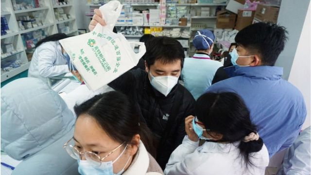
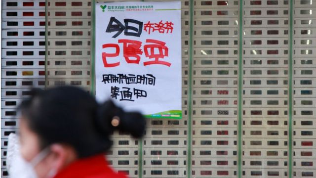
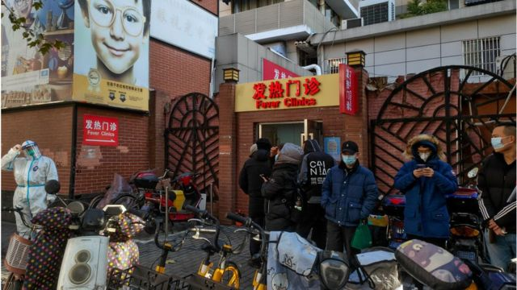

# [Chinese] 中国疫情政策大转向：糟糕的时间点，缺席的路线图和流失的信任

#  中国疫情政策大转向：糟糕的时间点，缺席的路线图和流失的信任

> 图像来源，  Getty Images

**近日，中国在新冠疫情措施方面的重大转向让民众措手不及，随着时间推移，药品不足、医院人满为患、甚至血库告急等问题纷纷爆出。**

公共政策专家对BBC中文表示，此次中国选择开放的时间点非常糟糕，而且一直以来， 政府缺少清晰且明确的开放路线图，准备明显不足。

##  仓促的转向

11月，中国各地包括上海和北京爆发大规模的抗议示威活动，反对严苛而又花样翻新的新冠封控措施，有抗议者甚至喊出让习近平下台的口号。

自12月开始，中国官方突然不再提坚持了许久新冠“清零”政策， “清零”这个名词也从官方会议和文件中瞬间消失，各地政府转而大幅放松新冠限制措施。

11月11日，中国政府发布了防疫“二十条”，放松了管控措施。12月7日，发布防疫“十条”，进一步放松管控，包括缩小核酸检测范围，不再对跨地区人员要求核酸阴性证明和健康码等。

新加坡国立大学李光耀公共政策学院副教授吴木銮对BBC中文表示，这次开放的时间点非常糟糕，本来就是流感高峰期，加上又有呼吸道合胞病毒（respiratory syncytial virus），可能形成“三疫大流行”（tripledemic）。

今年11月，中国工程院院士钟南山就曾在一次学术会议上表示，今年冬季，全球都面临着新冠肺炎疫情和流感疫情叠加流行的风险。

纽约州立大学奥尔巴尼分校政治学教授陈澄指出，这次政府在出现抗议活动后突然放开管控，而且是在药品到位和第四针开打之前，令不少人错愕。

“原本支持放开的人已经对政府不满，如今不少原本支持‘清零’的人也对这次转向感到不知所措。这种情况肯定会伤害社会对政府的信任，”陈澄对BBC中文表示。

陈澄认为，“二十条”出台就是政府准备转向放弃清零的清楚信号，抗议活动其实给政府创造了一个转向的机会。

> 图像来源，  Getty Images

“要放弃一个坚持已久，而且是被当作一个重大政绩的政策并不容易，也难以给社会上仍然拥护‘清零’的人有所交代，”陈澄说 **。** 她说 **，** 不管有意还是无意，政策转向过于仓促导致了目前的混乱，那些不愿意放弃“清零”的人除了对政府不满，也有新的指责目标。

近日，有声音批评参与“白纸”抗议的人， 认为他们要为目前中国防疫的被动局面负责。

吴木銮也认为，中国政府在疫苗普及和药品储备等方面准备不足。

“我不觉得他们有任何准备。国际上的经验已经很清楚，最重要的准备工作就是给老年人打疫苗。另外如果药品储存足够的话，大家怎么会去抢呢？”

##  缺席的路线图与社会契约

在放松管控前，许多国家会先提出一个路线图，安排一个步骤接一个步骤要怎么做。吴木銮指出，政府会与民众形成一个社会契约（social contract），但在中国完全没有这个过程。

“大家都不喜欢疫情带来的各种限制措施，许多政府就会说，你要我移除限制，那这个社会契约我们要重新做，基本做法就是打疫苗，从年纪比较大的人开始，然后慢慢放宽限制。”

吴木銮以新加坡为例指，去年6月，新加坡联合领导抗疫跨部门工作小组的贸工部长颜金勇、财政部长黄循财和卫生部长王乙康在媒体联名发文，提出关于疫苗接种、病毒检测和治疗的一系列计划和方案，与民众商榷，逐步迈向新常态。这是新加坡的“路线图”。

> 图像来源，  Getty Images
>
> 图像加注文字，中国放开防控措施后出现抢药潮

与新加坡对比，吴木銮指出，中国政府很多解释工作没有做好，也没有做好准备，中国早就应该引进保护率更高的复必泰疫苗。

“2021年（中国）损失了很多机会。当时很多国家、不论发达国家还是发展中国家，在推行疫苗策略，多轮施打疫苗；特别是mRNA新冠疫苗起到很大作用。中国公司复星代理的‘复必泰’疫苗就是此类疫苗，而中国浪费了这个机会，”吴木銮说。

“很多国家在做新的社会契约的过程中，老百姓会更加信任政府。本来中国民众对中国政府的信任度是相对高的，但中国的裂痕反而加深了。”

##  信任缺失

上个月的大规模抗议行动折射出民众对政府的不满，目前的这种缺医少药的混乱状况似乎还在加深这种不信任感。

中国国家卫健委近日报告每日新增感染仅3000余宗，与社交媒体上报告的大批人感染的现状完全不符。在死亡人数方面，国家卫健委在放开管控后仅报告寥寥数例死亡，均在北京。这些数字受到了广泛的质疑。

另外一方面，网络上许多声音质疑中国对“新冠死亡”的定义较为狭窄。

周二（12月20日），北京大学第一医院感染疾病科主任王贵强在国务院联防联控机制召开新闻发布会上称，国家卫健委最近明确对死亡病例进行相关判断，由新冠病毒导致的肺炎、呼吸衰竭导致的死亡归类为新冠病毒感染导致的死亡，而以其他疾病，基础病，比如心脑血管疾病、心梗等疾病导致的死亡就不归类为新冠导致的死亡。

> 图像来源，  Getty Images

他还称，为了更好地规范新冠疫情导致死亡的统计，目前也在做一些培训，要采取会诊和死亡讨论的方式，来最后判定这个病人到底是死于新冠还是死于其他的基础病。

对于未来的措施，陈澄认为，如果政府要重新建立社会信心，一些补救措施刻不容缓。除了推广第四针，调配抗原、药品这些已经开始做的事情以外，政府在信息发布上应该更加主动。

她指出，现在正处于中国政府换届的“青黄不接”时期，不少问题在明年春季之前恐怕得不到解决。

“李强政府一上来，就要面对疫情和经济的巨大挑战。如果应对不当，不仅会令人质疑二十大的人事安排，更会进一步削弱社会对政府的信心。”

