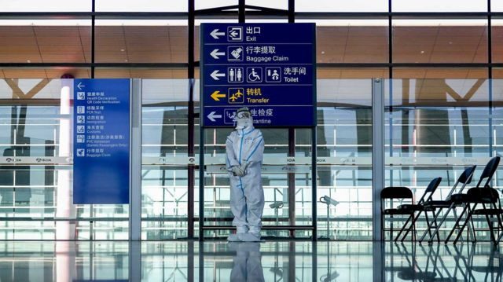

# [Chinese] 中国宣布取消入境隔离措施 将“新冠肺炎”更名为“新冠感染”

#  中国宣布取消入境隔离措施 将“新冠肺炎”更名为“新冠感染”

3 小时前

> 图像来源，  Getty Images
>
> 图像加注文字，中国将解除实行近三年的严格边境封锁。

**中国宣布从明年1月8日起，取消对入境人员的隔离管理，并宣布对国内的新冠感染者不再实行隔离措施。当局还宣布，将“新冠肺炎”更名为“新型冠状病毒感染”。**

中国国家卫健委周一（12月26日）在一份声明中称，赴中国的旅客将无需申请健康码和入境后进行隔离，但需要在行前48小时进行核酸检测。

声明称，当局还将向外籍人士来华提供签证便利，取消国际客运航班数量管控措施，并逐步恢复中国公民出境旅游。

此举标志着中国将逐步解除实行近三年的严格边境封锁，也意味着中国正进一步转向“与病毒共存”。

“新冠病毒将在自然界长期存在，其致病力较早期明显下降，所致疾病将逐步演化为一种常见的呼吸道传染病。”中国国家卫健委在一份通知中写道。

自2020年初以来，中国一直将新冠肺炎按该国传染病法中与鼠疫、霍乱同等级的甲类传染病管理。因此，根据《国境卫生检疫法》，出入境人员和行李，都需要接受检疫。

2021年8月，当局宣布除商务、出国留学或紧急情况，暂不签发或换发大多数普通护照。

根据目前的防疫政策，前往中国的旅客仍需在政府指定的隔离点集中隔离5天，并居家隔离3天。

上周，香港特区行政长官李家超到北京述职后返港，他对媒体表示，中央政府同意逐步全面通关，目标下月中前落实。

过去三年中，中国一直采取严格的“清零”政策，在国内普遍进行大规模核酸检测和居民区封锁，导致中国经济遭到重创，并在上个月引发了中国多年来最大规模的抗议活动。

但在本月，北京的政策突然大转弯，快速取消了国内几乎所有的新冠限制措施，此举受到一些民众的欢迎，但也在全国范围内引发了前所未有的感染浪潮。

许多城市的民众都反映医院人满为患，退烧药和感冒药供不应求。山东省青岛市上周末的官方数据显示，仅青岛市一天的感染人数就可能多达50万人。

