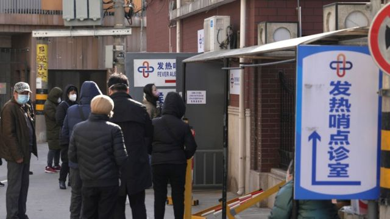
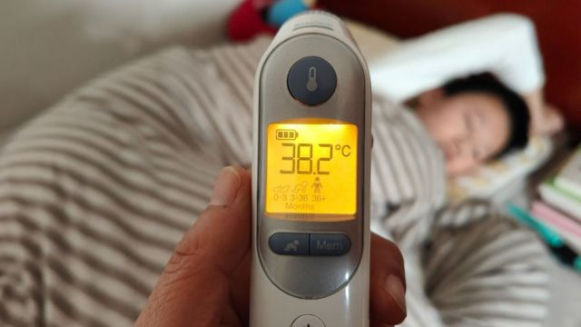
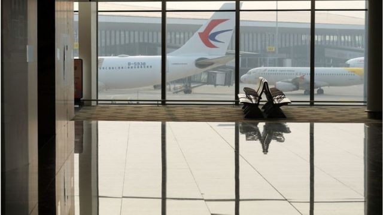

# [Chinese] 中国恢复对外通关：疫情蔓延出境、新变种的风险有多大？

#  中国恢复对外通关：疫情蔓延出境、新变种的风险有多大？

> 图像来源，  Getty Images

**由于严格的“清零”政策，在新冠疫情爆发后，中国限制与香港和国外的人员往来已近三年。周一（12月26日），中国政府表示将放松边境管控，取消入境隔离措施。**

##  取消入境隔离

中国国家卫健委12月26日发布 《关于对新型冠状病毒感染实施“乙类乙管”的总体方案》  ，提出取消针对入境人员的全员核酸检测和集中隔离，前往中国的人士只需在出发前48小时进行核酸检测，结果阴性者便可以入境，无需向中国驻外使领馆申请健康码。

方案还称，根据国际疫情形势和各方面服务保障能力，“有序恢复”中国公民出境旅游。

新方案意味着中国放松了已经实施三年的国际旅行限制。不少网民在社交媒体上庆祝。

微博网民“kamui520”说：“已经准备明年3、4月出去玩了，就是护照过期了还得找时间先续上。本来以为短时间内不会开放导致年假都消耗完了，不然明年可以出去玩个爽。”

据中国媒体报道，新政策对旅行消费的影响迅速显现，多家在线旅游平台出境机票、海外酒店搜索量大涨。

旅游中介网站携程数据显示，方案发布半小时内，携程平台热门海外目的地搜索量同比大涨10倍，出境（包含港澳台）机票、海外酒店搜索达到三年来峰值。

但也有民众表示，感染新冠之后不适，不想出门旅游。

“阳了（检测结果阳性）刚有康复的迹象，一想到发烧这几天的痛苦我省都不想跨。”微博网民“蓦咚咚-棋牌室常驻钻石会员”说。

> 图像来源，  Getty Images
>
> 图像加注文字，也有民众表示，感染新冠之后不适，不想出门旅游。

香港方面，政府发言人表示，中国大陆和香港通关很快将可实现。

发言人称，由政务司司长带领的“通关事务协调组”正“争分夺秒，双轨并行推进通关筹备工作”：一方面正在制订稳妥的通关方案；另一方面，香港与中央、广东省和深圳市相关单位保持联系，就通关方案达成共识后会随即提交中央审批，希望在明年1月中之前落实。

##  风险有多大？

在中国打开国门时，也有医疗专家担心，中国大范围的病毒传播可能会引发病毒变种。

美联社引述约翰·霍普金斯大学（Johns Hopkins University）传染病专家斯图尔特·坎贝尔·雷（Stuart Campbell Ray）说：“中国人口很多，而且免疫力有限。这种环境似乎我们可能会看到新变种爆发。”

雷说：“当我们看到大规模的感染潮时，通常会产生新的变种。”

日本、印度、韩国和意大利等国似乎对中国大面积爆发疫情有所担忧，加强了检疫措施。周二，日本首相岸田文雄以有报道称中国大陆新冠感染人数骤增为由，宣布12月30日零点起将实施加强入境防疫的紧急措施。

共同社报道指，对于从中国赴日及七天内去过中国的所有人员，实施入境时检测。岸田文雄称："中国中央和地方、政府与民间的疫情信息存在较大出入等，很难掌握详细情况，导致日本国内的担忧加剧。"

印度卫生部长上周六表示，印度已要求来自中国、日本、韩国、香港和泰国的游客提供新冠病毒阴性检测报告。

曼达维亚（Mansukh Mandaviya）部长说，来自这些国家的旅客如果出现新冠病毒症状或检测呈阳性，将被隔离。

对于中国大陆和香港通关的风险，美国西北大学预防医学系教授张晖接受BBC采访时表示，医学风险是双方面的： 一方面是香港民众进大陆会给大陆带来什么风险；另一方面，大陆居民来香港会给香港带来什么风险。

“第一个方面，香港民众到大陆来会不会带给大陆什么风险，风险永远是有的，但我觉得基本上很小，因为大陆病毒已经大范围蔓延了，”张晖指出。

“目前讨论中被忽略的一点是，大陆民众到香港会给香港带来什么风险。病毒在大陆大面积蔓延，在病毒大量复制时可能会出现新的变异株，这方面的风险相对于前一个风险可能会更大一点。”

但张晖认为，预计这个风险还没有大到决策部门改变入境政策的地步，因为大陆主流的毒株是奥密克戎BF.7或者其它传播性非常高的毒株，已经接近“病毒传播能力的天花板”。而要出现一个新的能够击败它们的优势株，需要显著更强的现实传播能力，实现这样的突变是很难的，或者说是一个小概率事件。

> 图像来源，  Getty Images

而大陆对外国开放边境也是同理，“双向的风险都不可能是零，但我认为风险是比较低的，”张晖表示，“目前欧美非常担心大陆会出现新的更强的毒株再次横扫世界，虽然我理解他们这种顾虑背后的科学道理，但是因为其概率很低，不应该影响大陆居民入境世界各国。”

张晖也认为，如果设置通关配额，虽然可以一定程度减缓病毒的传播，但无法阻止病毒的传播，其在减缓医学传播上带来的益处不足以抵消在经济、老百姓生活便利程度等方面带来的坏处，所以不建议对大陆居民通关设置配额或者额外的免疫检查。

同时，现在许多声音建议国内进口引进mRNA疫苗，但是张晖认为这样做的作用有限，因为病毒的传播速度太快。

“学术界普遍认为mRNA疫苗效果更好，但多快能运到大陆，多快能被大陆接受开始施打？这预计需要几个月的时间，已经很难赶上病毒的传播速度，所以必要性已经不是太强。”张晖说。

