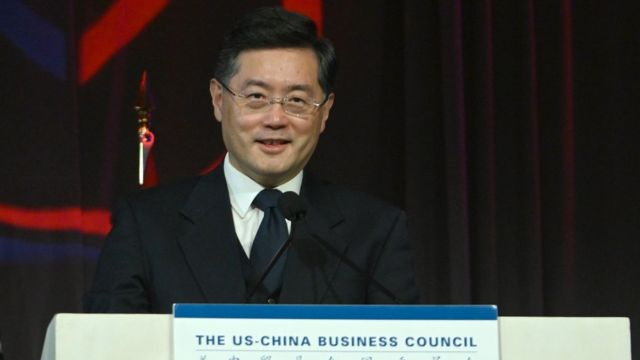
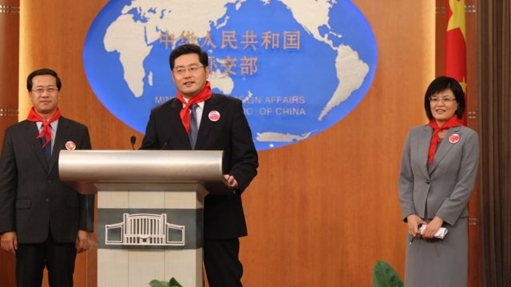
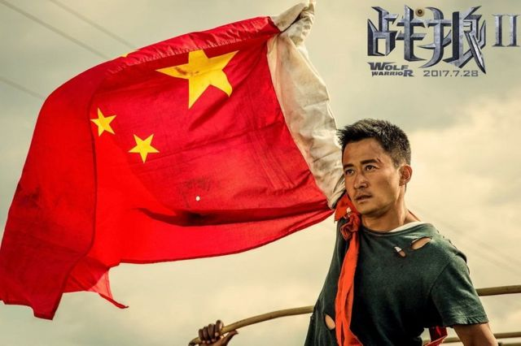
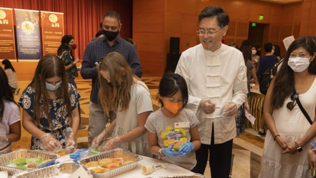

# [Chinese] 秦刚：“习近平亲密助手”出掌中国外交部 又一外媒熟悉面孔登场

#  秦刚：“习近平亲密助手”出掌中国外交部 又一外媒熟悉面孔登场

8 小时前

> 图像来源，  China News Service
>
> 图像加注文字，秦刚在新冠疫情中赴美就任中国大使，如今也在疫情中就任中国外长。

**中国宣布由56岁的驻美国大使秦刚接任外交部部长，接替在任近十年，已年届69岁的王毅，即时生效。**

中国全国人民代表大会常务委员会12月30日通过免去王毅外长职务，委任秦刚接替有关职务的决定。王毅仍将留任国务委员。消息公布后，中国外交部网站已即时换上新科部长的资料。

秦刚曾在中国外交部负责新闻和礼宾事务。他曾多次言辞犀利地回击外国记者对中国的质疑。他还被视为是中国国家主席习近平的得力助手。

秦刚 2021年7月  接替崔天凯出任中国驻美国大使，至升任外长之际才不过在任17个月。此刻，北京仍在设法稳定中美关系。

##  秦刚是谁？

秦刚是一位经验丰富的外交官，已在中国外交系统任职30多年。中国外交部公开信息显示，他曾三度派驻伦敦，在中国驻英大使馆担任参赞、公使等职务。

他为人熟知的经历是其在2005年和2011年两度担任外交部发言人，期间负责主持例行新闻发布会。他是最早一批发表尖锐言论捍卫中国的外交官之一，也常在发布会现场与记者辩论。

2007年，他曾在记者会上回应有关中国国务院发表的《2006年美国的人权纪录》问题时，表示希望向美国赠送一份“礼物”——儒家典籍“四书五经”。他称，希望美国学习孔子“正心、修身、齐家、治国、平天下”的思想。

在2009年的一次记者会上，当秦刚被BBC记者问及有媒体报道中国当局要求境内生产销售的电脑预装绿色上网过滤软件时，他突然反问记者说：“你有孩子吗？”

秦刚说：“如果你有孩子，或今后将要有孩子，我想你能够理解广大家长对互联网上有害信息传播的担忧和关切。”

> 图像来源，  Getty Images
>
> 图像加注文字，秦刚曾担任中国外交部发言人，更曾任职外国通讯社驻华记者站的新闻助理。

2008年，在外交部记者会上，当被问到“枪与玫瑰”（Guns N'Roses）乐队发行了一张名为《中国式民主》（Chinese Democracy）的新专辑时，秦刚不屑一顾。

“据我了解，很多人不喜欢这类音乐，因为它太嘈杂，噪音太大。”接着，他意外地对记者说：“我想你应该是一个成熟的成年人了吧？”

在2015年，他成为了礼宾司司长，负责中国对外活动和典礼事务，并在2018年被擢升为当时最年轻的外交部副外长，分管欧洲事务和新闻、礼宾事务。

在担任驻美大使之前，秦刚并没有与美国打交道的经验，也没有派驻过美国，尽管在1992年加入中国外交部之前，曾在美国合众国际社（UPI）北京分社担任新闻助理。上海澎湃新闻称，这可能使得秦刚“熟知外国媒体运作规律”。

秦刚一直被外界视为是习近平一个非常信赖的助手，曾多次陪同习近平外访。2016年，秦刚曾帮助习近平筹备在杭州召开的二十国集团（G20）峰会。据参加峰会的人向《华尔街日报》忆述，展开主场外交的习近平有一次转过身，半开玩笑地问秦刚，能否在连轴转的日程中休息一下，引起现场一片笑声，缓和了气氛。

不过，相比于经常使用挑衅性言论主动发起攻击的赵立坚、卢沙野等中国“战狼”外交官，秦刚被视为在讲话时更加谨慎和有分寸，在严肃政治议题外也更加温和。他鲜有在新冠病毒溯源等争议性问题上发言。

> 图像来源，  Deng Feng International Media
>
> 图像加注文字，“战狼”一词来自中国演员吴京导演的一部颇受中国观众欢迎的爱国主义电影。

##  中美关系——风雨仍飘摇

秦刚就任之际，中美关系仍充满针锋相对。

就在全国人大常委会通过秦刚任命的这天， 中国外交部例行记者会上  ，发言人汪文斌先批评美国“既是最大的虚假信息散布者，也是最大的新闻自由双标持有者”，继而就中国解放军战斗机在南海上空抵近美军军机称，“美方长期以来频繁派舰机对中国进行抵近侦察，严重危害中国国家安全”，复又评论说“我们历来坚决反对美国向中国台湾地区出售武器”。

中国宣布将自1月8日起放宽因新冠病毒病（COVID-19）而几近停顿了三年的国际旅行，美国马上对中国赴美旅客施加行前核酸检测要求，并批评中方疫情信息不透明，也是秦刚马上要面对的国际关系问题。

秦刚本周在美国《国家利益》半月刊以中国大使身份 发表署名文章  阐述中国外交立场，重申中美关系不是“零和游戏”。

> 图像来源，  Xinhua
>
> 图像加注文字，秦刚出任中国驻美大使仅17个月，便被召回国升职。

白宫国家安全委员会印太政策协调库尔特·坎贝尔（Kurt Campbell）曾评论说，中国希望短期内稳定对美关系，是因为北京当局要面对国内严峻的经济环境，以及其亚洲政策在区内遭遇抵制。

美国国务卿布林肯（Antony Blinken）不久前宣布将于1月或2月访华，国务院一位发言人表示，布林肯预期与秦刚“延续建设性工作关系”。

法新社引述这位发言人说：“美国将继续保持沟通渠道开放，负责任地管理美国与中华人民共和国的关系。”

不过，美国华府智库德国马歇尔基金会亚洲主任葛来仪（Bonnie Glaser）质疑，秦刚主要还将是遵从上司意志行事，首要是中国国家主席习近平，其次是国务委员王毅。

葛来仪对路透社说：“在中国外交政策上，他将是一位实施者，而非制定者。”

