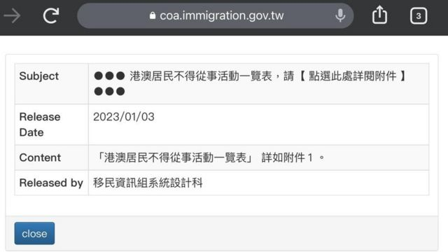
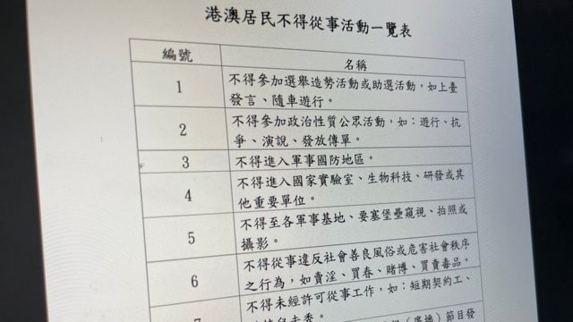
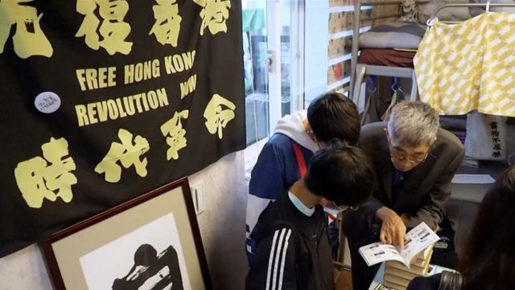
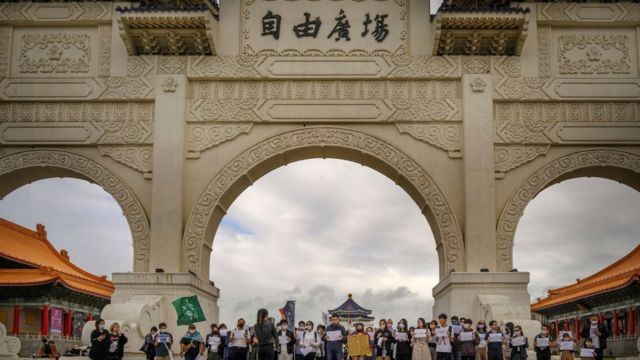
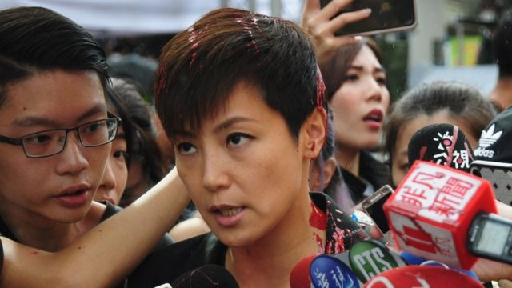

# [Chinese] 台湾禁访台港澳居民游行及接受采访？学者质疑法律依据

#  台湾禁访台港澳居民游行及接受采访？学者质疑法律依据

  * 李澄欣 
  * BBC中文 

> 图像来源，  Getty Images
>
> 图像加注文字，2020年，示威者在台北举标语要求释放12位遭到中国政府拘捕的港人。

**台湾移民署在2023年首个工作日发布“港澳居民不得从事活动一览表”，禁止行为包括“游行”和“接受媒体邀请”。有法律学者质疑有关规定“恐吓意味大于法律依据”。记者当天晚间发现该文件目前已下架。**

有关文件在1月3日早上刊载于移民署网站“香港澳门居民来台停留线上申请入出境许可证送件须知”的公告栏，列出九项港澳居民不得从事的活动：

  * 不得参加选举造势活动或助选活动，如上台发言、随车游行。 
  * 不得参加政治性质公众活动，如：游行、抗争、演说、发放传单。 
  * 不得进入军事国防地区。 
  * 不得进入国家实验室、生物科技、研发或其 他重要单位。 
  * 不得至各军事基地、要塞堡垒窥视、拍照或摄影。 
  * 不得从事违反社会善良风俗或危害社会秩序之行为，如卖淫、买春、赌博、买卖毒品。 
  * 不得未经许可从事工作，如：短期契约工、模特儿走秀。 
  * 不得接受媒体邀请，上电视（广播）节目发表意见，如：CALL IN节目。 
  * 不得违反其他法令有明确规范之行为，如: 刑法、国家安全法、国家机密保护法、反渗透法、社会秩序维护法、政治献金法等。 

公告没有写明法律依据、罚则和“港澳居民”定义，未知是仅限于在台“停留”的入境人士，还是包含在台湾持有居留身份的港澳人士。

> 图像加注文字，移民署网站1月3日上午公告“一览表”，附件目前已被下架。

> 图像加注文字，已被下架的一览表列出九项港澳居民不得从事活动

BBC中文在中午时分向移民署及陆委会查询详情，记者傍晚发现该文件已在网站内消失。陆委会晚间回应时称，港澳居民来台须遵守台湾法律规范，“据了解，内政部移民署已移除该公告页面，至未来有无胪列不得从事非法活动，以供港澳居民参考，尚在讨论中”。

有不愿具名的移民公司负责人透露，以前见过类似的清单，不过是针对大陆观光客，“这次好像意味着把港澳人当成大陆人，可预期未来这一年（在台湾的）香港人不会有好日子过。”

他表示，如有关限制也适用于“居留”的港澳人士，很多人将失去集会自由和接受媒体访问的权利，促请当局尽快澄清。

##  “恐吓意味”更大？

> 图像来源，  Reuters
>
> 图像加注文字，铜锣湾书店老板林荣基在台北店铺与读者对话。台湾移民署公告没有说明禁令是否包含在台湾持有居留身份的港澳人士。

专门研究移民法的国立政治大学法律学系副教授廖元豪对BBC中文表示，文件中与军事相关的内容，即使是台湾人“如果没有许可也不能做”，而第六条关于违反风俗的内容更是“本来就违法，有没有写都一样”。

但他指出，第1、2、8条都是一般人合法可为，涉及集会和言论自由，且演说、受访的解释范围很大，“一般观光客来玩也有可能在街头被记者采访”。

根据中华民国法律，《香港澳门关系条例》（简称《港澳条例》）第14条则规定，当事人如“有危害国家利益、公共安全、公共秩序或从事恐怖活动之虞”，可被强制出境甚至即时处分。

另外《入出国及移民法》第29条规定，“外国人在我国停留、居留期间，不得从事与许可停留、居留原因不符之活动或工作。但合法居留者，其请愿及合法集会游行，不在此限。”若违反规定，移民署可按规定强制驱逐出境。

廖元豪指出，原则上港澳人士归《港澳条例》管理，外国人归《入出国及移民法》管理，后者条文写得更严格和具体，可作补充。“但《入出国及移民法》也保证了合法集会游行这个权利，何况《港澳条例》从头到尾根本没有这个规定，那你怎么能说人家不能参加集会游行，这个说不通。”

他质疑该公告的法律依据，形容是“没有法律效力但有恐吓效果”。“你把游行、接受媒体邀请，跟卖淫、军事的东西放在一起，好像发表意见就跟危害国家安全一样可怕”，这可能会引发在台居留港澳人士的寒蝉效应，因害怕移民署拒绝续期签证或居留证而噤声。

##  港澳人士有权在台湾参与政治活动吗？

> 图像来源，  Getty Images

淡江大学两岸关系研究中心主任张五岳持相反意见，他对BBC中文表示，港澳人士入境来台本来就不能从事跟许可目的不相符的活动，各国都是如此规定，这跟宪法保障的基本人权“完全是两回事”。

“宪法保障国民拥有的人权和自由，是给中华民国国民，但港澳人士无论是停留还是居留，都不是中华民国国民。”

长期协助在台港人的公民团体工作者江旻谚也说，针对入境“停留”人士的限制不是新规定，不感到意外，但如果连“居留”的港澳人士也不能集会和受访，就“确实有点问题”，“有些（在台）港人本身是倡议人士，接受记者访问、去游行就是他们工作的一部分”。

他强调，台湾作为民主开放社会，政府不应该过度限制自由言论。“主要看政府的动机，今天如果有港人停留台湾时接受记者采访，讲了批评政府的声音，遭到政府刻意刁难的话，那实际上就有问题。因为即便有这个入境规定，政府还是要衡量这个行政手段会不会影响到民主社会。”

##  以往争议

港人入境后在台湾参与政治活动曾引发争议。2019年香港反修例示威游行期间，香港歌手何韵诗以加拿大护照、观光理由入境台湾，在当地参加挺港活动时遭人泼漆引起风波，曾有声音质疑她违反《入出国及移民法》第29条。

> 图像来源，  CNA
>
> 图像加注文字，香港歌手何韵诗2019年在台湾出席游行前接受媒体联访时，遭不明人士泼红漆。

移民署当时回应指，依照“两公约”规定，和平集会之权利应予确认，人民和平集会游行之权利，除有必要者外不得恣意限制之。

两公约是指《公民与政治权利国际公约》和《经济社会文化权利国际公约》，是联合国为落实《世界人权宣言》在1966年决议通过的，马英九执政时把两公约国内法化。

