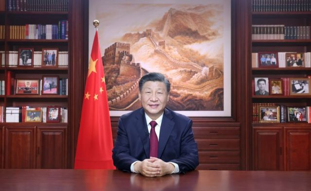
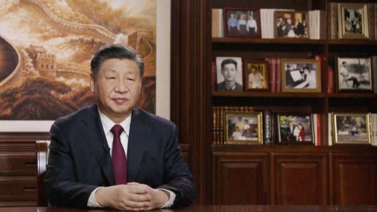

# [Chinese] 习近平的书架与新年贺词：回应抗议、青年人和胡锦涛“被离场”事件？

#  习近平的书架与新年贺词：回应抗议、青年人和胡锦涛“被离场”事件？

> 图像来源，  Xinhua
>
> 图像加注文字，新年前夕，中国国家主席习近平通过中央广播电视总台和互联网，发表2023年新年贺词。

****一** ** ****位** ** ****国家领导人的办公室陈列出什么物品，透露** ** ****着他的行事风格和治国理念** ** ****。** **

中国国家主席习近平在2022年底最后一天发表 新年贺词  。他端坐在自己位于北京中南海的办公室，背后的书架上挂着一幅巨型长城图， 旁边摆放着书籍和数十张照片  。 官媒央视（CCTV）  将这27张照片放大，向公众解释习主席的“珍贵瞬间”。

分析指出，习的新年贺词和照片凸显出中国政权当前最在意的事，为下一年的工作垫下基调。其中有关青年人的论述尤其值得留意。

书架上有的照片是第一次出现，包括前国家主席江泽民、前总理朱镕基和习近平之父——中共元老习仲勋的合影，以及习近平与江泽民、胡锦涛的合影。这反应了习近平如何理解江泽民的权力传承，并间接回应了胡锦涛在中共“二十大”上“被离场”所引发的争议。

##  回应“白纸抗议”？

在习近平的新年贺词中，最受关注的是一句对“不同诉求”的提法，普遍认为是对中国抗议“清零”政策的间接回应。

习近平说：“中国这么大，不同人会有不同诉求，对同一件事也会有不同看法，这很正常，要通过沟通协商凝聚共识”。

中国多个城市在11月下旬爆发抗议，抗议者以一张白纸代替诉求，指责政府严格“清零”政策带来灾难，有人甚至喊出“习近平下台”等口号，被认为是“八九”学运后中国最大规模的抗争。

美国纽约城市大学（The City University of New York）政治学教授夏明对BBC中文说，“白纸运动”凸显了党内对习近平的不满和矛盾，而他的新年贺词是在以某种方式进行回应。

习近平在去年10月中共“二十大”中集权力于一身，进入史无前例的第三任期，成为继毛泽东之后中国最具权势的领导人。

“中共党内的人只会私下或以温和的方式给习近平提意见，比如通过党内所谓的民主生活会。对他来说，直接的冲击来自于民间的情绪，尤其是当青年人要求就业、农民工要生存、打工族要吃饭，在民间爆发的毫无掩饰的愤怒”，夏明说，“‘白纸运动’代表着党内对习近平的不满，而他也在进行某种回应”。

澳大利亚国立大学政治学者宋文笛说，“与‘两个维护’和‘定于一尊’的论述对比，这在很大程度上是把与中央的不同意见用比较温和的方式表述出来，当作是有待凝聚的共识，而不是敌我矛盾的问题。”

宋文笛认为，这可以理解为对此前抗议的间接回应。他指出，过去一年里，中国在防疫政策上出现了不同声音，而一旦政府确定走向，“会希望过去的争论可以大致上既往不咎，然后凝聚党内不同意见，团结向前”。

但这并不意味着习近平意识到了问题存在，会进一步回应诉求。

“这种回应是无力的，无法在民间得到共鸣”，夏明说，习的讲话仍暗示，中国的做法是正确的，并将继续走下去。

习近平在新年贺词中肯定了疫情三年来的政策，他说，“我们始终坚持人民至上、生命至上，坚持科学精准防控，因时因势优化调整防控措施，最大限度保护了人民生命安全和身体健康”。

“作为权力已经集中于一身的最高领导者来说，在过年这样欢乐祥和的时间点做出比较大方的表态，是正常行为。但后续在实际执行上，在对不同意见的容忍上，是否会得到完整执行，抑或会坚壁清野，这个还有待观察”，宋文笛说。

中国目前正在经历防疫政策突然大转向后的痛楚。奥密克戎毒株在许多城市蔓延，老人住院和死亡急剧增加。坐在路边打点滴的病人、火葬场外排队的灵车等画面在社交媒体上扩散，有的地方甚至被爆出黄牛价出售火化名额。中国官员则反复声称政策大逆转是理性的、以科学为基础的。

习近平也表现出对当前疫情发展的忧虑，他说，“疫情防控进入新阶段，仍是吃劲的时候”。不过，一句“坚持就是胜利，团结就是胜利”或许给出了最空洞的解决方案。

##  着重关注青年人

> 图像来源，  CCTV
>
> 图像加注文字，分析指出，习的新年贺词和照片凸显出中国政权目前最在意的事，为下一年的工作垫下基调（图为央视播出的习近平新年讲话录像截屏画面）。

值得注意的是，习近平在新年贺词中四次提到“青年”，这是往年新年贺词中罕见的。他的书架上也摆放了一张与青年人的合影，被中国官媒央视排列在较前的位置。

习近平说：“明天的中国，希望寄予青年。青年兴则国家兴，中国发展要靠广大青年挺膺担当......广大青年要厚植家国情怀、涵养进取品格，以奋斗姿态激扬青春，不负时代，不负华年。”

宋文笛留意到，央视对照片的排序显示出，青年人的工作将越来越受到关注。

前三张照片分别是习近平个人在中共“二十大”、瞻仰延安革命纪念地以及冬奥会上的工作，第四张是在“五四”青年节期间与青年人的互动，排在中央军委举行的“八一勋章”和荣誉称号仪式之上。

在与青年人合影的配文中，央视重申了习的新年讲话“青年兴则国家兴”。并解释，2022年是中国共青团成立100周年，“青年在习近平总书记心中占据着重要位置”。

央视还引述中共“二十大”报告称，“全党要把青年工作作为战略性工作来抓，用党的科学理论武装青年，用党的初心使命感召青年，做青年朋友的知心人、青年工作的热心人、青年群众的引路人。”

中国共青团是共产党的“后备军”，但在习执政的时代受到边缘化。据报道，其团员从2012年近9000万人下降到2021年约7400万人。宋文笛认为，习的讲话暗示，今后共青团“很可能会再度受到新的重视”。

他还说，这也凸显出“白纸抗议”中的年轻人“带来了政治动能，很可能让习有了新的感悟”。

“抓青年工作可能成为新任期内高度优先的工作。除了意识形态，下一个就是青年工作，甚至放在强军梦之前”。

##  回应“二十大”胡锦涛“被离场”？

根据央视，有两张照片第一次出现在习近平主席的书架上。这在过去一年的背景下被赋予了强烈的政治意味。

一张是1999年9月30日，江泽民、朱镕基和习仲勋在庆祝建国五十周年招待会上的照片；另一张是习近平与江泽民、胡锦涛的合影，年份未知。

央视在这两张照片下写道：“历史长河波澜壮阔，一代又一代人接续奋斗创造了今天的中国。党用伟大奋斗创造了百年伟业，也一定能用新的伟大奋斗创造新的伟业。”

夏明认为，这表示习近平在“强化他对红色基因的传承，强化他是老一辈无产阶级革命家的继承者”。 “这传递出他是中国共产党的历史的选择，是独一无二的、必然的、正确的选择，这种表述的目的是维护当下的权威”。

在去年“二十大”期间，中共前总书记胡锦涛中途离开会场，引发关注。他最后一次公开露面是在12月6日江泽民追悼会上。习当时高调悼念了江泽民，称江的逝世是“不可估量的损失”，并号召“继承江泽民同志的遗志”。

习在新年贺词中再次高度评价江泽民，习近平说：“我们深切缅怀他的丰功伟绩和崇高风范，决心继承他的遗志，把新时代中国特色社会主义事业不断推向前进。”

宋文笛认为，“这表示他无意对前任做清洗动作。习得到政权的正当性和合法性，一部分是因为前两任领导人权力的和平移交。”

夏明也说，习并不想对胡锦涛进行清洗，因为目前在面对经济下滑、疫情持续、国际质疑的情况下，“中共的合法性处于危险境地，如果造成党内公开撕裂，代价太大”。

他还说，把这两张照片放在一起，通过把胡锦涛与江泽民的地位进行对比，显示出习对胡的地位的“降格”处理。

“从获得权力的基础来说，邓小平选江泽民更具合法性，而胡锦涛由邓小平隔代指定。所以对于习近平来说，胡锦涛的合法性不如江泽民。”

