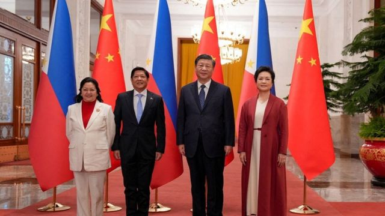
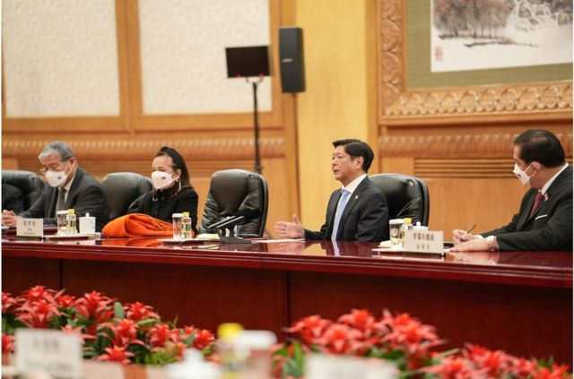
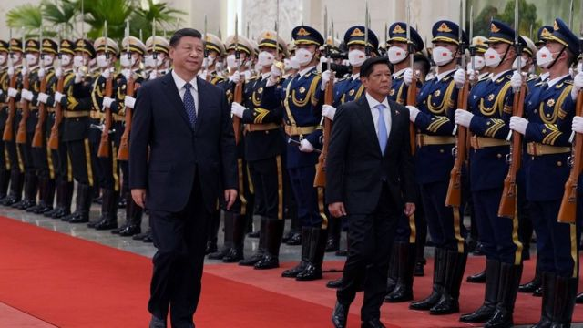
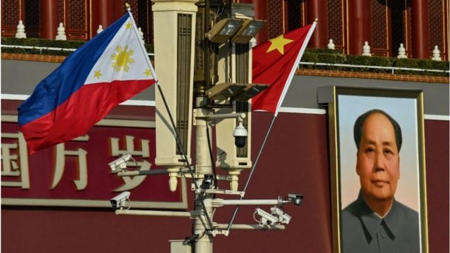

# [Chinese] 菲律宾总统小马科斯访华 中菲同意“和平”处理南海争端

#  菲律宾总统小马科斯访华 中菲同意“和平”处理南海争端 签署14项双边协议

> 图像来源，  Getty Images
>
> 图像加注文字，1月4日，在北京人民大会堂举行的欢迎仪式上，菲律宾总统小马科斯和第一夫人丽莎·阿拉内塔·马科斯与中国国家主席习近平及其夫人彭丽媛合影。

**中国和菲律宾周四（1月5日）在一份联合声明中表示，他们同意在两国外交部之间就南中国海问题建立直接沟通渠道，以和平处理争端。**

菲律宾总统小马科斯（Ferdinand Marcos Jr）1月3日至5日对中国进行国事访问。周三小马科斯与中国领导人习近平、李克强和栗战书分别举行了会面。

此次访问是小马科斯去年六月上任以来，首次访问中国，也是他首次正式出访非东盟国家。

中国对南海的领土主张一直是中国与包括菲律宾在内的一些东南亚国家关系紧张的根源。南海蕴藏着丰富的石油、天然气和渔业资源，每年海运贸易额约为3万亿美元。

##  联合声明

中国和菲律宾周四（1月5日）签署的这份联合声明包含14项协议，旨在缓和安全紧张局势和促进经济合作。2016年菲律宾寻求对于南海的仲裁裁决，该裁决宣布中国在南海的扩张主张无效。双方都在努力修复因此受到伤害的双边关系。

这份声明说，中菲同意在两国外交部之间就南海问题建立直接沟通渠道，以和平处理争端。

两位领导人在联合声明中都重申，他们的国家将尊重彼此的主权和领土完整。

> 图像来源，  Reuters
>
> 图像加注文字，声明说，中菲同意在两国外交部之间就南海问题建立直接沟通渠道，以和平处理争端。

双方还同意恢复关于南海石油和天然气勘探的会谈，并讨论在太阳能、风能、电动汽车和核能等领域的合作。中菲两国海警也将“尽快”会面，讨论“务实合作”。

声明说，两国将考虑在发射火箭时通知对方，并在回收火箭碎片方面进行合作。

去年11月，一枚中国火箭的碎片落入南海时，中国海警船阻止了一艘试图将其拖走的菲律宾船只。

声明还称，两国重申了维护南海和平与稳定以及航行和飞越自由的重要性，并将举行年度安全对话。

在经济合作方面，中方同意扩大菲律宾的进口，使双边贸易额恢复或超过新冠疫情前水平。双方还承诺增加游客数量和航班。

联合声明还说，双方将在疫苗采购方面进行合作。中国是世界上最大的新冠疫苗出口国之一。

菲律宾新闻发言人在一份声明中说，中国投资者在与小马科斯的商业会议后承诺投资228亿美元。投资承诺包括137.6亿美元用于可再生能源，主要是太阳能和风能；73亿美元用于战略监测，包括电动汽车和矿物加工；17亿美元用于农业综合经营。

“我向你们保证，我国政府致力于支持你们在菲律宾的商业活动。”小马科斯对中国企业高管表示。

##  重启油气开发谈判

新华社报道，习近平在会见小马科斯时表示，中方愿同菲方继续以友好协商方式妥善处理海上问题，重启油气开发谈判，推动非争议区油气开发合作，开展光伏、风能、新能源汽车等绿色能源合作。

习近平还表示，将推动两国在更多领域的合作，包括拓展基础教育、职业教育合作，探讨气象、航天等领域创新合作，中方还会和菲律宾持续开展疫苗研发合作。

中国总理李克强在会面中表示，前不久在柬埔寨举行的第25次中国—东盟领导人会议发表了《纪念〈南海各方行为宣言〉签署20周年联合声明》，表明中国和东盟国家有信心、有能力、有智慧维护南海和平稳定，通过友好磋商和谈判解决争议。

菲律宾此前曾对南海有争议水域的中国施工活动和中国船只“蜂拥而至”的报道提出了担忧。

路透社报道，小马科斯对记者说：“我们还讨论了我们可以做些什么来向前迈进，避免任何可能的错误和误解，这些错误和误解可能引发比我们已经存在的问题更大的问题。”

> 图像来源，  Getty Images

小马科斯说，习近平承诺妥协和提供解决方案，该解决方案可以使菲律宾渔民能够在其历史悠久的渔场中运作。

菲律宾总统府在一份声明中表示，两国周三签署了14项双边协议，包括农业、基础设施、发展合作、海上安全和旅游等方面的协议。

##  去年曾在泰国会面

早前中国外交部发言人汪文斌介绍，访问期间，习近平同小马科斯总统举行会谈，李克强、栗战书则分别会见小马科斯。双方将推进农业、基建、能源和人文四大重点领域合作。

这是小马科斯和习近平在去年11月泰国举行会议之后的第二次面对面会议。

> 图像来源，  Getty Images

中共官媒《人民日报》报道称，习近平当时在泰国表示，在南海问题上，双方要坚持友好协商，妥处分歧争议。而小马科斯说，历来主张不能让海上问题定义整个菲中关系，双方可就此进一步加强沟通。菲方将继续坚持一个中国政策，坚持和平原则，坚持独立自主外交，不会选边站队。

上周，菲律宾外交部官员说，小马科斯与习近平的会谈将包括中国在南海的行动。

分析人士预计，小马科斯会利用这次访问帮助菲律宾重新平衡外交政策。在前总统罗德里戈·杜特尔特（Rodrigo Duterte）领导下，菲律宾的外交政策更接近中国，远离美国。

