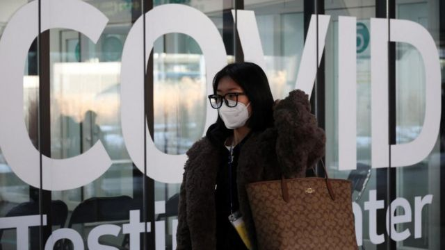

# [Chinese] 新冠疫情：中国进一步限制日韩公民来华签证，外交部称“对等措施”

#  新冠疫情：中国进一步限制日韩公民来华签证，外交部称“对等措施”

> 图像来源，  Reuters
>
> 图像加注文字，韩国仁川机场

**中国已停止向韩国和日本公民发放短期赴华签证，以报复两国针对中国游客的入境新冠检疫措施。周三，中国国家移民管理局进一步表示，即日起对韩国、日本公民暂停签发口岸签证及暂停72/144小时过境免签政策。**

中国政府此前表示，暂停签证的做法将持续到针对中国的“歧视性”入境限制被取消。

日本和韩国不是仅有的对中国旅客实施入境检疫要求的国家，但它们的措施是最严格的。

上周，韩国停止向中国游客发放旅游签证，中国外交部称此举“不可接受”、“不科学”。

日本目前允许中国旅客入境，前提是他们的新冠病毒检测呈阴性。这与英国和美国类似，但日本也限制了从中国飞往某些日本城市的航班。

中国驻韩国和日本大使馆证实了针对前往中国旅客的新签证限制。

上周日，中国自2020年3月以来首次重新开放边境，这是取消“清零”政策的一部分。

##  中国政策

周二，中国驻日本大使馆宣布，暂停审发日本公民赴华普通签证。

同日，中国驻韩国大使馆宣布，暂停签发韩国公民赴华访问、商务、旅游、就医、过境以及一般私人事务类短期签证。

中国驻韩国大使馆还称，措施将视韩国对华歧视性入境限制措施取消情况再作调整。

##  韩国日本怎么说？

针对中国最新的签证限制，韩国外交部告诉BBC，韩国对来自中国的旅客的政策是“依照科学和客观的证据”。

根据韩国疾病管理厅的数据，近期大约三分之一来自中国的入境人员新冠病毒检测呈阳性。

日本经济新闻报道，日本外务省周二向中国驻日本大使馆提出抗议，日本政府一名高官表示，“日本并未叫停从中国入境，这是完全不对等的措施”。

报道还引述日本旅行公司称，如果停止签证手续长期持续，将无法从日本到中国出差，中日之间商务活动有可能受到影响。

在首尔仁川国际机场——韩国唯一一个中国商业航班可以飞抵的机场——到达者会看到穿着个人防护装备的军人。

当他们被送到机场检测中心时，BBC设法与其中一些人交谈。

“我个人认为这是可以的。这次疫情期间，我经历过更糟的情况，”上海商人威廉说，“作为一名旅行者，我只是尽量遵守这些政策。”

但另一名乘客不同意。

“我觉得这一点也不科学，”来自香港的艾米丽说。和那些来自中国大陆的学生一样，她也被要求进行检测。

“我觉得这有点不公平。我想他们一定觉得很不安全。”

许多韩国人支持保护国家免受中国新冠感染者激增的影响，但并非所有人都相信这一决定完全是出于医疗考虑。

“这其中有政治因素，两国关系不太好。很多韩国人有敌意，把新冠病毒归咎于中国。”要去阿布扎比的金孙（Jinsun，音译）说。

另一名要去巴黎度蜜月的女性说，如果不是中国，韩国可能不会实施这样的规定。

“但话说回来，无论我们做什么，中国都会有意见，”她说。

韩国的限制措施应该至少持续到本月底，这将让科学家们有时间分析中国任何潜在的新变种。

“目前中国对新变种的监测不透明。如果一种新变种来自中国，对整个世界来说将是一个非常困难的局面，”高丽大学传染病专家、政府顾问Kim Woo Joo教授告诉BBC。

“这对韩国医疗体系来说也是一场灾难。我们目前已经有很多人住院和死亡，我们的老年人疫苗接种也不足。这是我们所担心的。”

目前，只有少数来自中国的商务或外交旅客被允许进入韩国。他们必须在出发前和抵达时检测呈阴性。

近日，一名新冠检测呈阳性的中国男子从一辆开往机场附近隔离酒店的巴士上逃了出来。两天后，他在首尔一家酒店被警方抓获。

##  中国回应

周二（1月10日），中国外交部发言人汪文斌回应称，近日有少数国家宣布对来自中国的旅客采取入境限制措施，中国以最大诚意沟通，但少数国家罔顾科学事实和本国疫情实际，仍针对中国采取歧视性入境限制措施。

“对此，中方坚决反对并采取对等措施。”汪文斌说。

他还表示，相关国家应该从事实出发，科学适度制定防疫措施，不应借机搞政治操弄，不应有歧视性做法，不应影响国家间正常的人员交往和交流合作。

在中国的社交媒体上，有许多人支持中国政府的做法。

微博网民“不务正业的王大锤”说：“求仁得仁，咱们不去了，等着哭吧。”

微博网民“迷茫的mama”则认为日本的做法没错：“其实日本外务省没错啊，对等做法是对所有经日本来中国的人都进行相同检查和隔离。干嘛不发签证……影响商业往来。”

